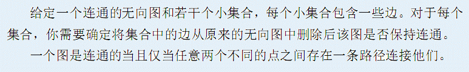

# [AHOI2013]连通图
[BZOJ3237]



可以发现，一个边是在若干区间内存在的。那么以询问建立时间轴，把边在线段树上放置到对应所有的出现区间上。然后线段树分治，递归之，维护一个支持删除的并查集。

```cpp
#include<iostream>
#include<cstdio>
#include<cstdlib>
#include<cstring>
#include<algorithm>
#include<vector>
using namespace std;

#define ll long long
#define mem(Arr,x) memset(Arr,x,sizeof(Arr))
#define lson (now<<1)
#define rson (lson|1)

const int maxN=101000<<1;
const int maxM=201000<<1;
const int maxK=101000<<1;
const int inf=2147483647;

class Edge
{
public:
	int u,v;
};


int n,m,Q;
Edge E[maxM];
int lst[maxN],UFS[maxN],Size[maxN];
int top,con,St1[maxN],St2[maxN],St3[maxN];
vector<int> Qn[maxN],S[maxN<<2];
int Ans[maxN];

void Modify(int now,int l,int r,int ql,int qr,int id);
void Query(int now,int l,int r);
int Find(int x);
void Union(int u,int v);
void Undo();

int main(){
	scanf("%d%d",&n,&m);
	for (int i=1;i<=n;i++) UFS[i]=i,Size[i]=1;
	for (int i=1;i<=m;i++) scanf("%d%d",&E[i].u,&E[i].v);
	scanf("%d",&Q);
	for (int i=1;i<=Q;i++){
		int c;scanf("%d",&c);
		while (c--){
			int id;scanf("%d",&id);
			if (lst[id]!=i-1) Modify(1,1,Q,lst[id]+1,i-1,id);
			lst[id]=i;
		}
	}

	for (int i=1;i<=m;i++) if (lst[i]<=Q-1) Modify(1,1,Q,lst[i]+1,Q,i);
	Query(1,1,Q);

	for (int i=1;i<=Q;i++)
		if (Ans[i]) printf("Connected\n");
		else printf("Disconnected\n");

	return 0;
}

void Modify(int now,int l,int r,int ql,int qr,int id){
	if ((l==ql)&&(r==qr)){
		S[now].push_back(id);return;
	}
	int mid=(l+r)>>1;
	if (qr<=mid) Modify(lson,l,mid,ql,qr,id);
	else if (ql>=mid+1) Modify(rson,mid+1,r,ql,qr,id);
	else{
		Modify(lson,l,mid,ql,mid,id);Modify(rson,mid+1,r,mid+1,qr,id);
	}
	return;
}

void Query(int now,int l,int r){
	int bot=top;
	for (int sz=S[now].size(),i=0;i<sz;i++) Union(E[S[now][i]].u,E[S[now][i]].v);
	if (l==r){
		Ans[l]=(con==(n-1));
		while (top!=bot) Undo();
		return;
	}
	int mid=(l+r)>>1;
	Query(lson,l,mid);Query(rson,mid+1,r);
	while (top!=bot) Undo();return;
}

int Find(int x){
	return (UFS[x]==x)?(x):(Find(UFS[x]));
}

void Union(int u,int v){
	u=Find(u);v=Find(v);
	if (u!=v){
		if (Size[u]<Size[v]) swap(u,v);con++;
		top++;St1[top]=u;St2[top]=v;St3[top]=Size[u];
		UFS[v]=u;Size[u]+=Size[v];
	}
	return;
}

void Undo(){
	int u=St1[top],v=St2[top],sz=St3[top];top--;con--;
	UFS[v]=v;Size[u]=sz;return;
}
```