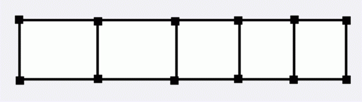

# [BJWC2011]神秘好人
[BZOJ2459]

有一个神秘好人跟Bdcxq玩一个游戏，如果Bdcxq成功完成了这个游戏，那么他将会得到一件礼物。  
这个游戏是这样的：  
有一个梯子形的图如下，每条边都有一个权值。

神秘好人一开始会告诉Bdcxq每条边的权值。  
然后神秘好人会做这样的事情：  
1．神秘好人会修改某条边的权值；  
2．神秘老人会问你从一个点走到另一个点所需经过边权和最小的权值和。  
如果Bdcxq一直能答对问题，那么他就完成了游戏，也能得到礼物。  
现在他请你编一个程序来帮他完成游戏。

用线段树维护区间四个边界点之间的最短路，讨论转移。查询的时候，再查询从旁边转移过来的最短路。

```cpp
#include<iostream>
#include<cstdio>
#include<cstdlib>
#include<cstring>
#include<algorithm>
#include<iomanip>
using namespace std;

#define ll long long
#define mem(Arr,x) memset(Arr,x,sizeof(Arr))
#define lson (now<<1)
#define rson (lson|1)

const int maxN=101000;
const int inf=2147483647;
const ll INF=1e17;

class SegmentData
{
public:
	ll d12,d13,d14,d23,d24,d34;
	ll left,right,up,down;
	void GetDist(){
		d12=min(up,left+down+right);
		d13=min(left,up+right+down);
		d14=min(up+right,left+down);
		d23=min(up+left,right+down);
		d24=min(right,up+left+down);
		d34=min(down,left+up+right);
		return;
	}
};

int n;
ll I1[maxN],I2[maxN],I3[maxN];
SegmentData S[maxN<<2];

void Build(int now,int l,int r);
void Modify(int now,int l,int r,int pos,int opt,ll key);
SegmentData Query(int now,int l,int r,int ql,int qr);
SegmentData operator + (SegmentData A,SegmentData B);
void Outp(int now,int l,int r);

int main(){
	scanf("%d",&n);
	for (int i=1;i<n;i++) scanf("%lld",&I1[i]);
	for (int i=1;i<=n;i++) scanf("%lld",&I2[i]);
	for (int i=1;i<n;i++) scanf("%lld",&I3[i]);
	Build(1,1,n-1);
	int m;scanf("%d",&m);
	while (m--){
		int opt;scanf("%d",&opt);
		if (opt==0){
			int a,b;ll c;scanf("%d%d%lld",&a,&b,&c);
			if (a==0) Modify(1,1,n-1,b,0,c);
			if (a==1){
				if (b!=1) Modify(1,1,n-1,b-1,3,c);
				if (b!=n) Modify(1,1,n-1,b,1,c);
			}
			if (a==2) Modify(1,1,n-1,b,2,c);
		}
		if (opt==1){
			int a,b;scanf("%d%d",&a,&b);
			if (a==b){
				printf("0\n");continue;
			}
			int l=(a+1)>>1,r=(b+1)>>1;
			if (l>r) swap(l,r),swap(a,b);
			SegmentData L,M,R;L=M=R=((SegmentData){INF,INF,INF,INF,INF,INF,INF,INF,INF});
			if (l==r){
				if (l-1>=1) L=Query(1,1,n-1,1,l-1);
				if (r<=n-1) R=Query(1,1,n-1,r,n-1);
				printf("%lld\n",min(L.d24,R.d13));
			}
			else{
				r--;
				if (l>1) L=Query(1,1,n-1,1,l-1);
				if (l<=r) M=Query(1,1,n-1,l,r);
				if (r<n-1) R=Query(1,1,n-1,r+1,n-1);
				if ((a&1)&&(b&1)) printf("%lld\n",min(min(M.d12,L.d24+M.d23),min(L.d24+M.d34+R.d13,R.d13+M.d14)));
				if ((a&1)&&(!(b&1))) printf("%lld\n",min(min(M.d14,L.d24+M.d23+R.d13),min(L.d24+M.d34,R.d13+M.d12)));
				if ((!(a&1))&&(b&1)) printf("%lld\n",min(min(M.d23,R.d13+M.d14+L.d24),min(M.d12+L.d24,M.d34+R.d13)));
				if ((!(a&1))&&(!(b&1))) printf("%lld\n",min(min(M.d34,L.d24+M.d14),min(L.d24+M.d12+R.d13,R.d13+M.d23)));
			}
		}
	}
	return 0;
}

void Build(int now,int l,int r){
	if (l==r){
		S[now].up=I1[l];S[now].down=I3[l];
		S[now].left=I2[l];S[now].right=I2[l+1];
		S[now].GetDist();return;
	}
	int mid=(l+r)>>1;
	Build(lson,l,mid);Build(rson,mid+1,r);
	S[now]=S[lson]+S[rson];return;
}

void Modify(int now,int l,int r,int pos,int opt,ll key){
	if (l==r){
		if (opt==0) S[now].up=key;
		if (opt==1) S[now].left=key;
		if (opt==2) S[now].down=key;
		if (opt==3) S[now].right=key;
		S[now].GetDist();return;
	}
	int mid=(l+r)>>1;
	if (pos<=mid) Modify(lson,l,mid,pos,opt,key);
	else Modify(rson,mid+1,r,pos,opt,key);
	S[now]=S[lson]+S[rson];return;
}

SegmentData Query(int now,int l,int r,int ql,int qr){
	if ((l==ql)&&(r==qr)) return S[now];
	int mid=(l+r)>>1;
	if (qr<=mid) return Query(lson,l,mid,ql,qr);
	else if (ql>=mid+1) return Query(rson,mid+1,r,ql,qr);
	else return Query(lson,l,mid,ql,mid)+Query(rson,mid+1,r,mid+1,qr);
}

SegmentData operator + (SegmentData A,SegmentData B){
	SegmentData ret;
	ret.d12=min(A.d12+B.d12,A.d14+B.d23);
	ret.d13=min(A.d13,A.d12+B.d13+A.d34);
	ret.d14=min(A.d12+B.d14,A.d14+B.d34);
	ret.d23=min(A.d23+B.d12,A.d34+B.d23);
	ret.d24=min(B.d24,B.d12+A.d24+B.d34);
	ret.d34=min(A.d34+B.d34,A.d23+B.d14);
	return ret;
}

void Outp(int now,int l,int r){
	cout<<"["<<l<<","<<r<<"] "<<S[now].d12<<" "<<S[now].d13<<" "<<S[now].d14<<" "<<S[now].d23<<" "<<S[now].d24<<" "<<S[now].d34<<endl;
	if (l==r) return;
	int mid=(l+r)>>1;
	Outp(lson,l,mid);Outp(rson,mid+1,r);
	return;
}
```