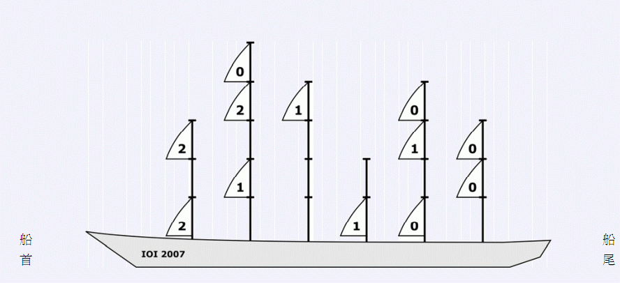

# [IOI2007]sails船帆
[BZOJ1804 Luogu4647]

让我们来建造一艘新的海盗船。船上有 N个旗杆，每根旗杆被分成单位长度的小节。旗杆的长度等于它被分成的小节的数目。每根旗杆上会挂一些帆，每张帆正好占据旗杆上的一个小节。在一根旗杆上的帆可以任意排布在不同的小节中，但是每个小节上至多能挂一张帆。  
在风中，帆的不同排布方式会产生不同的推动力。靠近船头的帆比它后面的相同高度上的帆获得的推动力少，换句话说，靠近船头的帆的推动力由于受它后面相同高度的帆的影响而打了折扣。对于任意一张帆，它的推动力折扣等于在它后面并且和它在同一高度的帆的数目。  
所有帆的任意一种位置组合的推动力折扣总和等于在该位置下所有帆的推动力折扣的总和。  
(  
这条船上有6个旗杆，从前（图上的左边）到后的高度分别是3，5，4，2，4和3。图中所示的帆的位置组合的总推动力折扣是10。上图给出了每张帆自己的推动力折扣。 任务 给定N个旗杆的高度和每个旗杆上挂的帆的数目，写一个程序求出所有位置组合中的可能达到的最小的总推动力折扣。  

首先知道，帆的顺序对答案是没有影响的，因为若第$i$行帆的数量为$Cnt[i]$，则答案为$\sum\_{i=1}^n \frac{Cnt[i] \times (Cnt[i]-1)}{2} $。  
所以可以贪心地想，把列按照高度排序以后，每次放入一列时，在前$[1,h]$格子中选择$k$个最小的来放。  
如何寻找这些位置呢？假设我们已经把行按照已经放入的次数降序排列了，那么我们知道，最小的$k$个一定是后$k$个，也就是$[h-k+1,h]$这些。但是，如果直接把这些位置上的数$+1$可能会导致原来降序的排列不单调了。不单调的原因是$[h-k+1]$位置上的数与$[h-k]$相同，此时对$[h-k+1]$位置$+1$就会导致不单调。方法是把与$[h-k+1]$相同的的数全部移动到这个数出现第一次的地方，在这里$+1$，就可以保证序列在修改后依然单调不增了。  
至于维护区间加法，查询某个数第一次出现的位置等操作可以用线段树来实现。

```cpp
#include<iostream>
#include<cstdio>
#include<cstdlib>
#include<cstring>
#include<algorithm>
using namespace std;

#define ll long long
#define mem(Arr,x) memset(Arr,x,sizeof(Arr))
#define lson (now<<1)
#define rson (lson|1)

const int maxN=101000;
const int inf=2147483647;

class SegmentData
{
public:
	int mn,lazy;
};

class Data
{
public:
	int h,k;
};

int n,mxH;
Data D[maxN];
SegmentData S[maxN<<2];

bool cmp(Data A,Data B);
void PushDown(int now);
void Update(int now);
void Modify(int now,int l,int r,int ql,int qr,int key);
int GetNum(int now,int l,int r,int pos);
int QueryNum(int now,int l,int r,int key);

int main()
{
	scanf("%d",&n);
	for (int i=1;i<=n;i++) scanf("%d%d",&D[i].h,&D[i].k);
	sort(&D[1],&D[n+1],cmp);
	mxH=D[n].h+1;Modify(1,1,mxH,mxH,mxH,-inf);
	for (int i=1;i<=n;i++)
	{
		//cout<<i<<endl;
		int pos=D[i].h-D[i].k+1;
		//cout<<"pos:"<<pos<<endl;
		int num=GetNum(1,1,mxH,pos);
		//cout<<"num:"<<num<<endl;
		int p1=QueryNum(1,1,mxH,num),p2=QueryNum(1,1,mxH,num-1);
		//cout<<"p1:"<<p1<<" p2:"<<p2<<endl;
		if (p2<=D[i].h)
		{
			Modify(1,1,mxH,p2,D[i].h,1);
			Modify(1,1,mxH,p1,p2-pos+p1-1,1);
		}
		else Modify(1,1,mxH,p1,p1+D[i].k-1,1);
		//for (int j=1;j<=mxH;j++) cout<<GetNum(1,1,mxH,j)<<" ";cout<<endl;
	}
	ll Ans=0;
	for (int i=1;i<mxH;i++)
	{
		ll x=GetNum(1,1,mxH,i);
		Ans+=x*(x-1)/2;
	}
	printf("%lld\n",Ans);
	return 0;
}

bool cmp(Data A,Data B){
	return A.h<B.h;
}

void PushDown(int now)
{
	if (S[now].lazy)
	{
		int lz=S[now].lazy;S[now].lazy=0;
		S[lson].lazy+=lz;S[rson].lazy+=lz;
		S[lson].mn+=lz;S[rson].mn+=lz;
	}
	return;
}

void Update(int now)
{
	S[now].mn=min(S[lson].mn,S[rson].mn);
	return;
}

void Modify(int now,int l,int r,int ql,int qr,int key)
{
	//cout<<"Modify:"<<now<<" "<<l<<" "<<r<<" "<<ql<<" "<<qr<<" "<<key<<endl;
	if ((l==ql)&&(r==qr)){
		S[now].mn+=key;S[now].lazy+=key;return;
	}
	PushDown(now);
	int mid=(l+r)>>1;
	if (qr<=mid) Modify(lson,l,mid,ql,qr,key);
	else if (ql>=mid+1) Modify(rson,mid+1,r,ql,qr,key);
	else
	{
		Modify(lson,l,mid,ql,mid,key);
		Modify(rson,mid+1,r,mid+1,qr,key);
	}
	Update(now);return;
}

int GetNum(int now,int l,int r,int pos)
{
	if (l==r) return S[now].mn;
	PushDown(now);
	int mid=(l+r)>>1;
	if (pos<=mid) return GetNum(lson,l,mid,pos);
	else return GetNum(rson,mid+1,r,pos);
}

int QueryNum(int now,int l,int r,int key)
{
	if (l==r) return l;
	PushDown(now);
	int mid=(l+r)>>1;
	if (S[lson].mn<=key) return QueryNum(lson,l,mid,key);
	else return QueryNum(rson,mid+1,r,key);
}
```