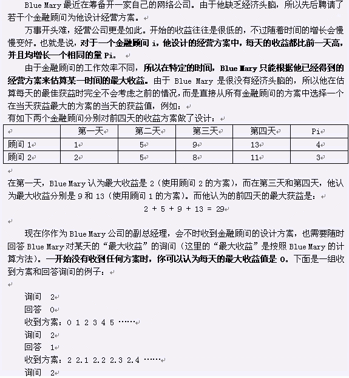

# [JSOI2008]Blue Mary开公司
[BZOJ1568 Luogu4254]



线段树维护区间最高直线。

```cpp
#include<iostream>
#include<cstdio>
#include<cstdlib>
#include<cstring>
#include<algorithm>
using namespace std;

#define ll long long
#define ld long double
#define mem(Arr,x) memset(Arr,x,sizeof(Arr))
#define lson (now<<1)
#define rson (lson|1)

const int maxN=101000;
const int maxNum=50000;
const ld eps=1e-8;
const int inf=2147483647;

class Line
{
public:
	ld k,b;
	ld calc(ld x){
		return k*x+b;
	}
};

int n;
Line L[maxN];
int S[(maxNum+10)<<2];
char opt[10];
bool getans=0;

void Modify(int now,int l,int r,int id);
ld Query(int now,int l,int r,int T);
bool Better(int id1,int id2,int x);

int main()
{
	scanf("%d",&n);
	int linecnt=0;
	while (n--)
	{
		scanf("%s",opt);
		if (opt[0]=='Q')
		{
			int T;scanf("%d",&T);getans=0;
			ld ret=Query(1,1,maxNum,T);
			if (getans==0) printf("0\n");
			else printf("%d\n",max(0,(int)(ret/100)));
		}
		if (opt[0]=='P')
		{
			ld S,P;scanf("%LF%LF",&S,&P);
			L[++linecnt]=((Line){P,S-P});
			Modify(1,1,maxNum,linecnt);
		}
	}
	return 0;
}

void Modify(int now,int l,int r,int id)
{
	if (S[now]==0){
		S[now]=id;return;
	}
	int mid=(l+r)>>1;
	if (Better(id,S[now],l)==(Better(id,S[now],r))){
		if (Better(id,S[now],l)) S[now]=id;
		return;
	}
	if (Better(id,S[now],mid)) swap(id,S[now]);
	if (Better(id,S[now],l)) Modify(lson,l,mid,id);
	if (Better(id,S[now],r)) Modify(rson,mid+1,r,id);
	return;
}

ld Query(int now,int l,int r,int T)
{
	ld ret=-inf;
	if (S[now]){
		getans=1;ret=L[S[now]].calc(T);
	}
	if (l==r) return ret;
	int mid=(l+r)>>1;
	if (T<=mid) return max(ret,Query(lson,l,mid,T));
	else return max(ret,Query(rson,mid+1,r,T));
}

bool Better(int id1,int id2,int x){
	return L[id1].calc(x)>L[id2].calc(x);
}
```