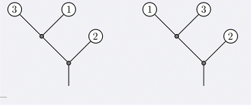

# [POI2011]Tree Rotations
[BZOJ2212 Luogu3521]

Byteasar the gardener is growing a rare tree called Rotatus Informatikus. It has some interesting features: The tree consists of straight branches, bifurcations and leaves. The trunk stemming from the ground is also a branch. Each branch ends with either a bifurcation or a leaf on its top end. Exactly two branches fork out from a bifurcation at the end of a branch - the left branch and the right branch. Each leaf of the tree is labelled with an integer from the range . The labels of leaves are unique. With some gardening work, a so called rotation can be performed on any bifurcation, swapping the left and right branches that fork out of it. The corona of the tree is the sequence of integers obtained by reading the leaves' labels from left to right. Byteasar is from the old town of Byteburg and, like all true Byteburgers, praises neatness and order. He wonders how neat can his tree become thanks to appropriate rotations. The neatness of a tree is measured by the number of inversions in its corona, i.e. the number of pairs（I,j）, (1< = I < j < = N ) such that(Ai>Aj) in the corona(A1,A2,A3…An). 

The original tree (on the left) with corona(3,1,2) has two inversions. A single rotation gives a tree (on the right) with corona(1,3,2), which has only one inversion. Each of these two trees has 5 branches. Write a program that determines the minimum number of inversions in the corona of Byteasar's tree that can be obtained by rotations.  
现在有一棵二叉树，所有非叶子节点都有两个孩子。在每个叶子节点上有一个权值(有n个叶子节点，满足这些权值为1..n的一个排列)。可以任意交换每个非叶子节点的左右孩子。  
要求进行一系列交换，使得最终所有叶子节点的权值按照遍历序写出来，逆序对个数最少。

值域线段树叶子到根维护每一个点包含的值域。合并两个儿子的时候，可以知道交换只会改变两个之间的逆序对贡献而不会改变两个自己原来的贡献，那么在线段树合并的时候统计一下左边对右边的逆序数和右边对左边的逆序数，两者取较小值。

```cpp
#include<iostream>
#include<cstdio>
#include<cstdlib>
#include<cstring>
#include<algorithm>
using namespace std;

#define ll long long
#define mem(Arr,x) memset(Arr,x,sizeof(Arr))

const int maxN=201000*2;
const int inf=2147483647;

class SegmentData
{
public:
	int ls,rs,sum;
};

int n;
int nodecnt,Ls[maxN],Rs[maxN],Key[maxN];
int segcnt,root[maxN];
SegmentData S[maxN*30];
ll sum1,sum2,Ans;

void Input(int u);
void Calc(int u);
void Modify(int &now,int l,int r,int pos,int key);
int Merge(int r1,int r2);

int main()
{
	scanf("%d",&n);nodecnt++;
	Input(1);
	Calc(1);
	printf("%lld\n",Ans);
	return 0;
}

void Input(int u)
{
	int key;scanf("%d",&key);
	if (key==0){
		Ls[u]=++nodecnt;Rs[u]=++nodecnt;
		Input(Ls[u]);Input(Rs[u]);
	}
	else Key[u]=key;
	return;
}

void Calc(int u)
{
	//cout<<u<<" "<<Ls[u]<<" "<<Rs[u]<<endl;
	if (Key[u]!=0){
		Modify(root[u],1,n,Key[u],1);return;
	}
	Calc(Ls[u]);Calc(Rs[u]);
	sum1=0;sum2=0;
	root[u]=Merge(root[Ls[u]],root[Rs[u]]);
	Ans=Ans+min(sum1,sum2);
	return;
}

void Modify(int &now,int l,int r,int pos,int key)
{
	S[++segcnt]=S[now];now=segcnt;
	S[now].sum+=key;
	if (l==r) return;
	int mid=(l+r)>>1;
	if (pos<=mid) Modify(S[now].ls,l,mid,pos,key);
	else Modify(S[now].rs,mid+1,r,pos,key);
}

int Merge(int r1,int r2)
{
	if (r1==0) return r2;
	if (r2==0) return r1;
	int now=++segcnt;
	sum1=sum1+1ll*S[S[r1].ls].sum*S[S[r2].rs].sum;
	sum2=sum2+1ll*S[S[r1].rs].sum*S[S[r2].ls].sum;
	S[now].sum=S[r1].sum+S[r2].sum;
	S[now].ls=Merge(S[r1].ls,S[r2].ls);
	S[now].rs=Merge(S[r1].rs,S[r2].rs);
	return now;
}
```