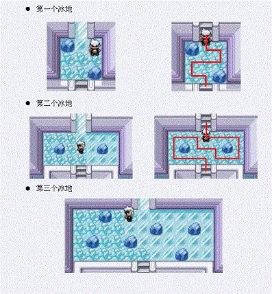

# [ZJOI2011]道馆之战
[BZOJ2325 Luogu4679]

口袋妖怪（又名神奇宝贝或宠物小精灵）红/蓝/绿宝石中的水系道馆需要经过三个冰地才能到达馆主的面前，冰地中的每一个冰块都只能经过一次。当一个冰地上的所有冰块都被经过之后，到下一个冰地的楼梯才会被打开。  
三个冰地分别如下：

当走出第三个冰地之后，就可以与馆主进行道馆战了。馆主发现这个难度太小，导致经常有挑战者能通过，为了加大难度，将道馆分成了n个房间，每个房间中是两个冰块或障碍，表示一列冰地。任意两个房间之间均有且仅有一条路径相连，即这n个房间构成一个树状结构。每个房间分成了A和B两个区域，每一区域都是一个薄冰块或者障碍物。每次只能移动到相邻房间的同一类区域(即若你现在在这个房间的A区域，那么你只能移动到相邻房间的A区域)或这个房间的另一区域。现在挑战者从房间u出发，馆主在房间v，那么挑战者只能朝接近馆主所在房间的方向过去。一开始挑战者可以在房间u的任意一个冰块区域内。如果挑战者踩过的冰块数达到了最大值(即没有一种方案踩过的冰块数更多了)，那么当挑战者走到最后一个冰块上时，他会被瞬间传送到馆主面前与馆主进行道馆战。自从馆主修改规则后已经经过了m天，每天要么是有一个挑战者来进行挑战，要么就是馆主将某个房间进行了修改。对于每个来的挑战者，你需要计算出他若要和馆主进行战斗需要经过的冰块数。

树链剖分+线段树，在线段树中维护 d11,d12,d21,d22 表示左边两个格子到右边两个格子的最长距离， f11,f12,f21,f22 分别表示从左右边界 4 个格子出发的最长路，讨论情况合并信息。每次查询的答案就在 f11 和 f12 的最大值中。  
注意在树链剖分跳转查询信息的时候，最后要把出发点一边的信息翻转过来再与另一半合并，因为合并的时候是让深度浅的在前面的。

```cpp
#include<iostream>
#include<cstdio>
#include<cstdlib>
#include<cstring>
#include<algorithm>
using namespace std;

#define ll long long
#define mem(Arr,x) memset(Arr,x,sizeof(Arr))
#define lson (now<<1)
#define rson (lson|1)

const int maxN=50100;
const int maxM=maxN<<1;
const int inf=100000000;

class SegmentData
{
public:
	int d11,d12,d21,d22;
	int f11,f12,f21,f22;
};

int n,m;
int edgecnt=0,Head[maxN],Next[maxM],V[maxM];
int Size[maxN],Hs[maxN],Top[maxN],Fa[maxN],Dpt[maxN];
int dfncnt,dfn[maxN];
char Ar[maxN][5];
SegmentData S[maxN<<2];

void Add_Edge(int u,int v);
void dfs1(int u,int fa);
void dfs2(int u,int top);
void Modify(int now,int l,int r,int pos,int key);
SegmentData Query(int now,int l,int r,int ql,int qr);
int LCA(int u,int v);
SegmentData operator + (SegmentData A,SegmentData B);
void Outp(int now,int l,int r);
ostream & operator << (ostream &os,SegmentData A);

int main(){
	mem(Head,-1);
	scanf("%d%d",&n,&m);
	for (int i=1;i<n;i++){
		int u,v;scanf("%d%d",&u,&v);
		Add_Edge(u,v);Add_Edge(v,u);
	}

	Dpt[1]=1;dfs1(1,1);dfs2(1,1);
	for (int i=1;i<=n;i++){
		scanf("%s",Ar[i]);
		int key=0;
		if (Ar[i][0]=='.') key|=1;
		if (Ar[i][1]=='.') key|=2;
		Modify(1,1,n,dfn[i],key);
	}
	while (m--){
		char opt;
		scanf(" %c",&opt);
		if (opt=='C'){
			int u;scanf("%d",&u);scanf(" %s",Ar[u]);
			int key=0;
			if (Ar[u][0]=='.') key|=1;
			if (Ar[u][1]=='.') key|=2;
			Modify(1,1,n,dfn[u],key);
		}
		if (opt=='Q'){
			int u,v;scanf("%d%d",&u,&v);
			printf("%d\n",LCA(u,v));
		}
	}
	return 0;
}

void Add_Edge(int u,int v){
	Next[++edgecnt]=Head[u];Head[u]=edgecnt;V[edgecnt]=v;
	return;
}

void dfs1(int u,int fa){
	Size[u]=1;Hs[u]=0;
	for (int i=Head[u];i!=-1;i=Next[i])
		if (V[i]!=fa){
			Dpt[V[i]]=Dpt[u]+1;Fa[V[i]]=u;dfs1(V[i],u);
			Size[u]+=Size[V[i]];
			if (Size[V[i]]>Size[Hs[u]]) Hs[u]=V[i];
		}
	return;
}

void dfs2(int u,int top){
	Top[u]=top;dfn[u]=++dfncnt;
	if (Hs[u]==0) return;
	dfs2(Hs[u],top);
	for (int i=Head[u];i!=-1;i=Next[i])
		if ((V[i]!=Fa[u])&&(V[i]!=Hs[u]))
			dfs2(V[i],V[i]);
	return;
}

void Modify(int now,int l,int r,int pos,int key){
	if (l==r){
		S[now].d11=S[now].d12=S[now].d21=S[now].d22=-inf;
		S[now].f11=S[now].f12=S[now].f21=S[now].f22=-inf;
		if (key&1) S[now].d11=S[now].f11=S[now].f21=1;
		if (key&2) S[now].d22=S[now].f12=S[now].f22=1;
		if ((key&1)&&(key&2)) S[now].d12=S[now].d21=S[now].f11=S[now].f12=S[now].f21=S[now].f22=2;
		return;
	}
	int mid=(l+r)>>1;
	if (pos<=mid) Modify(lson,l,mid,pos,key);
	else Modify(rson,mid+1,r,pos,key);
	S[now]=S[lson]+S[rson];return;
}

SegmentData Query(int now,int l,int r,int ql,int qr){
	if ((l==ql)&&(r==qr)) return S[now];
	int mid=(l+r)>>1;
	if (qr<=mid) return Query(lson,l,mid,ql,qr);
	else if (ql>=mid+1) return Query(rson,mid+1,r,ql,qr);
	else return Query(lson,l,mid,ql,mid)+Query(rson,mid+1,r,mid+1,qr);
}

int LCA(int u,int v){
	if ((Ar[u][0]=='#')&&(Ar[u][1]=='#')) return 0;
	SegmentData A1,A2;
	A1=A2=((SegmentData){0,0,0,0,0,0,0,0});
	while (Top[u]!=Top[v]){
		if (Dpt[Top[u]]>Dpt[Top[v]]) A1=Query(1,1,n,dfn[Top[u]],dfn[u])+A1,u=Fa[Top[u]];
		else A2=Query(1,1,n,dfn[Top[v]],dfn[v])+A2,v=Fa[Top[v]];
	}
	if (Dpt[u]<Dpt[v]) A2=Query(1,1,n,dfn[u],dfn[v])+A2;
	else A1=Query(1,1,n,dfn[v],dfn[u])+A1;
	swap(A1.d12,A1.d21);swap(A1.f11,A1.f21);swap(A1.f12,A1.f22);
	A1=A1+A2;
	return max(A1.f11,A1.f12);
}

SegmentData operator + (SegmentData A,SegmentData B){
	SegmentData rt;
	rt.d11=max(A.d11+B.d11,A.d12+B.d21);if (rt.d11<0) rt.d11=-inf;
	rt.d12=max(A.d12+B.d22,A.d11+B.d12);if (rt.d12<0) rt.d12=-inf;
	rt.d21=max(A.d21+B.d11,A.d22+B.d21);if (rt.d21<0) rt.d21=-inf;
	rt.d22=max(A.d22+B.d22,A.d21+B.d12);if (rt.d22<0) rt.d22=-inf;
	rt.f11=max(A.f11,max(A.d11+B.f11,A.d12+B.f12));if (rt.f11<0) rt.f11=-inf;
	rt.f12=max(A.f12,max(A.d21+B.f11,A.d22+B.f12));if (rt.f12<0) rt.f12=-inf;
	rt.f21=max(B.f21,max(B.d11+A.f21,B.d21+A.f22));if (rt.f21<0) rt.f21=-inf;
	rt.f22=max(B.f22,max(B.d12+A.f21,B.d22+A.f22));if (rt.f22<0) rt.f22=-inf;
	return rt;
}

void Outp(int now,int l,int r){
	cout<<"["<<l<<","<<r<<"] "<<S[now].d11<<" "<<S[now].d12<<" "<<S[now].d21<<" "<<S[now].d22<<" "<<S[now].f11<<" "<<S[now].f12<<" "<<S[now].f21<<" "<<S[now].f22<<endl;
	if (l==r) return;
	int mid=(l+r)>>1;
	Outp(lson,l,mid);Outp(rson,mid+1,r);
	return;
}

ostream & operator << (ostream &os,SegmentData A){
	os<<A.d11<<" "<<A.d12<<" "<<A.d21<<" "<<A.d22<<" "<<A.f11<<" "<<A.f12<<" "<<A.f21<<" "<<A.f22;return os;
}
```