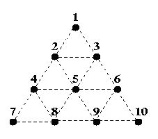
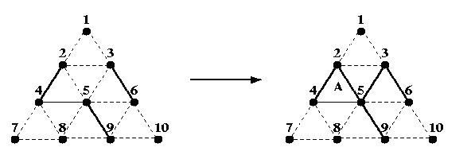

# Triangle War
[POJ1085 ZOJ1155 UVA751 CSU1865]

Triangle War is a two-player game played on the following triangular grid:   
  
Two players, A and B, take turns filling in any dotted line connecting two dots, with A starting first. Once a line is filled, it cannot be filled again. If the line filled by a player completes one or more triangles, she owns the completed triangles and she is awarded another turn (i.e. the opponent skips a turn). The game ends after all dotted lines are filled in, and the player with the most triangles wins the game. The difference in the number of triangles owned by the two players is not important.  
For example, if A fills in the line between 2 and 5 in the partial game on the left below:   
  
Then, she owns the triangle labelled A and takes another turn to fill in the line between 3 and 5. B can now own 3 triangles (if he wishes) by filling in the line between 2 and 3, then the one between 5 and 6, and finally the one between 6 and 9. B would then make one more move before it is A's turn again.  
In this problem, you are given a number of moves that have already been made. From the partial game, you should determine which player will win assuming that each player plays a perfect game from that point on. That is, assume that each player always chooses the play that leads to the best possible outcome for himself/herself. 

对抗搜索+$Alpha-Beta$剪枝。  
但需要注意的是，直接这样搜索会超时。结合动态规划的思想，可以把状态记下来。因为两人在面对同一局面的时候决策是一样的，所以不妨设$F[status]$表示当前状态为$status$的时候，最优决策能够得到的最大分数，记忆化搜索之。

对抗搜索
```cpp
#include<iostream>
#include<cstdio>
#include<cstdlib>
#include<cstring>
#include<algorithm>
using namespace std;

#define ll long long
#define mem(Arr,x) memset(Arr,x,sizeof(Arr))
#define RG register
#define IL inline

const int maxN=20;
const int maxM=20;
const int End=(1<<18)-1;
const int inf=2147483647;

int Id[maxN][maxN];
int Tri[maxN];

int dfs(RG int status,RG int opt,RG int alpha,RG int beta,RG int c1,RG int c2);
void Place(int &status,RG int edge,int &cnt);

int main()
{
	Id[1][2]=1<<0;Id[1][3]=1<<1;Id[2][3]=1<<2;Id[2][4]=1<<3;Id[2][5]=1<<4;Id[3][5]=1<<5;Id[3][6]=1<<6;Id[4][5]=1<<7;Id[5][6]=1<<8;Id[4][7]=1<<9;Id[4][8]=1<<10;Id[5][8]=1<<11;Id[5][9]=1<<12;Id[6][9]=1<<13;Id[6][10]=1<<14;Id[7][8]=1<<15;Id[8][9]=1<<16;Id[9][10]=1<<17;
	Tri[1]=Id[1][2]|Id[1][3]|Id[2][3];
	Tri[2]=Id[2][4]|Id[2][5]|Id[4][5];
	Tri[3]=Id[2][3]|Id[2][5]|Id[3][5];
	Tri[4]=Id[3][5]|Id[3][6]|Id[5][6];
	Tri[5]=Id[4][7]|Id[4][8]|Id[7][8];
	Tri[6]=Id[4][5]|Id[4][8]|Id[5][8];
	Tri[7]=Id[5][8]|Id[5][9]|Id[8][9];
	Tri[8]=Id[5][6]|Id[5][9]|Id[6][9];
	Tri[9]=Id[6][9]|Id[6][10]|Id[9][10];
	//for (int i=1;i<=9;i++) cout<<Tri[i]<<" ";cout<<endl;

	RG int TTT;scanf("%d",&TTT);
	for (RG int ti=1;ti<=TTT;ti++)
	{
		RG int n;
		RG int opt=0,status=0,cnt[2]={0,0};
		scanf("%d",&n);
		for (RG int i=1;i<=n;i++)
		{
			RG int e1,e2;scanf("%d%d",&e1,&e2);
			if (e1>e2) swap(e1,e2);
			RG int c=cnt[opt];
			Place(status,Id[e1][e2],cnt[opt]);
			if (c==cnt[opt]) opt^=1;
		}
		//cout<<opt<<" "<<cnt[0]<<" "<<cnt[1]<<" "<<status<<endl;
		printf("Game %d: %c wins.\n",ti,(dfs(status,opt,-inf,inf,cnt[0],cnt[1])==1)?('A'):('B'));
	}

	return 0;
}

int dfs(RG int status,RG int opt,RG int alpha,RG int beta,RG int c1,RG int c2)
{
	if (c1>=5) return 1;
	if (c2>=5) return -1;
	RG int now=(~status)&End;
	if (opt==0)
	{
		while (now)
		{
			RG int e=(now)&(-now),nst=status;
			RG int c=c1,ret;
			Place(nst,e,c);
			if (c>c1) ret=dfs(nst,opt,alpha,beta,c,c2);
			else ret=dfs(nst,opt^1,alpha,beta,c1,c2);
			if (ret>alpha) alpha=ret;
			if (alpha>=beta) return alpha;
			now-=e;
		}
		return alpha;
	}
	else
	{
		while (now)
		{
			RG int e=(now)&(-now),nst=status;
			RG int c=c2,ret;
			Place(nst,e,c);
			if (c>c2) ret=dfs(nst,opt,alpha,beta,c1,c);
			else ret=dfs(nst,opt^1,alpha,beta,c1,c2);
			if (ret<beta) beta=ret;
			if (beta<=alpha) return beta;
			now-=e;
		}
		return beta;
	}
}

void Place(int &status,RG int edge,int &cnt)
{
	int nstatus=status|edge;
	for (RG int i=1;i<=9;i++)
		if ( ((status&Tri[i])!=Tri[i]) && ((nstatus&Tri[i])==Tri[i])) cnt++;
	status=nstatus;
	return;
}
```

记忆化搜索
```cpp
#include<iostream>
#include<cstdio>
#include<cstdlib>
#include<cstring>
#include<algorithm>
using namespace std;

#define ll long long
#define mem(Arr,x) memset(Arr,x,sizeof(Arr))
#define RG register
#define IL inline

const int maxN=20;
const int maxM=20;
const int End=(1<<18)-1;
const int inf=2147483647;

int Id[maxN][maxN];
int Tri[maxN];
int F[1<<maxM];

int dfs(RG int status);
int Place(int status,RG int edge);

int main()
{
	Id[1][2]=1<<0;Id[1][3]=1<<1;Id[2][3]=1<<2;Id[2][4]=1<<3;Id[2][5]=1<<4;Id[3][5]=1<<5;Id[3][6]=1<<6;Id[4][5]=1<<7;Id[5][6]=1<<8;Id[4][7]=1<<9;Id[4][8]=1<<10;Id[5][8]=1<<11;Id[5][9]=1<<12;Id[6][9]=1<<13;Id[6][10]=1<<14;Id[7][8]=1<<15;Id[8][9]=1<<16;Id[9][10]=1<<17;
	Tri[1]=Id[1][2]|Id[1][3]|Id[2][3];
	Tri[2]=Id[2][4]|Id[2][5]|Id[4][5];
	Tri[3]=Id[2][3]|Id[2][5]|Id[3][5];
	Tri[4]=Id[3][5]|Id[3][6]|Id[5][6];
	Tri[5]=Id[4][7]|Id[4][8]|Id[7][8];
	Tri[6]=Id[4][5]|Id[4][8]|Id[5][8];
	Tri[7]=Id[5][8]|Id[5][9]|Id[8][9];
	Tri[8]=Id[5][6]|Id[5][9]|Id[6][9];
	Tri[9]=Id[6][9]|Id[6][10]|Id[9][10];
	//for (int i=1;i<=9;i++) cout<<Tri[i]<<" ";cout<<endl;

	RG int TTT;scanf("%d",&TTT);
	mem(F,0);
	for (RG int ti=1;ti<=TTT;ti++)
	{
		RG int n;
		RG int opt=0,status=0,score=0;
		scanf("%d",&n);
		for (RG int i=1;i<=n;i++)
		{
			RG int e1,e2;scanf("%d%d",&e1,&e2);
			if (e1>e2) swap(e1,e2);
			int c=Place(status,Id[e1][e2]);
			status|=Id[e1][e2];
			if (c) score+=c*((opt==0)?(1):(-1));
			else opt^=1;
		}
		int ret=dfs(status);
		if (opt==0) score+=ret;
		else score-=ret;
		printf("Game %d: %c wins.\n",ti,((score>0)?('A'):('B')));
	}
	return 0;
}

int dfs(int status)
{
	if (F[status]) return F[status];
	if (status==End) return F[status]=0;
	int now=(~status)&End;
	int Ret=-inf;
	while (now)
	{
		int e=(now)&(-now);
		int c=Place(status,e);
		if (c) Ret=max(Ret,c+dfs(status|e));
		else Ret=max(Ret,-dfs(status|e));
		now-=e;
	}
	return F[status]=Ret;
}

int Place(int status,RG int edge)
{
	int ret=0;
	int nstatus=status|edge;
	for (RG int i=1;i<=9;i++)
		if ( ((status&Tri[i])!=Tri[i]) && ((nstatus&Tri[i])==Tri[i])) ret++;
	return ret;
}
```