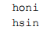
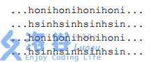

# [BJWC2018]八维
[Luogu4472]

我们将一个M 行N 列的字符矩阵无限复制，可以得到一个无限字符矩阵。例如，对于以下矩阵

可以无限复制出矩阵


我们认为矩阵是八连通的。八连通， 指矩阵中的每个位置与上下左右和四个斜向(左上、右上、左下、右下) 的位置相邻。因此，从矩阵任意位置出发沿八个方向中的任意一个都可以无限延长。  
如果我们随机选择一个位置和一个方向，则可以从此位置开始沿此方向连续选取K 个字符组成一个字符串。问，两次这样操作得到两个相同字符串的概率是多少。(假设随机选择时任意位置是等可能的，任意方向也是等可能的)

注意到数据范围允许枚举每一个位置和每一方向，那么问题就只是如何得到一某一个位置开头的字符串以及如何找到相同的。后一个问题可以直接用 Hash 解决，而对于前一个问题，观察到 K 的数据范围很大但是矩阵是循环的，所以考虑用倍增的方式得到 Hash 值。

```cpp
#include<cstdio>
#include<cstdlib>
#include<cstring>
#include<map>
#include<algorithm>
using namespace std;

#define GetX(x) (((x)%n+n-1)%n+1)
#define GetY(x) (((x)%m+m-1)%m+1)
#define uint unsigned long long
#define ll long long
#define mem(Arr,x) memset(Arr,x,sizeof(Arr))

const int maxN=510;
const int maxBit=30;
const uint base=101;
const int F1[]={-1,-1,-1,0,1,1,1,0};
const int F2[]={-1,0,1,1,1,0,-1,-1};

int n,m,K;
char Input[maxN][maxN];
uint Base[maxBit];
uint Hash[maxBit][maxN][maxN];
map<uint,int> Mp;

int main(){
	Base[0]=base;for (int i=1;i<maxBit;i++) Base[i]=Base[i-1]*Base[i-1];
	scanf("%d%d%d",&n,&m,&K);
	for (int i=1;i<=n;i++) scanf("%s",Input[i]+1);
	for (int f=0;f<8;f++){
		mem(Hash,0);
		for (int i=1;i<=n;i++) for (int j=1;j<=m;j++) Hash[0][i][j]=Input[i][j]-'a'+1;
		for (int b=1;b<maxBit;b++)
			for (int i=1;i<=n;i++)
				for (int j=1;j<=m;j++)
					Hash[b][i][j]=Hash[b-1][i][j]*Base[b-1]+Hash[b-1][GetX(i+F1[f]*(1<<(b-1)))][GetY(j+F2[f]*(1<<(b-1)))];
		for (int i=1;i<=n;i++)
			for (int j=1;j<=m;j++){
				int x=i,y=j;uint hash=0;
				for (int b=maxBit-1;b>=0;b--)
					if (K&(1<<b)) hash=hash*Base[b]+Hash[b][x][y],x=GetX(x+F1[f]*(1<<b)),y=GetY(y+F2[f]*(1<<b));
				++Mp[hash];
			}
	}
	ll cnt=0,all=1ll*n*m*8;all*=all;
	for (map<uint,int>::iterator it=Mp.begin();it!=Mp.end();it++)
		cnt=cnt+1ll*(*it).second*(*it).second;
	ll g=__gcd(cnt,all);cnt/=g;all/=g;
	printf("%lld/%lld\n",cnt,all);return 0;
}
```