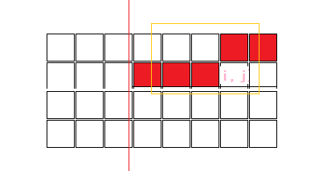

# [SCOI2016]围棋
[BZOJ4572 Luogu3290]

近日，谷歌研发的围棋AI—AlphaGo以4:1的比分战胜了曾经的世界冠军李世石，这是人工智能领域的又一里程碑。  
与传统的搜索式AI不同，AlphaGo使用了最近十分流行的卷积神经网络模型。在卷积神经网络模型中，棋盘上每一块特定大小的区域都被当做一个窗口。例如棋盘的大小为5\*6，窗口大小为2\*4，那么棋盘中共有12个窗口。此外，模型中预先设定了一些模板，模板的大小与窗口的大小是一样的。  
下图展现了一个5\*6的棋盘和两个2\*4的模板。 
对于一个模板，只要棋盘中有某个窗口与其完全匹配，我们称这个模板是被激活的，否则称这个模板没有被激活。  
例如图中第一个模板就是被激活的，而第二个模板就是没有被激活的。我们要研究的问题是：对于给定的模板，有多少个棋盘可以激活它。为了简化问题，我们抛开所有围棋的基本规则，只考虑一个n\*m的棋盘，每个位置只能是黑子、白子或无子三种情况，换句话说，这样的棋盘共有3n\*m种。此外，我们会给出q个2\*c的模板。  
我们希望知道，对于每个模板，有多少种棋盘可以激活它。强调：模板一定是两行的。

轮廓线$DP$。分开作每一个询问，由于直接求有多少个包含不好求，似乎需要容斥，所以不妨反过来求不能激活的方案数。设$F[i][j][S][x][y]$表示在$(i,j)$格，串的第一行与$(i,j)$匹配到了第$x$个字符，与第二行匹配到了第$y$个字符，上一行和这一行的前一部分与模板的第一行能否匹配的状态为$S$。  


然后考虑转移。提前预处理出$KMP$自动机，构建出在每一个位置，后面加一个字符转移到的状态。那么枚举这一位填的状态是什么，把$x,y$分别转移到对应的自动机下一个节点，若到达最后一个，则跳$Next$强制不能选择。但若出现当前点$y$已经匹配到了最后一个，并且上一行能够匹配到模板的第一行的最后一个，则说明如果转移会得到一个匹配，所以不转移。  
$i,j$可以滚动，而$S$实际上只需要记录$m-C$位状态，因为只有这里是有可能出现贡献的。

```cpp
#include<iostream>
#include<cstdio>
#include<cstdlib>
#include<cstring>
#include<algorithm>
using namespace std;

#define ll long long
#define mem(Arr,x) memset(Arr,x,sizeof(Arr))

const int maxN=110;
const int maxM=13;
const int maxAlpha=3;
const int Mod=1e9+7;
const int inf=2147483647;

int n,m,C,Q,U;
char S1[maxM],S2[maxM];
int M[100];
int Next[maxN],ta[maxAlpha][maxN],tb[maxAlpha][maxN];
int F[1<<maxM][maxM][maxM],G[1<<maxM][maxM][maxM];

void Add(int &x,int y);
void clear();
void copy();

int main(){
	M['W']=0;M['B']=1;M['X']=2;
	scanf("%d%d%d%d",&n,&m,&C,&Q);
	U=1<<(m-C+1);
	while (Q--){
		mem(F,0);mem(G,0);mem(ta,0);mem(tb,0);mem(S1,-1);mem(S2,-1);
		scanf(" %s",S1+1);scanf(" %s",S2+1);
		for (int i=1;i<=C;i++) S1[i]=M[S1[i]],S2[i]=M[S2[i]];
		int na,nb;

		Next[0]=Next[1]=0;
		for (int i=2;i<=C;i++){
			int j=Next[i-1];
			while ((j!=0)&&(S1[j+1]!=S1[i])) j=Next[j];
			if (S1[j+1]==S1[i]) j++;Next[i]=j;
		}
		na=Next[C];
		for (int i=0;i<C;i++)
			for (int k=0;k<maxAlpha;k++){
				int now=i;
				while ((now!=0)&&(S1[now+1]!=k)) now=Next[now];
				if (S1[now+1]==k) now++;
				ta[k][i]=now;
			}

		Next[0]=Next[1]=0;
		for (int i=2;i<=C;i++){
			int j=Next[i-1];
			while ((j!=0)&&(S2[j+1]!=S2[i])) j=Next[j];
			if (S2[j+1]==S2[i]) j++;Next[i]=j;
		}
		nb=Next[C];
		for (int i=0;i<=C;i++)
			for (int k=0;k<maxAlpha;k++){
				int now=i;
				while ((now!=0)&&(S2[now+1]!=k)) now=Next[now];
				if (S2[now+1]==k) now++;
				tb[k][i]=now;
			}

		F[0][0][0]=1;
		for (int i=1;i<=n;i++){
			clear();
			for (int S=0;S<U;S++)
				for (int x=0;x<C;x++)
					for (int y=0;y<C;y++)
						Add(G[S][0][0],F[S][x][y]);
			copy();
			for (int j=1;j<=m;j++){
				clear();
				for (int S=0;S<U;S++)
					for (int x=0;x<C;x++)
						for (int y=0;y<C;y++)
							if (F[S][x][y])
								for (int k=0;k<maxAlpha;k++){
									int nS=S,nx=ta[k][x],ny=tb[k][y];
									if ((j>=C)&&(nS&(1<<(j-C)))) nS^=(1<<(j-C));
									if (nx==C) nS|=(1<<(j-C)),nx=na;
									if (ny==C){
										if (S&(1<<(j-C))) continue;
										ny=nb;
									}
									Add(G[nS][nx][ny],F[S][x][y]);
								}
				copy();
			}
		}
		int ans=1;for (int i=1;i<=n;i++) for (int j=1;j<=m;j++) ans=1ll*ans*3ll%Mod;
		for (int S=0;S<U;S++) for (int x=0;x<C;x++) for (int y=0;y<C;y++) ans=(ans-F[S][x][y]+Mod)%Mod;

		printf("%d\n",ans);
	}
	return 0;
}

void Add(int &x,int y){
	x=(x+y)%Mod;return;
}

void clear(){
	for (int S=0;S<U;S++) for (int i=0;i<C;i++) for (int j=0;j<C;j++) G[S][i][j]=0;
	return;
}

void copy(){
	for (int S=0;S<U;S++) for (int i=0;i<C;i++) for (int j=0;j<C;j++) F[S][i][j]=G[S][i][j];
	return;
}
```