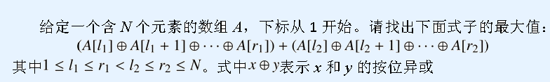

# REBXOR
[BZOJ4260 Codechef REBXOR]



分别用 01Trie 树求左边的前缀 max 和右边的后缀 max ，枚举断点组合答案。

```cpp
#include<iostream>
#include<cstdio>
#include<cstdlib>
#include<cstring>
#include<algorithm>
using namespace std;

#define ll long long
#define mem(Arr,x) memset(Arr,x,sizeof(Arr))

const int maxN=404000;
const int maxBit=32;
const int inf=2147483647;

int n;
int Seq[maxN];
int nodecnt=1,rt=1,son[2][maxN*maxBit];
int Lx[maxN],Rx[maxN];

void Insert(int key);
int Query(int key);

int main(){
	scanf("%d",&n);
	for (int i=1;i<=n;i++) scanf("%d",&Seq[i]);

	rt=nodecnt=1;
	Insert(0);
	for (int i=1,sum=0;i<=n;i++){
		sum^=Seq[i];
		Lx[i]=max(Lx[i-1],Query(sum));
		Insert(sum);
	}

	rt=nodecnt=1;mem(son,0);
	Insert(0);
	for (int i=n,sum=0;i>=1;i--){
		sum^=Seq[i];
		Rx[i]=max(Rx[i+1],Query(sum));
		Insert(sum);
	}

	int Ans=0;
	for (int i=1;i<n;i++) Ans=max(Ans,Lx[i]+Rx[i+1]);
	printf("%d\n",Ans);return 0;
}

void Insert(int key){
	int now=rt;
	for (int i=maxBit-1;i>=0;i--){
		int b=(key&(1<<i))!=0;
		if (son[b][now]==0) son[b][now]=++nodecnt;
		now=son[b][now];
	}
	return;
}

int Query(int key){
	int now=rt,ret=0;
	for (int i=maxBit-1;i>=0;i--){
		int b=(key&(1<<i))!=0;
		if (son[b^1][now]) ret|=(1<<i),now=son[b^1][now];
		else now=son[b][now];
	}
	return ret;
}
```