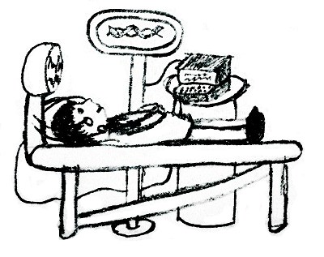

# Arpa’s abnormal DNA and Mehrdad’s deep interest
[CF741E]

All of us know that girls in Arpa’s land are... ok, you’ve got the idea :D  
Anyone knows that Arpa isn't a normal man, he is ... well, sorry, I can't explain it more. Mehrdad is interested about the reason, so he asked Sipa, one of the best biology scientists in Arpa's land, for help. Sipa has a DNA editor.



Sipa put Arpa under the DNA editor. DNA editor showed Arpa's DNA as a string S consisting of n lowercase English letters. Also Sipa has another DNA T consisting of lowercase English letters that belongs to a normal man.  
Now there are (n + 1) options to change Arpa's DNA, numbered from 0 to n. i-th of them is to put T between i-th and (i + 1)-th characters of S (0 ≤ i ≤ n). If i = 0, T will be put before S, and if i = n, it will be put after S.  
Mehrdad wants to choose the most interesting option for Arpa's DNA among these n + 1 options. DNA A is more interesting than B if A is lexicographically smaller than B. Mehrdad asked Sipa q questions:  
Given integers l, r, k, x, y, what is the most interesting option if we only consider such options i that l ≤ i ≤ r andIf there are several most interesting options, Mehrdad wants to know one with the smallest number i.  
Since Sipa is a biology scientist but not a programmer, you should help him.

给定一个串 S 和一个串 T ，构造 $S _ i,i \in [0,|S|]$ 为把 T 插入到 S 的第 $i$ 位后形成的串。每次询问 $l,r,x,y,k$，求满足 $l \le i \le r,x \le i  \le y \pmod k$ 中字典序最小的 $S _ i$ 。

首先考虑如何比较字典序，根据插入的 T 的位置分段，从第一个开始比较，那么问题就变成两个串的 lcs 问题，这个可以提前预处理 SA 然后 O(1) 判断。推荐的做法是直接按照这个比较方式给位置排序，这样下面的问题就转化为区间 rmq 了。  
然后考虑回答询问。考虑离线下来对 K 分类讨论。对于大于 $\sqrt{n}$ 的 K ，显然这样的块只会出现最多 $\sqrt{n}$ 次，那么预先预处理出一个 ST 表来直接查询。对于小于 $\sqrt{n}$ 的，考虑枚举 $i \in [0,\sqrt{n}]$ ，回答那些 $x \le i  \le y \pmod k$ 的询问，这里同样也是一个 ST 表。如果要保证复杂度的正确，这里应该使用 $O(n)-O(1)$ 的 ST 表，这样复杂度就是 $O(n\log n+(Q+n)\sqrt{n})$ 的了。

```cpp
#include<cstdio>
#include<cstdlib>
#include<cstring>
#include<algorithm>
#include<vector>
#include<iostream>
#include<cmath>
using namespace std;

#define mem(Arr,x) memset(Arr,x,sizeof(Arr))
#define pow2(x) (1<<(x))

const int maxN=101000*2;
const int maxBit=20;
const int maxSqrt=300;
const int inf=2147483647;

class Question{
public:
    int l,r,x,y,id;
};

char S[maxN],T[maxN];
int L,L1,L2,SA[maxN],SSA[maxN],Rk[maxN],A[maxN],B[maxN],CA[maxN],CB[maxN],Height[maxBit][maxN];
int Lg2[maxN],Id[maxN],Sorter[maxN];
int Seq[maxBit][maxN],Ans[maxN];
vector<Question> Qn[maxN];

void GetSA();
int GetLcp(int u,int v);
bool cmp(int a,int b);
int GetMin(int l,int r);

int main(){
    for (int i=1;i<maxN;i++) Lg2[i]=log2(i);
    scanf("%s",S+1);scanf("%s",T+1);L1=strlen(S+1);L2=strlen(T+1);L=L1+L2;
    for (int i=1;i<=L2;i++) S[L1+i]=T[i];

    GetSA();

    for (int i=0;i<=L1;i++) Sorter[i]=i;
    sort(&Sorter[0],&Sorter[L1+1],cmp);
    for (int i=0;i<=L1;i++) Id[Sorter[i]]=i;
    
    for (int i=0;i<=L1;i++) Seq[0][i]=Id[i];
    for (int i=1;i<maxBit;i++)
	for (int j=0;j+pow2(i)-1<=L1;j++)
	    Seq[i][j]=min(Seq[i-1][j],Seq[i-1][j+pow2(i-1)]);

    int Q;scanf("%d",&Q);
    for (int qi=1;qi<=Q;qi++){
	int l,r,k,x,y;scanf("%d%d%d%d%d",&l,&r,&k,&x,&y);
	Ans[qi]=inf;
	if (k==1) Ans[qi]=min(Ans[qi],GetMin(l,r));
	if (k>=maxSqrt){
	    for (int i=x,j=y;i<=L1;i+=k,j+=k){
		Ans[qi]=min(Ans[qi],GetMin(max(i,l),min(j,r)));
	    }
	}
	else Qn[k].push_back((Question){l,r,x,y,qi});
    }
    for (int K=2;K<maxSqrt;K++)
	if (Qn[K].size())
	    for (int md=0;md<K;md++){
		int cnt=-1;
		for (int i=md;i<=L1;i+=K) Seq[0][++cnt]=Id[i];
		for (int i=1;i<maxBit;i++)
		    for (int j=0;j+pow2(i)-1<=cnt;j++)
			Seq[i][j]=min(Seq[i-1][j],Seq[i-1][j+pow2(i-1)]);
		for (int i=0,sz=Qn[K].size();i<sz;i++)
		    if ((Qn[K][i].x<=md)&&(Qn[K][i].y>=md)){
			int L=Qn[K][i].l,R=Qn[K][i].r;
			if (L%K>md) L=L+K-(L%K-md);
			else L=L+md-L%K;
			if (R%K<md) R=R-K+md-R%K;
			else R=R-(R%K-md);
			
			if (L>R) continue;
			L=(L-md)/K;R=(R-md)/K;
			
			if (L<=R) Ans[Qn[K][i].id]=min(Ans[Qn[K][i].id],GetMin(L,R));
		    }
	    }
    for (int i=1;i<=Q;i++)
	if (Ans[i]==inf) printf("-1 ");
	else printf("%d ",Sorter[Ans[i]]);
    return 0;
}

void GetSA(){
    for (int i=1;i<=L;i++) CA[S[i]]++;
    for (int i=1;i<maxN;i++) CA[i]+=CA[i-1];
    for (int i=L;i>=1;i--) SA[CA[S[i]]--]=i;
    Rk[SA[1]]=1;
    for (int i=2;i<=L;i++){
	Rk[SA[i]]=Rk[SA[i-1]];
	if (S[SA[i]]!=S[SA[i-1]]) Rk[SA[i]]++;
    }
    for (int len=1;Rk[SA[L]]!=L;len<<=1){
	mem(CA,0);mem(CB,0);
	for (int i=1;i<=L;i++) ++CA[A[i]=Rk[i]],++CB[B[i]=(i+len<=L)?Rk[i+len]:0];
	for (int i=1;i<maxN;i++) CA[i]+=CA[i-1],CB[i]+=CB[i-1];
	for (int i=L;i>=1;i--) SSA[CB[B[i]]--]=i;
	for (int i=L;i>=1;i--) SA[CA[A[SSA[i]]]--]=SSA[i];
	Rk[SA[1]]=1;
	for (int i=2;i<=L;i++){
	    Rk[SA[i]]=Rk[SA[i-1]];
	    if ((A[SA[i]]!=A[SA[i-1]])||(B[SA[i]]!=B[SA[i-1]])) ++Rk[SA[i]];
	}
    }
    for (int i=1,j=0;i<=L;i++){
	if (j) --j;
	while (S[i+j]==S[SA[Rk[i]-1]+j]) ++j;
	Height[0][Rk[i]]=j;
    }
    for (int i=1;i<20;i++)
	for (int j=1;j+pow2(i-1)<=L;j++)
	    Height[i][j]=min(Height[i-1][j],Height[i-1][j+pow2(i-1)]);
    return;
}
int GetLcp(int u,int v){
    if (u==v) return L1+L2-u+1;
    u=Rk[u];v=Rk[v];if (u>v) swap(u,v);
    ++u;int lg=Lg2[v-u+1];
    return min(Height[lg][u],Height[lg][v-pow2(lg)+1]);
}
bool cmp(int a,int b){
    if (a==b) return 0;
    int lcp=0,opt=(a>b);if (a>b) swap(a,b);
    if (b-a>=L2){
	lcp=GetLcp(L1+1,a+1);
	if (lcp<L2) return (S[L1+1+lcp]<S[a+1+lcp])^opt;
	lcp=GetLcp(a+1,a+L2+1);
	if (lcp<b-L2-a) return (S[a+1+lcp]<S[a+L2+1+lcp])^opt;
	lcp=GetLcp(b-L2+1,L1+1);
	if (lcp<L2) return (S[b-L2+1+lcp]<S[L1+1+lcp])^opt;
	return opt^1;
    }
    else{
	lcp=GetLcp(L1+1,a+1);
	if (lcp<b-a) return (S[L1+1+lcp]<S[a+1+lcp])^opt;
	lcp=GetLcp(L1+1+b-a,L1+1);
	if (lcp<a+L2-b) return (S[L1+1+b-a+lcp]<S[L1+1+lcp])^opt;
	lcp=GetLcp(a+1,L1+1+a+L2-b);
	if (lcp<b-a) return (S[a+1+lcp]<S[L1+1+a+L2-b+lcp])^opt;
    }
    return (a<b)^opt;
}
int GetMin(int l,int r){
    if (l>r) return inf;
    int lg=Lg2[r-l+1];
    return min(Seq[lg][l],Seq[lg][r-pow2(lg)+1]);
}

```