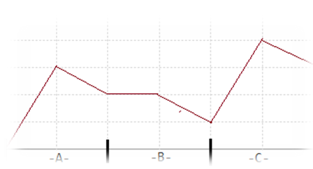

# 股市的预测
[BZOJ2119]

墨墨的妈妈热爱炒股，她要求墨墨为她编写一个软件，预测某只股票未来的走势。股票折线图是研究股票的必备工具，它通过一张时间与股票的价位的函数图像清晰地展示了股票的走势情况。经过长时间的观测，墨墨发现很多股票都有如下的规律：之前的走势很可能在短时间内重现！如图可以看到这只股票A部分的股价和C部分的股价的走势如出一辙。通过这个观测，墨墨认为他可能找到了一个预测股票未来走势的方法。进一步的研究可是难住了墨墨，他本想试图统计B部分的长度与发生这种情况的概率关系，不过由于数据量过于庞大，依赖人脑的力量难以完成，于是墨墨找到了善于编程的你，请你帮他找一找给定重现的间隔（B部分的长度），有多少个时间段满足首尾部分的走势完全相同呢？当然，首尾部分的长度不能为零。  


相当于是给定中间一段长度不能选，前后选择一段相同的。那么可以枚举长度，然后每隔长度个设置断点，那么合法的一定就会跨过相邻两个断点，所以对相邻断点求$lcp,lcs$，组合答案。

```cpp
#include<iostream>
#include<cstdio>
#include<cstdlib>
#include<cstring>
#include<algorithm>
#include<cmath>
using namespace std;

#define ll long long
#define mem(Arr,x) memset(Arr,x,sizeof(Arr))

const int maxN=50100*2;
const int maxBit=21;
const int inf=2147483647;

int n,K,S[maxN];
int Log2[maxN],Appr[maxN];

class SA
{
public:
	int Num[maxN];
	int A[maxN],B[maxN],CntA[maxN],CntB[maxN];
	int SA[maxN],SSA[maxN],Rank[maxN],Height[maxBit][maxN];

	void GetSA(){
		for (int i=1;i<=n;i++) CntA[Num[i]]++;
		for (int i=1;i<maxN;i++) CntA[i]+=CntA[i-1];
		for (int i=n;i>=1;i--) SA[CntA[Num[i]]--]=i;
		Rank[SA[1]]=1;
		for (int i=2;i<=n;i++){
			Rank[SA[i]]=Rank[SA[i-1]];
			if (Num[SA[i]]!=Num[SA[i-1]]) Rank[SA[i]]++;
		}
		for (int i=1;Rank[SA[n]]!=n;i<<=1){
			mem(CntA,0);mem(CntB,0);
			for (int j=1;j<=n;j++){
				CntA[A[j]=Rank[j]]++;
				CntB[B[j]=((i+j<=n)?(Rank[i+j]):(0))]++;
			}
			for (int j=1;j<maxN;j++) CntA[j]+=CntA[j-1],CntB[j]+=CntB[j-1];
			for (int j=n;j>=1;j--) SSA[CntB[B[j]]--]=j;
			for (int j=n;j>=1;j--) SA[CntA[A[SSA[j]]]--]=SSA[j];
			Rank[SA[1]]=1;
			for (int j=2;j<=n;j++){
				Rank[SA[j]]=Rank[SA[j-1]];
				if ((A[SA[j]]!=A[SA[j-1]])||(B[SA[j]]!=B[SA[j-1]])) Rank[SA[j]]++;
			}
		}

		for (int i=1,j=0;i<=n;i++){
			while (Num[i+j]==Num[SA[Rank[i]-1]+j]) j++;
			Height[0][Rank[i]]=j;
			if (j) j--;
		}

		for (int i=1;i<maxBit;i++)
			for (int j=1;j+(1<<(i-1))<=n;j++)
				Height[i][j]=min(Height[i-1][j],Height[i-1][j+(1<<(i-1))]);

		//for (int i=1;i<=n;i++) cout<<Num[i]<<" ";cout<<endl;
		//for (int i=1;i<=n;i++) cout<<Rank[i]<<" ";cout<<endl;
		//for (int i=1;i<=n;i++) cout<<SA[i]<<" ";cout<<endl;
		//for (int i=1;i<=n;i++) cout<<Height[0][i]<<" ";cout<<endl<<endl;
		return;
	}

	int LCP(int p1,int p2){
		if ((p1<0)||(p1>n)||(p2<0)||(p2>n)) return 0;
		//cout<<"GetLCP:"<<p1<<" "<<p2<<endl;
		p1=Rank[p1];p2=Rank[p2];
		if (p1>p2) swap(p1,p2);
		//cout<<p1<<" "<<p2<<endl;
		int lg=Log2[p2-p1];
		return min(Height[lg][p1+1],Height[lg][p2-(1<<lg)+1]);
	}
};

SA A,B;

int main()
{
	for (int i=1;i<maxN;i++) Log2[i]=log2(i);
	
	scanf("%d%d",&n,&K);
	for (int i=1;i<=n;i++) scanf("%d",&S[i]);
	for (int i=1;i<n;i++) S[i]=S[i+1]-S[i];
	n--;
	for (int i=1;i<=n;i++) Appr[i]=S[i];
	sort(&Appr[1],&Appr[n+1]);int numcnt=unique(&Appr[1],&Appr[n+1])-Appr-1;
	for (int i=1;i<=n;i++) S[i]=lower_bound(&Appr[1],&Appr[numcnt+1],S[i])-Appr;
	for (int i=1;i<=n;i++) A.Num[i]=S[i],B.Num[n-i+1]=S[i];

	A.GetSA();B.GetSA();

	ll Ans=0;
	for (int len=1;len<=n;len++)
		for (int i=len;i<=n;i+=len){
			int j=i+len+K;
			if (j>n) continue;
			int a=A.LCP(i,j),b=B.LCP(n-i+2,n-j+2);
			a=min(a,len);b=min(b,len-1);
			Ans=Ans+max(0,a+b-len+1);
		}

	printf("%lld\n",Ans);
	return 0;
}
```