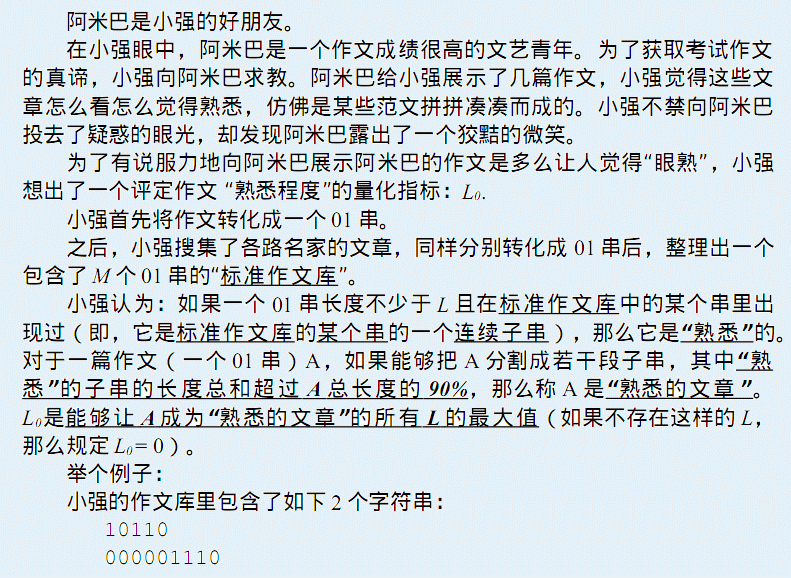
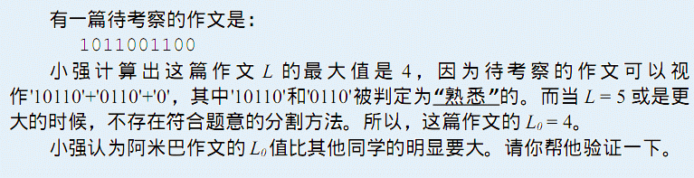

# [CTSC2012]熟悉的文章
[BZOJ2806 Luogu4022]

  


利用后缀自动机可以得到待考察的作文的每一个位置结尾的最长能匹配的长度。二分$L$，那么有转移方程$F[i]=max(F[i-1],F[j]+i-j)$其中$j \in [i-Mx[i],i-L]$，可以看出这个是单调的，用单调队列维护。

```cpp
#include<iostream>
#include<cstdio>
#include<cstring>
#include<cstdlib>
#include<algorithm>
using namespace std;

#define ll long long
#define ld long double
#define mem(Arr,x) memset(Arr,x,sizeof(Arr))

const int maxN=1100000;
const int maxAlpha=3;
const ld eps=1e-8;
const int inf=2147483647;

class Node
{
public:
	int son[maxAlpha];
	int fa,len;
};

int n,m,len;
int nodecnt=1,root=1,last=1;
Node S[maxN];
char str[maxN];
int Mx[maxN],Q[maxN],F[maxN];

void Insert(int c);
bool Check(int limit);

int main()
{
	scanf("%d%d",&n,&m);
	for (int i=1;i<=m;i++)
	{
		scanf("%s",str+1);
		last=1;int l=strlen(str+1);
		for (int i=1;i<=l;i++) Insert(str[i]-'0');
		Insert(2);
	}
	//cout<<"Input over!"<<endl;
	while (n--)
	{
		scanf("%s",str+1);
		len=strlen(str+1);

		int now=root;
		int L=0,R=0,Ans=0;
		int nowl=0;
		for (int i=1;i<=len;i++)
		{
			while ((now!=0)&&(S[now].son[str[i]-'0']==0)) now=S[now].fa,nowl=S[now].len;
			if (now==0){
				for (;i<=len;i++) Mx[i]=0;break;
			}
			now=S[now].son[str[i]-'0'];nowl++;
			Mx[i]=nowl;R=max(R,Mx[i]);
		}

		//cout<<"Mx:";for (int i=1;i<=len;i++) cout<<Mx[i]<<" ";cout<<endl;

		do
		{
			//cout<<"("<<L<<","<<R<<")"<<endl;
			int mid=(L+R)>>1;
			if (Check(mid)) Ans=mid,L=mid+1;
			else R=mid-1;
		}
		while (L<=R);

		printf("%d\n",Ans);
	}
	return 0;
}

void Insert(int c)
{
	if ((S[last].son[c]!=0)&&(S[last].len+1==S[S[last].son[c]].len)){
		last=S[last].son[c];return;
	}
	int np=++nodecnt,p=last;last=nodecnt;
	S[np].len=S[p].len+1;
	while ((p!=0)&&(S[p].son[c]==0)) S[p].son[c]=np,p=S[p].fa;
	if (p==0) S[np].fa=root;
	else
	{
		int q=S[p].son[c];
		if (S[p].len+1==S[q].len) S[np].fa=q;
		else
		{
			int nq=++nodecnt;S[nq]=S[q];S[nq].len=S[p].len+1;
			S[q].fa=S[np].fa=nq;
			while ((p!=0)&&(S[p].son[c]==q)) S[p].son[c]=nq,p=S[p].fa;
		}
	}
	return;
}

bool Check(int limit)
{
	//cout<<"Check:"<<limit<<endl;
	int L=1,R=1;
	for (int i=0;i<limit;i++) F[i]=0;
	for (int i=limit;i<=len;i++)
	{
		while ((L<=R)&&(F[Q[R]]+i-Q[R]<=F[i-limit]+limit)) R--;
		Q[++R]=i-limit;
		while ((L<=R)&&(Q[L]<i-Mx[i])) L++;
		//cout<<Q[L]<<" -> "<<i<<" "<<i-Mx[i]<<endl;
		F[i]=F[i-1];
		if (L<=R) F[i]=max(F[i],F[Q[L]]+i-Q[L]);
	}
	//for (int i=1;i<=len;i++) cout<<F[i]<<" ";cout<<endl;
	//cout<<(ld)len*(ld)0.90<<" ? "<<F[len]<<" "<<((ld)1.0*(ld)F[len]+eps>=(ld)len*(ld)0.90)<<endl;
	return (ld)1.0*(ld)F[len]+eps>=(ld)len*(ld)0.90;
}
```