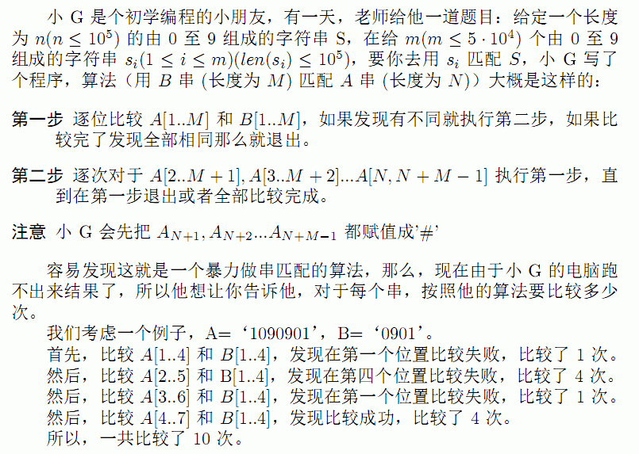

# 匹配
[BZOJ3413]



可以发现，要求的是 S 串与询问串一直到第一次匹配的所有前缀的 lcp 。倒过来转化为后缀，那么就是最后一次匹配后面所有的后缀与询问串的 lcs 。
匹配得到最后一次的匹配位置，然后一直跳 fail 树查找 endpos 在最后一次匹配右边的累计答案。线段树合并预处理出 endpos 。

```cpp
#include<cstdio>
#include<cstdlib>
#include<cstring>
#include<algorithm>
#include<vector>
#include<iostream>
using namespace std;

typedef long long ll;
const int maxN=101000*2;
const int Alpha=10;

class SAM{
    public:
    int son[Alpha],fail,len,pos;
};
class SegmentData{
    public:
    int ls,rs,cnt;
};

int n,m,smcnt=1,lst=1,sgcnt=0,rt[maxN];
char In[maxN];
SAM Sm[maxN];
SegmentData Sg[maxN*20];
vector<int> T[maxN];

void Insert(int c,int id);
void Modify(int &x,int l,int r,int p);
int Merge(int x,int y);
int Query(int x,int l,int r,int ql,int qr);
int Querymx(int x,int l,int r);
void dfs_init(int u);
int main(){
    scanf("%d",&n);scanf("%s",In+1);reverse(&In[1],&In[n+1]);
    for (int i=1;i<=n;i++) Insert(In[i]-'0',i);

    for (int i=2;i<=smcnt;i++) T[Sm[i].fail].push_back(i);
    dfs_init(1);
    scanf("%d",&m);
    while (m--){
        scanf("%s",In+1);int len=strlen(In+1);reverse(&In[1],&In[len+1]);
        int now=1,match=0;
        for (int p=1;p<=len;p++){
            int c=In[p]-'0';
            while (now&&!Sm[now].son[c]) now=Sm[now].fail,match=Sm[now].len;
            if (now==0){
                now=1;match=0;continue;
            }
            now=Sm[now].son[c];++match;
        }
        int limit=1;ll Ans=0;
        if (match==len) limit=Querymx(rt[now],1,n),Ans=n-limit;
        else Ans=n-limit+1;
        while (now){
            if (Sm[Sm[now].fail].len+1<=match) Ans=Ans+1ll*(min(Sm[now].len,match)-Sm[Sm[now].fail].len)*Query(rt[now],1,n,limit,n);
            now=Sm[now].fail;
        }
        printf("%lld\n",Ans);
    }
    return 0;
}
void Insert(int c,int id){
    int np=++smcnt,p=lst;lst=smcnt;
    Sm[np].len=Sm[p].len+1;Sm[np].pos=id;Modify(rt[lst],1,n,id);
    while (p&&Sm[p].son[c]==0) Sm[p].son[c]=np,p=Sm[p].fail;
    if (p==0) Sm[np].fail=1;
    else{
        int q=Sm[p].son[c];
        if (Sm[q].len==Sm[p].len+1) Sm[np].fail=q;
        else{
            int nq=++smcnt;Sm[nq]=Sm[q];Sm[nq].len=Sm[p].len+1;
            Sm[np].fail=Sm[q].fail=nq;
            while (p&&Sm[p].son[c]==q) Sm[p].son[c]=nq,p=Sm[p].fail;
        }
    }
    return;
}
void Modify(int &x,int l,int r,int p){
    Sg[++sgcnt]=Sg[x];x=sgcnt;++Sg[x].cnt;
    if (l==r) return;
    int mid=(l+r)>>1;if (p<=mid) Modify(Sg[x].ls,l,mid,p);else Modify(Sg[x].rs,mid+1,r,p);
    return;
}
int Merge(int x,int y){
    if (!x||!y) return x+y;
    int z=++sgcnt;Sg[z].cnt=Sg[x].cnt+Sg[y].cnt;
    Sg[z].ls=Merge(Sg[x].ls,Sg[y].ls);Sg[z].rs=Merge(Sg[x].rs,Sg[y].rs);
    return z;
}
int Query(int x,int l,int r,int ql,int qr){
    if (x==0) return 0;
    if (l==ql&&r==qr) return Sg[x].cnt;
    int mid=(l+r)>>1;
    if (qr<=mid) return Query(Sg[x].ls,l,mid,ql,qr);
    else if (ql>=mid+1) return Query(Sg[x].rs,mid+1,r,ql,qr);
    else return Query(Sg[x].ls,l,mid,ql,mid)+Query(Sg[x].rs,mid+1,r,mid+1,qr);
}
int Querymx(int x,int l,int r){
    if (l==r) return l;int mid=(l+r)>>1;
    if (Sg[x].rs) return Querymx(Sg[x].rs,mid+1,r);
    return Querymx(Sg[x].ls,l,mid);
}
void dfs_init(int u){
    for (int i=0,sz=T[u].size();i<sz;i++) dfs_init(T[u][i]),rt[u]=Merge(rt[u],rt[T[u][i]]);
    return;
}
```