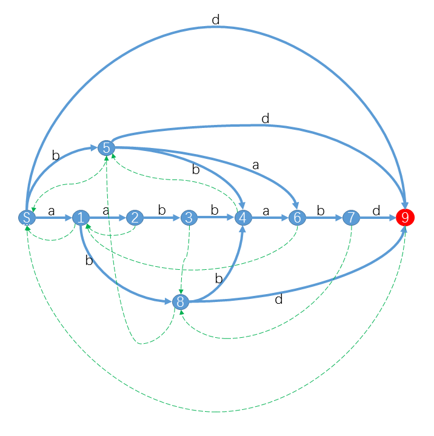

# 后缀自动机一·基本概念
[hihocoder1441]

小Hi：今天我们来学习一个强大的字符串处理工具：后缀自动机（Suffix Automaton，简称SAM）。对于一个字符串S，它对应的后缀自动机是一个最小的确定有限状态自动机（DFA），接受且只接受S的后缀。  
小Hi：比如对于字符串S="aabbabd"，它的后缀自动机是：
  
其中红色状态是终结状态。你可以发现对于S的后缀，我们都可以从S出发沿着字符标示的路径（蓝色实线）转移，最终到达终结状态。例如"bd"对应的路径是S59，"abd"对应的路径是S189，"abbabd"对应的路径是S184679。而对于不是S后缀的字符串，你会发现从S出发，最后会到达非终结状态或者“无路可走”。特别的，对于S的子串，最终会到达一个合法状态。例如"abba"路径是S1846，"bbab"路径是S5467。而对于其他不是S子串的字符串，最终会“无路可走”。 例如"aba"对应S18X，"aaba"对应S123X。（X表示没有转移匹配该字符）  
小Ho：好像很厉害的样子！对于任意字符串都能构造出一个SAM吗？另外图中那些绿色虚线是什么？  
小Hi：是的，任意字符串都能构造出一个SAM。我们知道SAM本质上是一个DFA，DFA可以用一个五元组 <字符集，状态集，转移函数、起始状态、终结状态集>来表示。下面我们将依次介绍对于一个给定的字符串S如何确定它对应的 状态集 和 转移函数 。至于那些绿色虚线虽然不是DFA的一部分，却是SAM的重要部分，有了这些链接SAM是如虎添翼，我们后面再细讲。  
小Hi：这一节我们将介绍给定一个字符串S，如何确定S对应的SAM有哪些状态。首先我们先介绍一个概念 子串的结束位置集合 endpos。对于S的一个子串s，endpos(s) = s在S中所有出现的结束位置集合。还是以S="aabbabd"为例，endpos("ab") = {3, 6}，因为"ab"一共出现了2次，结束位置分别是3和6。同理endpos("a") = {1, 2, 5}, endpos("abba") = {5}。  
小Hi：我们把S的所有子串的endpos都求出来。如果两个子串的endpos相等，就把这两个子串归为一类。最终这些endpos的等价类就构成的SAM的状态集合。例如对于S="aabbabd"：
 
|状态|子串|endpos|
|--|--|--|
|S|空串|{0,1,2,3,4,5,6}|
|1|a|{1,2,5}|
|2|aa|{2}|
|3|aab|{3}|
|4|aabb,abb,bb|{4}|
|5|b|{3,4,6}|  
|6|aabba,abba,bba,ba|{5}|  
|7|aabbab,abbab,bbab,bab|{6}|
|8|ab|{3,6}|
|9|aabbabd,abbabd,bbabd,babd,abd,bd,d|{7}|

小Ho：这些状态恰好就是上面SAM图中的状态。  
小Hi：没错。此外，这些状态还有一些美妙的性质，且等我一一道来。首先对于S的两个子串s1和s2，不妨设length(s1) <= length(s2)，那么 s1是s2的后缀当且仅当endpos(s1) ⊇ endpos(s2)，s1不是s2的后缀当且仅当endpos(s1) ∩ endpos(s2) = ∅。  
小Ho：我验证一下啊... 比如"ab"是"aabbab"的后缀，而endpos("ab")={3,6}，endpos("aabbab")={6}，是成立的。"b"是"ab"的后缀，endpos("b")={3,4,6}, endpos("ab")={3,6}也是成立的。"ab"不是"abb"的后缀，endpos("ab")={3,6}，endpos("abb")={4}，两者没有交集也是成立的。怎么证明呢？  
小Hi：证明还是比较直观的。首先证明s1是s2的后缀=>endpos(s1) ⊇ endpos(s2)：既然s1是s2后缀，所以每次s2出现时s1以必然伴随出现，所以有endpos(s1) ⊇ endpos(s2)。再证明endpos(s1) ⊇ endpos(s2)=>s1是s2的后缀：我们知道对于S的子串s2，endpos(s2)不会是空集，所以endpos(s1) ⊇ endpos(s2)=>存在结束位置x使得s1结束于x，并且s2也结束于x，又length(s1) <= length(s2)，所以s1是s2的后缀。综上我们可知s1是s2的后缀当且仅当endpos(s1) ⊇ endpos(s2)。s1不是s2的后缀当且仅当endpos(s1) ∩ endpos(s2) = ∅是一个简单的推论，不再赘述。  
小Ho：我好像对SAM的状态有一些认识了！我刚才看上面的表格就觉得SAM的一个状态里包含的子串好像有规律。考虑到SAM中的一个状态包含的子串都具有相同的endpos，那它们应该都互为后缀？  
小Hi：你观察力还挺敏锐的。下面我们就来讲讲一个状态包含的子串究竟有什么关系。上文提到我们把S的所有子串按endpos分类，每一类就代表一个状态，所以我们可以认为一个状态包含了若干个子串。我们用substrings(st)表示状态st中包含的所有子串的集合，longest(st)表示st包含的最长的子串，shortest(st)表示st包含的最短的子串。例如对于状态7，substring(7)={aabbab,abbab,bbab,bab}，longest(7)=aabbab，shortest(7)=bab。  
小Hi：对于一个状态st，以及任意s∈substrings(st)，都有s是longest(st)的后缀。证明比较容易，因为endpos(s)=endpos(longest(st))，所以endpos(s) ⊇ endpos(longest(st))，根据我们刚才证明的结论有s是longest(st)的后缀。  
小Hi：此外，对于一个状态st，以及任意的longest(st)的后缀s，如果s的长度满足：length(shortest(st)) <= length(s) <= length(longsest(st))，那么s∈substrings(st)。 证明也是比较容易，因为：length(shortest(st)) <= length(s) <= length(longsest(st))，所以endpos(shortest(st)) ⊇ endpos(s) ⊇ endpos(longest(st))， 又endpos(shortest(st)) = endpos(longest(st))，所以endpos(shortest(st)) = endpos(s) = endpos(longest(st))，所以s∈substrings(st)。  
小Ho：这么说来，substrings(st)包含的是longest(st)的一系列连续后缀？  
小Hi：没错。比如你看状态7中包含的就是aabbab的长度分别是6，5，4，3的后缀；状态6包含的是aabba的长度分别是5，4，3，2的后缀。    
小Hi：前面我们讲到substrings(st)包含的是longest(st)的一系列连续后缀。这连续的后缀在某个地方会“断掉”。比如状态7，包含的子串依次是aabbab,abbab,bbab,bab。按照连续的规律下一个子串应该是"ab"，但是"ab"没在状态7里，你能想到这是为什么么？  
小Ho：aabbab,abbab,bbab,bab的endpos都是{6}，下一个"ab"当然也在结束位置6出现过，但是"ab"还在结束位置3出现过，所以"ab"比aabbab,abbab,bbab,bab出现次数更多，于是就被分配到一个新的状态中了。  
小Hi：没错，当longest(st)的某个后缀s在新的位置出现时，就会“断掉”，s会属于新的状态。比如上例中"ab"就属于状态8，endpos("ab"}={3,6}。当我们进一步考虑"ab"的下一个后缀"b"时，也会遇到相同的情况："b"还在新的位置4出现过，所以endpos("b")={3,4,6}，b属于状态5。在接下去处理"b"的后缀我们会遇到空串，endpos("")={0,1,2,3,4,5,6}，状态是起始状态S。  
小Hi：于是我们可以发现一条状态序列：7->8->5->S。这个序列的意义是longest(7)即aabbab的后缀依次在状态7、8、5、S中。我们用Suffix Link这一串状态链接起来，这条link就是上图中的绿色虚线。  
小Ho：原来如此。  
小Hi：Suffix Links后面会有妙用，我们暂且按下不表。  
小Hi：最后我们来介绍SAM的转移函数。对于一个状态st，我们首先找到从它开始下一个遇到的字符可能是哪些。我们将st遇到的下一个字符集合记作next(st)，有next(st) = {S[i+1] | i ∈ endpos(st)}。例如next(S)={S[1], S[2], S[3], S[4], S[5], S[6], S[7]}={a, b, d}，next(8)={S[4], S[7]}={b, d}。  
小Hi：对于一个状态st来说和一个next(st)中的字符c，你会发现substrings(st)中的所有子串后面接上一个字符c之后，新的子串仍然都属于同一个状态。比如对于状态4，next(4)={a}，aabb,abb,bb后面接上字符a得到aabba，abba，bba，这些子串都属于状态6。  
小Hi：所以我们对于一个状态st和一个字符c∈next(st)，可以定义转移函数trans(st, c) = x | longest(st) + c ∈ substrings(x) 。换句话说，我们在longest(st)（随便哪个子串都会得到相同的结果）后面接上一个字符c得到一个新的子串s，找到包含s的状态x，那么trans(st, c)就等于x。  
小Ho：吼~ 终于把SAM中各个部分搞明白了。  
小Hi：SAM的构造有时空复杂度均为O(length(S))的算法，我们将在后面介绍。这一期你可以先用暴力算法依照定义构造SAM，先对SAM有个直观认识再说。  
小Ho：没问题，暴力算法我最拿手了。我先写程序去了。

暴力构造
```cpp
#include<iostream>
#include<cstdio>
#include<cstdlib>
#include<cstring>
#include<algorithm>
using namespace std;

#define ll long long
#define mem(Arr,x) memset(Arr,x,sizeof(Arr))

const int maxN=55;
const int inf=2147483647;

int n;
char str[maxN];
char s[maxN];
int pcnt,Pos[maxN];

bool Cmp(char *s1,char *s2,int l1,int r1,int l2,int r2);

int main()
{
	scanf("%s",str+1);
	int L;L=strlen(str+1);
	scanf("%d",&n);
	while (n--)
	{
		scanf("%s",s+1);
		int len=strlen(s+1);
		pcnt=0;
		for (int i=1;i+len-1<=L;i++)
			if (Cmp(str,s,i,i+len-1,1,len)) Pos[++pcnt]=i+len-1;
		bool flag=1;
		for (int i=1;i<=len;i++)
		{
			int cnt=0;
			for (int j=1;j+(len-i+1)-1<=L;j++)
			{
				//cout<<j<<" "<<j+(len-i+1)-1<<" "<<i<<" "<<len<<endl;
				if (Cmp(str,s,j,j+(len-i+1)-1,i,len)) cnt++;
			}
			//cout<<i<<" "<<cnt<<endl;
			if (cnt!=pcnt)
			{
				flag=0;
				for (int j=i-1;j<=len;j++) printf("%c",s[j]);
				printf(" ");break;
			}
		}
		if (flag==1) printf("%c ",s[len]);
		for (int i=Pos[1]-len+1;i>=1;i--)
		{
			flag=1;
			for (int j=2;j<=pcnt;j++)
				if (Cmp(str,str,i,Pos[i],Pos[j]-(Pos[1]-i+1)+1,Pos[j])==0){
					flag=0;break;
				}
			if (flag==0)
			{
				for (int j=i+1;j<=Pos[1];j++) printf("%c",str[j]);
				printf(" ");break;
			}
		}
		if (flag==1)
		{
			for (int i=1;i<=Pos[1];i++) printf("%c",str[i]);
			printf(" ");
		}
		for (int i=1;i<=pcnt;i++) printf("%d ",Pos[i]);
		printf("\n");
	}
	return 0;
}

bool Cmp(char *s1,char *s2,int l1,int r1,int l2,int r2)
{
	for (int i=l1,j=l2;i<=r1,j<=r2;i++,j++)
		if (s1[i]!=s2[j]) return 0;
	return 1;
}
```