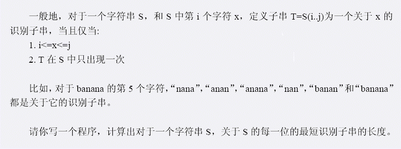

# 识别子串
[BZOJ1396]



注意到一个识别子串即为后缀自动机上 endpos 大小为 1 的点，那么一个 endpos 为 1 节点的子串集合能对一个区间贡献答案，可以拆分这个一段区间等差数列和一段区间取 min ，离线下来差分。

```cpp
#include<cstdio>
#include<cstdlib>
#include<cstring>
#include<algorithm>
#include<vector>
#include<set>
#include<iostream>
using namespace std;

#define mem(Arr,x) memset(Arr,x,sizeof(Arr))

const int maxN=101000*2;
const int Alpha=26;
const int inf=2000000000;

class SAM{
public:
    int son[Alpha],fail,len,ep;
};

int n,root=1,lst=1,nodecnt=1,Eps[maxN];
SAM S[maxN];
char I[maxN];
vector<int> T[maxN],Vt[maxN],Vm[maxN];
multiset<int> M1,M2;

void Extend(int c,int id);
void dfs(int x);

int main(){
    scanf("%s",I+1);n=strlen(I+1);
    for (int i=1;i<=n;i++) Extend(I[i]-'a',i);

    for (int i=2;i<=nodecnt;i++) T[S[i].fail].push_back(i);
    dfs(1);
    for (int i=2;i<=nodecnt;i++)
	if (Eps[i]==1){
	    int l=S[S[i].fail].len+1,r=S[i].len;
	    Vt[S[i].ep-r+1].push_back(S[i].ep+1);
	    Vt[S[i].ep-l+2].push_back(-(S[i].ep+1));
	    if (l>1){
		Vm[S[i].ep-l+2].push_back(l);
		Vm[S[i].ep+1].push_back(-l);
	    }
	}
    M1.insert(inf);
    M2.insert(inf);
    for (int i=1;i<=n;i++){
	for (int j=0,sz=Vt[i].size();j<sz;j++)
	    if (Vt[i][j]>0) M1.insert(Vt[i][j]);
	    else M1.erase(M1.find(-Vt[i][j]));
	for (int j=0,sz=Vm[i].size();j<sz;j++)
	    if (Vm[i][j]>0) M2.insert(Vm[i][j]);
	    else M2.erase(M2.find(-Vm[i][j]));
	printf("%d\n",min(*M1.begin()-i,*M2.begin()));
    }
    return 0;
}

void Extend(int c,int id){
    int np=++nodecnt,p=lst;lst=nodecnt;
    S[np].len=S[p].len+1;S[np].ep=id;Eps[np]=1;
    while (p&&S[p].son[c]==0) S[p].son[c]=np,p=S[p].fail;
    if (p==0) S[np].fail=1;
    else{
	int q=S[p].son[c];
	if (S[q].len==S[p].len+1) S[np].fail=q;
	else{
	    int nq=++nodecnt;S[nq]=S[q];S[nq].len=S[p].len+1;
	    S[q].fail=S[np].fail=nq;
	    while (p&&S[p].son[c]==q) S[p].son[c]=nq,p=S[p].fail;
	}
    }
    return;
}
void dfs(int x){
    for (int i=0,sz=T[x].size();i<sz;i++)
	dfs(T[x][i]),Eps[x]+=Eps[T[x][i]];
    return;
}
```