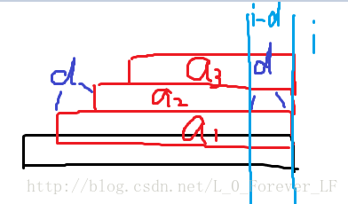

# Palindrome Partition
[CF932G]

Given a string s, find the number of ways to split s to substrings such that if there are k substrings (p1, p2, p3, ..., pk) in partition, then pi = pk - i + 1 for all i (1 ≤ i ≤ k) and k is even.

给定一个字符串，求将其划分为$s1,s2.....sk$，满足$k$为整数并且$s1=sk,s2=sk-1......$的方案数。

直接划分不好处理，考虑把字符串转化为$c1,cn,c2,cn-1,c3,cn-2.....$的形式，这样原来要求的划分的方案数就变成了求把当前新字符串划分成若干偶回文串的方案数。设$F[i]$为前$i$个字符的方案数，那么在回文自动机上跳$i$的回文后缀$j$，有$F[i]=\sum\_{j}F[i-S[j].len]$。回文树的$fail$树高最坏情况是$O(n)$的，这样的复杂度是$O(n^2)$。  
考虑优化。回文后缀有着很好的性质，那就是如果按照长度分类，可以分成不超过$log n$个等差数列。于是考虑每一次加上一段等差数列。对于回文树上的节点$p$，设$g[p]$表示其所代表的最后一个等差数列的和，即$F[i-a1]+F[i-a2]+F[i-a3]$  

由回文和$border$的性质，可以发现$S[i-a1,i-d]==S[i-a2,d]$，所以$G[i]$相当于在$G[S[i].fail]$的基础上加上一个$F[i-a3]$（要能加上$G[S[i].fail]$的前提是$fail$也在此等差数列内），那么就可以直接维护了。

```cpp
#include<iostream>
#include<cstdio>
#include<cstdlib>
#include<cstdlib>
#include<cstring>
#include<algorithm>
using namespace std;

#define ll long long
#define mem(Arr,x) memset(Arr,x,sizeof(Arr))

const int maxN=1010000;
const int maxAlpha=26;
const int Mod=1e9+7;
const int inf=2147483647;

class Node
{
public:
	int son[maxAlpha];
	int fail,len,nxt,diff;
};

char str[maxN],str2[maxN];
int nodecnt,last;
int F[maxN],G[maxN];
Node S[maxN];

void Insert(int pos,int c);

int main()
{
	scanf("%s",str+1);
	int len=strlen(str+1);
	if (len%2==1){
		printf("0\n");return 0;
	}

	for (int i=1;2*i-1<=len;i++) str2[2*i-1]=str[i];
	for (int i=len;(len-i+1)*2<=len;i--) str2[(len-i+1)*2]=str[i];

	for (int i=1;i<=len;i++) str[i]=str2[i];

	nodecnt=1;last=0;
	S[0].len=0;S[1].len=-1;
	S[0].fail=S[1].fail=1;

	F[0]=1;
	for (int i=1;i<=len;i++)
	{
		Insert(i,str[i]-'a');
		for (int p=last;p;p=S[p].nxt)
		{
			G[p]=F[i-S[S[p].nxt].len-S[p].diff];
			if (S[p].diff==S[S[p].fail].diff) G[p]=(G[p]+G[S[p].fail])%Mod;
			if (i%2==0) F[i]=(F[i]+G[p])%Mod;
		}
	}

	printf("%d\n",F[len]);

	return 0;
}

void Insert(int pos,int c)
{
	int p=last;
	while (str[pos-1-S[p].len]!=str[pos]) p=S[p].fail;
	if (S[p].son[c]==0)
	{
		int np=++nodecnt,q=S[p].fail;
		while (str[pos-1-S[q].len]!=str[pos]) q=S[q].fail;
		S[np].fail=S[q].son[c];S[np].len=S[p].len+2;
		S[p].son[c]=np;
		S[np].diff=S[np].len-S[S[np].fail].len;
		if (S[np].diff!=S[S[np].fail].diff) S[np].nxt=S[np].fail;
		else S[np].nxt=S[S[np].fail].nxt;
	}
	last=S[p].son[c];
	return;
}
```