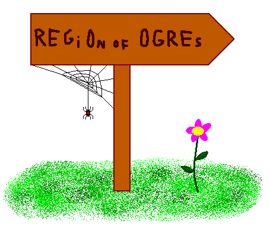

# Egor and an RPG game
[CF1097E]

One Saturday afternoon Egor was playing his favorite RPG game. While discovering new lands and territories, he came across the following sign:



Egor is a passionate player, but he is an algorithmician as well. That's why he instantly spotted four common letters in two words on the sign above — if we permute the letters "R", "E", "G", "O" from the first word, we can obtain the letters "O", "G", "R", "E". Egor got inspired by the sign and right away he came up with a problem about permutations.  
You are given a permutation of length 𝑛. You have to split it into some non-empty subsequences so that each element of the permutation belongs to exactly one subsequence. Each subsequence must be monotonic — that is, either increasing or decreasing.  
Sequence is called to be a subsequence if it can be derived from permutation by deleting some (possibly none) elements without changing the order of the remaining elements.  
The number of subsequences should be small enough — let 𝑓(𝑛) be the minimum integer 𝑘 such that every permutation of length 𝑛 can be partitioned into at most 𝑘 monotonic subsequences.  
You need to split the permutation into at most 𝑓(𝑛) monotonic subsequences.

长度为 n 的最坏构造是满足 $\frac{c(c-1)}{2}>n$ 的最小的 c 。这种构造方式大概是以 1,2,3,...,c 的长度构造总体上升的下降序列，这样可以使得下降序列和上升序列的个数都达到根号级别。  
那么考虑根号的构造。对于当前序列，求出其最长上升子序列长度，若大于 c 则直接选取；否则，根据 Dilworth 定理，一定存在 c 个下降序列，依次构造即可。

```cpp
#include<cstdio>
#include<cstring>
#include<algorithm>
#include<vector>
#include<set>
#include<iostream>
using namespace std;

#define mem(Arr,x) memset(Arr,x,sizeof(Arr))
const int maxN=101000;
const int Block=350;

int n,Seq[maxN],St[maxN],Stp[maxN],From[maxN];
bool vis[maxN];
vector<int> Ans[maxN];
set<pair<int,int> > S;

int main(){
    //freopen("in","r",stdin);
    int Case;scanf("%d",&Case);
    while (Case--){
        scanf("%d",&n);for (int i=1;i<=n;i++) scanf("%d",&Seq[i]);
        int cnt=0,res=n;
        while (1){
            int top=0,K=0;while ((K+2)*(K+1)/2<=res) ++K;
            for (int i=1;i<=n;i++)
                if (vis[i]==0){
                    int p=lower_bound(&St[1],&St[top+1],Seq[i])-St;
                    From[i]=Stp[p-1];Stp[p]=i;St[p]=Seq[i];
                    top=max(top,p);
                }
            if (top>K){
                int now=Stp[top];++cnt;res-=top;
                while (now){
                    Ans[cnt].push_back(Seq[now]);vis[now]=1;now=From[now];
                }
                reverse(Ans[cnt].begin(),Ans[cnt].end());
                for (int i=1;i<=top;i++) St[i]=Stp[i]=0;
                continue;
            }
            else{
                S.clear();
                for (int i=1;i<=n;i++)
                    if (vis[i]==0){
                        set<pair<int,int> >::iterator p=S.lower_bound(make_pair(Seq[i],0));
                        if (p==S.end()){
                            ++cnt;Ans[cnt].push_back(Seq[i]);S.insert(make_pair(Seq[i],cnt));
                        }
                        else{
                            int lst=(*p).second;S.erase(p);
                            Ans[lst].push_back(Seq[i]);S.insert(make_pair(Seq[i],lst));
                        }
                    }
                break;
            }
        }
        printf("%d\n",cnt);
        for (int i=1;i<=cnt;i++){
            int sz=Ans[i].size();printf("%d ",sz);
            for (int j=0;j<sz;j++) printf("%d ",Ans[i][j]);printf("\n");
            Ans[i].clear();
        }
        for (int i=1;i<=n;i++) vis[i]=0;
    }
    return 0;
}
```