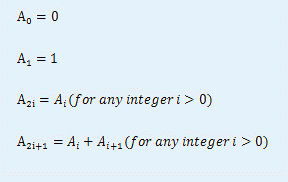

# [ZJOI2012]数列
[BZOJ2656 Luogu2609]

小白和小蓝在一起上数学课，下课后老师留了一道作业，求下面这个数列的通项公式：

小白作为一个数学爱好者，很快就计算出了这个数列的通项公式。于是，小白告诉小蓝自己已经做出来了，但为了防止小蓝抄作业，小白并不想把公式公布出来。于是小白为了向小蓝证明自己的确做出来了此题以达到其炫耀的目的，想出了一个绝妙的方法：即让小蓝说一个正整数N，小白则说出 的值，如果当N很大时小白仍能很快的说出正确答案，这就说明小白的确得到了公式。但这个方法有一个很大的漏洞：小蓝自己不会做，没法验证小白的答案是否正确。作为小蓝的好友，你能帮帮小蓝吗？

不难想到拆成二进制位来考虑，从低位向高位做，每走一次，最多会新扩展出两个数，但每一层本质不同的数只有两个，而且两个数只有最后一位有区别，那么分别记末尾为 0 和为 1 的方案数，按照当前位为 0 或 1 分类讨论累加。剩下的就是高精度了。

```cpp
#include<iostream>
#include<cstdio>
#include<cstdlib>
#include<cstring>
#include<algorithm>
using namespace std;

#define ll long long
#define mem(Arr,x) memset(Arr,x,sizeof(Arr))

const int maxLen=510;
const int P=1000000;
const int inf=2147483647;

class Bigint
{
public:
	int num[maxLen],high;
	Bigint(){
		high=0;mem(num,0);return;
	}

	void Init(){
		high=0;mem(num,0);return;
	}
	
	void MainTain(){
		for (int i=1;i<high;i++) num[i+1]+=num[i]/P,num[i]%=P;
		while (num[high]>=P) num[high+1]=num[high]/P,num[high]%=P,++high;
		return;
	}
	
	Bigint(int x){
		mem(num,0);num[high=1]=x;MainTain();
		return;
	}

	Bigint operator = (int x){
		mem(num,0);num[high=1]=x;MainTain();return *this;
	}

	Bigint operator = (Bigint A){
		high=A.high;for (int i=1;i<=high;i++) num[i]=A.num[i];
		return *this;
	}
};

char N[maxLen];
int A[maxLen],B[maxLen],Bp[maxLen];
Bigint f0,f1;

Bigint operator + (Bigint A,Bigint B);

int main(){
	int TTT;scanf("%d",&TTT);
	while (TTT--){
		scanf("%s",N);int len=strlen(N);mem(A,0);mem(B,0);
		for (int i=1;i<=len;i++) A[i]=N[i-1]-'0';reverse(&A[1],&A[len+1]);
		int blen=0;
		while (len>=1){
			B[++blen]=A[1]&1;int res=0;
			for (int i=len;i>=1;i--){
				res=res*10+A[i];
				Bp[i]=res/2;res%=2;
			}
			for (int i=1;i<=len;i++) A[i]=Bp[i];
			while ((len>=1)&&(A[len]==0)) --len;
		}
		f0=0;f1=0;
		if (B[1]) f0=1,f1=1;
		else f0=1;
		for (int i=2;i<=blen;i++)
			if (B[i]) f1=f0+f1;
			else f0=f0+f1;
		printf("%d",f1.num[f1.high]);for (int i=f1.high-1;i>=1;i--) printf("%06d",f1.num[i]);
		printf("\n");
	}
	return 0;
}

Bigint operator + (Bigint A,Bigint B){
	A.high=max(A.high,B.high);
	for (int i=1;i<=A.high;i++) A.num[i]=A.num[i]+B.num[i];
	A.MainTain();return A;
}
```