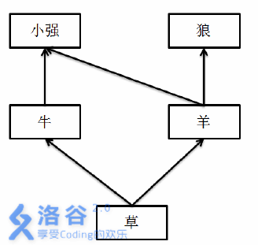

# [ZJOI2012]灾难
[BZOJ2815 Luogu2597]

阿米巴是小强的好朋友。  
阿米巴和小强在草原上捉蚂蚱。小强突然想，如果蚂蚱被他们捉灭绝了，那么吃蚂蚱的小鸟就会饿死，而捕食小鸟的猛禽也会跟着灭绝，从而引发一系列的生态灾难。  
学过生物的阿米巴告诉小强，草原是一个极其稳定的生态系统。如果蚂蚱灭绝了，小鸟照样可以吃别的虫子，所以一个物种的灭绝并不一定会引发重大的灾难。  
我们现在从专业一点的角度来看这个问题。我们用一种叫做食物网的有向图来描述生物之间的关系：  
一个食物网有N个点，代表N种生物，如果生物x可以吃生物y，那么从y向x连一个有向边。  
这个图没有环。  
图中有一些点没有连出边，这些点代表的生物都是生产者，可以通过光合作用来生存； 而有连出边的点代表的都是消费者，它们必须通过吃其他生物来生存。  
如果某个消费者的所有食物都灭绝了，它会跟着灭绝。  
我们定义一个生物在食物网中的“灾难值”为，如果它突然灭绝，那么会跟着一起灭绝的生物的种数。  
举个例子：在一个草场上，生物之间的关系是：


如果小强和阿米巴把草原上所有的羊都给吓死了，那么狼会因为没有食物而灭绝，而小强和阿米巴可以通过吃牛、牛可以通过吃草来生存下去。所以，羊的灾难值是1。但是，如果草突然灭绝，那么整个草原上的5种生物都无法幸免，所以，草的灾难值是4  
给定一个食物网，你要求出每个生物的灾难值。

如果把导致会某一物种灭绝的物种列出来，可以建出一棵类似树的结构，这棵树上的某个点灭绝会导致其子树内的所有点也灭绝。按照从生产者出发的拓扑序，维护这棵树。类似增量构造的方法，找到当前物种食用的所有物种，求出它们在树上的 LCA ，因为只有这个 LCA 及 LCA 的祖先灭绝才会使得该物种的所有食物灭绝。那么把当前物种挂在 LCA 下。  
由于需要动态地增加儿子，所以采用倍增的方式求 LCA 。

```cpp
#include<iostream>
#include<cstdio>
#include<cstdlib>
#include<cstring>
#include<algorithm>
#include<vector>
#include<queue>
using namespace std;

#define ll long long
#define mem(Arr,x) memset(Arr,x,sizeof(Arr))

const int maxN=70000;
const int maxM=1010000;
const int maxBit=18;
const int inf=2147483647;

int n;
int edgecnt=0,Head[maxN],Next[maxM],V[maxM],Dg[maxN];
int Fa[maxBit][maxN],Dph[maxN],Size[maxN];
vector<int> To[maxN],Fd[maxN];
queue<int> Q;

void Add_Edge(int u,int v);
int LCA(int u,int v);
void dfs(int u);

int main(){
	mem(Head,-1);
	scanf("%d",&n);
	for (int i=1;i<=n;i++){
		int x;scanf("%d",&x);
		while (x){
			Add_Edge(x,i);Fd[i].push_back(x);scanf("%d",&x);
		}
	}

	for (int i=1;i<=n;i++) if (Dg[i]==0) Q.push(i),To[n+1].push_back(i);
	while (!Q.empty()){
		int u=Q.front();Q.pop();

		for (int i=Head[u];i!=-1;i=Next[i])
			if ((--Dg[V[i]])==0) Q.push(V[i]);
		
		int lca=0;
		for (int i=0,sz=Fd[u].size();i<sz;i++)
			if (lca==0) lca=Fd[u][i];
			else lca=LCA(lca,Fd[u][i]);
		if (lca==0){
			Fa[0][u]=n+1;Dph[u]=1;continue;
		}
		To[lca].push_back(u);
		Fa[0][u]=lca;Dph[u]=Dph[lca]+1;
		for (int i=1;i<maxBit;i++)
			if (Fa[i-1][u]) Fa[i][u]=Fa[i-1][Fa[i-1][u]];
	}
	dfs(n+1);
	for (int i=1;i<=n;i++) printf("%d\n",Size[i]-1);return 0;
}

void Add_Edge(int u,int v){
	Next[++edgecnt]=Head[u];Head[u]=edgecnt;V[edgecnt]=v;Dg[v]++;
	return;
}

int LCA(int u,int v){
	//cout<<"LCA:"<<u<<" "<<v<<":";
	if (Dph[u]<Dph[v]) swap(u,v);
	for (int i=maxBit-1;i>=0;i--) if ((Fa[i][u])&&(Dph[Fa[i][u]]>=Dph[v])) u=Fa[i][u];
	if (u==v) return u;
	for (int i=maxBit-1;i>=0;i--) if ((Fa[i][u])&&(Fa[i][v])&&(Fa[i][u]!=Fa[i][v])) u=Fa[i][u],v=Fa[i][v];
	return Fa[0][u];
}

void dfs(int u){
	Size[u]=1;
	for (int i=0,sz=To[u].size();i<sz;i++){
		dfs(To[u][i]);Size[u]+=Size[To[u][i]];
	}
	return;
}
```