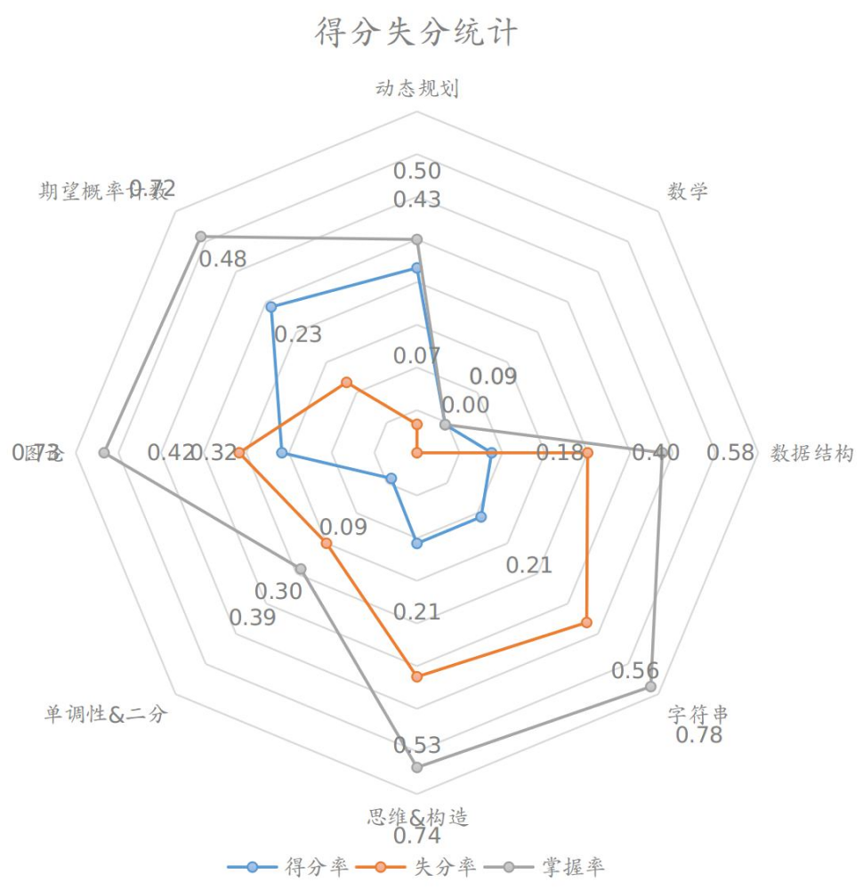
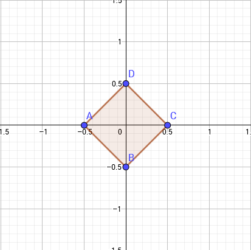
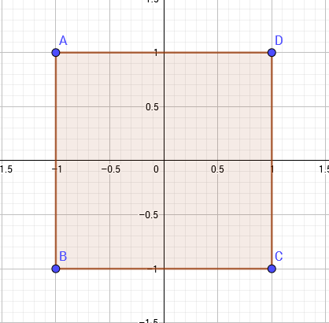

# HN2018省队集训总结
by SYC

## 综述
简单记录一下九天省队集训。

与去年只会写搜索相比，今年省队集训收获颇多。一些题目在考场上能够写出行之有效的算法，也学习到了很多以前不知道的姿势。  
一些技巧和算法也能更加熟练地运用了，像是计数的式子，还有后缀自动机、后缀数组这类算法/数据结构

## 考试分析
考试涉及的面较广，对于各方面的考察较全面，下面分析一下考试情况。
### 得分分析


从得分情况来看，得分不太稳定，对于自己熟练掌握的部分，能够得到较多的分数；而对于自己不太熟练的部分，可能就要花较长的时间。这导致了在有的时候能够获得较高的分数，而另外的一些时候可能无法获得高分。  
对于不熟练或是没能完全掌握的内容，今后要着重练习练习，要更加全面地学习知识。
### 排名分析


从排名情况来看，前段和后段发挥较好，中间有一段时间状态没有跟上来。总体来看，排名还是略呈上升态势，能够逐步稳定。
### 失分细则


$得分率=\frac{\sum实际得分}{总分}$。从得分率来看，期望概率计数、动态规划和图论的题目得分率较高，这类题在考场上可能需要一定时间推导，但是如果推出来了就比较好实现，所以得分率较高。  
$失分率=\frac{\sum能够得的分-实际得分}{\sum能够得的分}$。从失分率来看，思维构造和字符串类的一些题目是会做的，但是考场上由于各种原因，没有调出来或者是没有想到，考完后看题解能够较快更正好。  
$掌握率=\frac{\sum能够得的分}{总分}$。掌握率能反应在更正题目后，还有多少是需要新学习和练习的。图中可以看出，对于数学数论方面还有很多东西要学，比如说多项式相关的内容，这个已经在学习了。另一部分则是一些优化的$Trick$，比如单调性优化或者是二分，这个需要找出单调性，对于有一些题目并不是那么地明显，所以也需要多加练习。  
综合来看，对于数学和单调性相关的内容，掌握非常不全面，还需要多多学习，打算接下来就练习这个专题。对于图论和字符串，基本的算法大致都已经掌握了（字符串还差回文自动机），但是一些方法和题型还没熟练，所以要多加练习。对于思维题、构造题，如果知道结论的话可以较快地做出来，所以关键在于如何取猜测结论和证明，这个也要多见一些题。而对于动态规划和数据结构，这是两个很大而且很常见的类型，也有一部分是暂时还未能更正的，要查漏补缺，巩固练习。

## 学习内容
省队集训这几天，也学习了一些新的知识。
### 博弈论（未完全学完）
#### 对抗搜索
一般而言，站在两个人的立场上进行搜索。  
通常为了方便处理，将一个人的权值设置为负数，另一个为正数，这样就可以在不同的层进行$min-max$搜索。

##### Alpha-Beta剪枝
$Alpha-Beta$剪枝在于把父亲或者祖先的信息向下传递，若发现当前的答案无论如何都无法更新祖先时，直接返回。

##### 记忆化
对于可记忆的搜索，可以加上记忆化或转化为可以记忆化的方式，通常是对于某一局面，两人不论谁先操作，得到的结果一样时，可以记忆化。

#### 巴什博弈（Bash Game）
一般来说都是画出必胜和必败态的转移方式，然后找规律或者是归纳法得到解。
### 数论
#### 积分与导数
##### 定积分

###### 定积分定义
设函数$f(x)$在$[a,b]$上连续，将区间$[a,b]$分成$n$个子区间$[x\_0,x\_1], (x\_1,x\_2], (x\_2,x\_3], …, (x\_{n-1},x\_n]$，其中$x\_0=a，x\_n=b$。可知各区间的长度依次是：$\Delta x\_1=x\_1-x\_0$，在每个子区间$(x\_{i-1},x\_i]$中任取一点$\delta \_{i(1,2,...,n)}$，作和式$\sum\_{i=1}^{n}f(\delta\_i) \Delta X\_i$，该和式叫做积分和，设$\lambda=max(\Delta x\_1, \Delta x\_2, …, \Delta x\_n)$（即$\lambda$是最大的区间长度），如果当$\lambda→0$时，积分和的极限存在，则这个极限叫做函数$f(x)$在区间$[a,b]$的定积分，记为  
$$\int\_{a}^{b} f(x)dx$$  
与不定积分的区别在于，它积分出来后的值是一个**常数**而不是一个函数。

##### 定积分的性质
###### 1.$a=b$时
$$\int\_a^b f(x)dx=0$$

###### 2.$a \ge b$时
$$\int\_a^b f(x)dx=-\int\_b^a f(x)dx$$

###### 3.常数可提至积分符号前
$$\int\_a^b C \times f(x)dx=C \times \int\_a^b f(x)dx$$

###### 4. 代数和的积分等于积分的代数和
$$\int\_a^b [f(x)\pm g(x)]dx=\int\_a^b f(x)dx\pm\int\_a^b g(x)dx$$

###### 5.定积分的可加性
$$\int\_a^b f(x)dx=\int\_a^c f(x)dx+\int\_c^b f(x)dx$$

###### 6.保号性
若在$[a,b]$上有$f(x) \ge 0$，则有  
$$\int\_a^b f(x)dx \ge 0$$

###### 7. 积分中值定理
若函数$f(x)$在$[a,b]$上连续，那么至少存在一个点$\varepsilon$满足  
$$\int\_a^b f(x)dx=f(\varepsilon) \times (b-a)$$

##### 积分公式
###### 1.牛顿·莱布尼茨公式
如果$f(x)$是$[a,b]$上的连续函数，并且有$F'(x)=f(x)$，则  
$$\int\_a^b f(x)dx=F(b)-F(a)$$
###### 2.基本积分公式（基本导数公式的逆）
$$\int k\ dx=kx+C$$
$$\int x^\mu dx=\frac{x^{\mu+1}}{\mu+1}+C$$
$$\int \frac{dx}{x}=\ln |x|+c$$
$$\int k^x dx=\frac{k^x}{\ln k}+c$$
###### 3.定积分换元公式
在计算定积分的时候，有时为了而方便变形，可能需要换元来简化运算。  
假设函数$f(x)$在区间$[a,b]$上连续，且函数$x=\varphi(t)$满足条件：$\varphi(\alpha)=a,\varphi(\beta)=b$，且$\varphi(t)$在$[\alpha,\beta]$上具有连续导数，且其值域$R_\varphi=[a,b]$，则有  
$$\int\_a^b f(x)dx=\int\_{\alpha}^{\beta} f[\varphi(t)]\varphi'(t)dt$$  
需要注意的是，用$x=\varphi(t)$把原来的变量$x$代换成新变量$t$的时候，积分限也要变成相应于新变量$t$的积分限。
#### 导数
##### 基本导数求导法则与导数公式
###### 1.常数和基本初等函数的导数公式
1.$(C)'=0$  
2.$(x^\mu)'=\mu x^{\mu-1}$  
3.$(\sin x)'=\cos x$  
4.$(\cos x)'=-\sin x$  
5.$(\tan x)'=\sec^2 x$  
6.$(\cot x)'=-\csc^2 x$  
7.$(\sec x)'=\sec x \tan x$  
8.$(\csc x)'=-\csc x\cot x$  
9.$(a^x)'=a^x \ln a$  
10.$(e^x)'=e^x$  
11.$(log\_a x)'=\frac{1}{x \ln a}$  
12.$(\ln x)'=\frac{1}{x}$  
###### 2.函数的和、差、积、商的求导法则
设$u=u(x),v=v(x)$都可导，则  
1.$(u \pm v)'=u' \pm v'$  
2.$(Cu)'=Cu'$，其中$C$为常数  
3.$(uv)'=u'v+uv'$  
4.$(\frac{u}{v})'=\frac{u'v-uv'}{v^2}$
###### 3.反函数求导法则
设$x=f(y)$在区间$I\_y$内单调、可导且$f'(y)\ne 0$，则它的反函数$y=f^{-1}(x)$在$I\_x=f(I\_y)$内也可导，且  
$$[f^{-1}(x)]'=\frac{1}{f'(y)}$$
###### 4.复合函数求导法则
设$y=f(u)$，而$u=g(x)$且$f(u),g(x)$均可导，则复合函数$y=f[g(x)]$的导数为  
$$y'(x)=f'(u) g'(x)$$
#### 快速傅里叶变换
##### FFT
非预处理单位根
```cpp
void FFT(complex<ld> *P,int opt)
{
	for (int i=0;i<N;i++) if (i<Rader[i]) swap(P[i],P[Rader[i]]);
	for (int i=1;i<N;i<<=1)
	{
		complex<ld> dw(cos(Pi/i),sin(Pi/i)*opt);
		int l=i<<1;
		for (int j=0;j<N;j+=l)
		{
			complex<ld> w(1,0);
			for (int k=0;k<i;k++,w*=dw)
			{
				complex<ld> X=P[j+k],Y=w*P[j+k+i];
				P[j+k]=X+Y;P[j+k+i]=X-Y;
			}
		}
	}
	if (opt==-1) for (int i=0;i<N;i++) P[i].real()=P[i].real()/N+0.5;
	return;
}
```

单位根预处理 更快
```cpp
预处理:
for (int i=0;i<N;i++) Wn[i]=complex<ld>(cos(2*Pi*i/N),sin(2*Pi*i/N)),Iwn[i]=conj(Wn[i]);
FFT:
void FFT(complex<ld> *P,int N,const int opt)
{
	for (int i=0;i<N;i++) if (i<Rader[i]) swap(P[i],P[Rader[i]]);
	for (int i=1;i<N;i<<=1)
	{
		int l=i<<1;
		complex<ld> dw(cos(Pi/i),sin(Pi/i)*opt);
		for (int j=0;j<N;j+=l)
		{
			complex<ld> w(1,0);
			for (int k=0;k<i;k++,w*=dw)
			{
				complex<ld> X=P[j+k],Y=w*P[j+k+i];
				P[j+k]=X+Y;P[j+k+i]=X-Y;
			}
		}
	}
	return;
}
```
##### NTT
要求模数为形如$2^r+1$的质数，因为要求要能把$phi(mod)$分解为$2$的若干次幂的部分

```cpp
void NTT(ll *P,int N,int opt)
{
	for (int i=0;i<N;i++) if (i<Rader[i]) swap(P[i],P[Rader[i]]);
	for (int i=1;i<N;i<<=1)
	{
		int l=i<<1;
		ll dw=QPow(G,(Mod-1)/l);
		if (opt==-1) dw=QPow(dw,Mod-2);
		for (int j=0;j<N;j+=l)
		{
			ll w=1;
			for (int k=0;k<i;k++,w=w*dw%Mod)
			{
				ll X=P[j+k],Y=w*P[j+k+i]%Mod;
				P[j+k]=(X+Y)%Mod;P[j+k+i]=(X-Y+Mod)%Mod;
			}
		}
	}
	if (opt==-1)
	{
		ll inv=QPow(N,Mod-2);
		for (int i=0;i<N;i++) P[i]=P[i]*inv%Mod;
	}
	return;
}
```
当然亦可以预预处理

##### 任意模数NTT
有两种方法，一种是拆分成三个能直接$NTT$的模数来做，然后用中国剩余定理来合并答案。  
另一种是$MTT$
###### NTT+CRT
（暂未写）
###### MTT
考虑把每一个数拆成$A \times M+B$的形式，其中$M$一般取$\sqrt{Mod}$，那么就可以做四边$DFT$+三遍$IDFT$，最后组合答案。  
更好的办法可以做到只要三遍$DFT$
#### 中国剩余定理CRT
##### 基本内容
中国剩余定理给出了下图所示的一元线性同余方程组有解的判定条件，并用构造法给出了在有解情况下解的具体形式


##### 构造方法
###### 一般情况
设 $M = \prod\_1^n m\_i$ ，并设 $M\_i = \frac{M}{m\_i}$ 是除了$m\_i$以外的$n-1$个整数的乘积。  
设 $t\_i = M\_i^{-1} \mod m\_i$ ，即$t\_i$为$M\_i$模 $m\_i$ 意义下的逆元，$M\_i \times t\_i \equiv 1 \pmod {m\_i},i \in \lbrace 1,2,3,…,n \rbrace$  
方程的通解形式为$x=\sum a\_i \times t\_i \times M\_i $  
而在模$M$的意义下，只有一个解。

###### 更一般的情况
一般的中国剩余定理要求模数互质，那么不互质要怎么做呢？  
考虑把模方程组两两合并的方法。假设要合并$x=a\_1+m\_1 \times x\_1$和$x=a\_2+m\_2 \times x\_2$，那么有$a\_a+m\_1 \times x\_1=a\_2+m\_2 \times x\_2$，$m\_1 \times x\_1+m\_2 \times x\_2=a\_2-a\_1$，可以用扩展欧几里得解出$x\_1$的最小正整数解，带入得到$x$，最后合并得到$y = x \mod(lcm(m\_1,m\_2))$

##### 代码实现
###### 模数互质
```cpp
int CRT(int a[],int m[],int n){
    int M = 1;
    int ans = 0;
    for(int i=1; i<=n; i++)
        M *= m[i];
    for(int i=1; i<=n; i++){
        int x, y;
        int Mi = M / m[i];
        ex_gcd(Mi, m[i], x, y);
        ans = (ans + Mi * x * a[i]) % M;
    }
    if(ans < 0) ans += M;
    return ans;
}
```
###### 模数不互质
```cpp
bool merge(LL a1, LL m1, LL a2, LL m2, LL &a3, LL &m3)  {
    LL d = gcd(m1, m2);
    LL c = a2 - a1;
    if(c % d) return false;
    c = (c % m2 + m2) % m2;
    m1 /= d;
    m2 /= d;
    c /= d;
    c *= Inv(m1, m2);//Inv为乘法逆元，数论常用内容——欧几里得算法与扩展欧几里得算法
    c %= m2;
    c *= m1 * d;
    c += a1;
    m3 = m1 * m2 * d;
    a3 = (c % m3 + m3) % m3;
    return true;
}

LL CRT(LL a[], LL m[], int n)  {
    LL a1 = a[1];
    LL m1 = m[1];
    for(int i=2; i<=n; i++)  {
        LL a2 = a[i];
        LL m2 = m[i];
        LL m3, a3;
        if(!merge(a1, m1, a2, m2, a3, m3))
            return -1;
        a1 = a3;
        m1 = m3;
    }
    return (a1 % m1 + m1) % m1;
}
```
### 字符串
#### 后缀自动机
##### 相关概念
1.$endpos(s)$，是一个集合，对于子串$s$，它的所有出现过的位置记为$endpos(s)$。如果两个子串的$endpos$集合相等，则把这两个子串归为一类，即在后缀自动机上表示为一个节点。  
2.$substring(st)$，状态$st$的所有包含的子串集合。
3.$shortest(st)$，对于状态$st$，其能代表的最短子串。  
4.$longest(st)$，对于状态$st$，其能代表的最长子串。  
5.$parent$，对于状态$st$，$shortest(st)$的任意一个非自己的后缀一定出现在了更多的位置，其中最长的那个，会出现在$parent(st)$的$endpos$中，并且一定是其$longest$。  

##### 一些性质
###### 1.$endpos$的性质
1.对于$S$的两个子串$s1,s2$，假设有$length(s1) \le length(s2)$，则$s1$是$s2$的后缀当且仅当$endpos(s2) \subseteq endpos(s1)$。$s1$不是$s2$的后缀当且仅当$endpos(s1) \cap endpos(s2)=\varnothing$。
###### 2.$shortest$和$longest$的性质
1.对于状态$st$，任意$s \in substring(st)$，都有$s$是$longest(st)$的后缀。  
2.对于状态$st$，任意$longest(st)$的后缀$s$，若$length(shotest(st)) \le length(s) \le length(longest(st))$，那么$s \in substring(st)$
###### 3.$substring$的性质
1.$substring(st)$包含的是状态$longest(st)$的一系列长度**连续**的后缀。
###### 4.$parent$的性质
1.$longest(parent(st)))$一定是$shortest(st)$的最长的后缀，也就是去掉第一个字符的子串。  
2.$length(shortest(st))=length(longest(parent(st)))+1$  
3.若$tranc(st,c)==NULL$，则$trans(parent(st),c)==NULL$  
4.$endpos(parent(st))$包含了它的所有儿子的$endpos$，所以$endpos(parent)$可以看作是它的儿子$endpos$的并集。
### 图论
#### 几个距离
##### 欧几里得距离
多维空间中两点的直线距离  
$$\sqrt{(x1-x2)^2+(y1-y2)^2+……+(k1-k2)^2}$$

##### 曼哈顿距离
两点横纵坐标差的绝对值之和
$$|x1-x2|+|y1-y2|$$

##### 切比雪夫距离
坐标差中的较大值
$$max(|x1-x2|,|y1-y2|)$$

##### 切比雪夫距离与曼哈顿距离的转化
考虑在二维平面上，与原点曼哈顿距离为$1$的点  
  
那么，与原点切比雪夫距离为$1$的点为  
  
可以发现，第二个图相当于把第一个图旋转$45°$再放大一倍。  
所以曼哈顿距离中的点$(x,y)$转化到切比雪夫中就是$(\frac{x+y}{2},\frac{x-y}{2})$
#### 网络流
##### 最大流
###### Dinic
```cpp
bool Bfs()
{
	mem(Depth,-1);
	int h=1,t=0;Depth[SS]=1;Q[1]=SS;
	do
		for (int u=Q[++t],i=Head[u];i!=-1;i=Next[i])
			if ((E[i].flow>0)&&(Depth[E[i].v]==-1))
				Depth[Q[++h]=E[i].v]=Depth[u]+1;
	while (t!=h);
	return Depth[TT]!=-1;
}

int dfs(int u,int flow)
{
	if (u==TT) return flow;
	for (int i=Head[u];i!=-1;i=Next[i])
		if ((E[i].flow>0)&&(Depth[E[i].v]==Depth[u]+1))
		{
			int di=dfs(E[i].v,min(flow,E[i].flow));
			if (di){
				E[i].flow-=di;E[i^1].flow+=di;return di;
			}
		}
	return 0;
}
```

###### ISAP
```cpp
主过程，修改Depth,Gap优化
while (Depth[S]<n)
{
    if (u==T)
    {
        Ans+=ISAP();
        u=S;
    }
    RG bool flag=0;
    for (RG int now=cur[u];now!=-1;now=Next[now])
    {
        int v=E[now].v;
        if ((E[now].w>0)&&(Depth[u]==Depth[v]+1))
        {
            flag=1;
            Path[v]=now;
            cur[u]=now;
            u=v;
            break;
        }
    }
		if (!flag)
		{
        RG int MIN=n-1;
        for (i=Head[u];i!=-1;i=Next[i])
        if (E[i].w>0) MIN=min(MIN,Depth[E[i].v]);
        Gap[Depth[u]]--;
        if (Gap[Depth[u]]==0) break;
        Depth[u]=MIN+1;
        Gap[Depth[u]]++;
        cur[u]=Head[u];
        if (u!=S) u=E[Path[u]].u;
    }
}
倒着BFS预处理Depth
IL void Bfs()
{
    RG int h=1,t=0;
    Q[1]=T;
    mem(Depth,-1);
    Depth[T]=0;
    do
    {
		t++;if (t>=queuesize) t=0;RG int u=Q[t];
		Gap[Depth[u]]++;
		for (RG int i=Head[u];i!=-1;i=Next[i])
		{
			RG int v=E[i].v;
			if ((E[i].w==0)&&(Depth[v]==-1))
			{
				Depth[v]=Depth[u]+1;
				h++;if (h>=queuesize) h=0;
				Q[h]=v;
			}
		}
    }
    while (t!=h);
    return;
}
ISAP得到流并增广
IL int ISAP()
{
    RG int u=T,flow=inf;
    while (u!=S)
    {
		flow=min(flow,E[Path[u]].w);
		u=E[Path[u]].u;
    }
    u=T;
    while (u!=S)
    {
		E[Path[u]].w-=flow;
		E[Path[u]^1].w+=flow;
		u=E[Path[u]].u;
    }
    return flow;
}
```

##### 最小费用流
其实就是$spfa$
```cpp
bool spfa()
{
	while (!Q.empty()) Q.pop();mem(inq,0);
	for (int i=1;i<=Y;i++) Dist[i]=inf;
	Dist[S]=0;inq[S]=1;Q.push(S);Flow[S]=inf;
	do
	{
		int u=Q.front();Q.pop();
		for (int i=Head[u];i!=-1;i=Next[i])
		{
			//if (E[i].flow>0) cout<<u<<" -> "<<E[i].v<<" "<<Dist[u]<<" "<<E[i].w<<" "<<Dist[E[i].v]<<endl;
			if ((E[i].flow>0)&&(Dist[u]+E[i].w+eps<Dist[E[i].v]))
			{
				Dist[E[i].v]=Dist[u]+E[i].w;Flow[E[i].v]=min(Flow[u],E[i].flow);Path[E[i].v]=i;
				//cout<<"Update:"<<E[i].v<<" "<<Dist[E[i].v]<<" "<<Flow[E[i].v]<<endl;
				if (inq[E[i].v]==0){
					inq[E[i].v]=1;Q.push(E[i].v);
				}
			}
		}
		inq[u]=0;
		//cout<<"Dist:";for (int i=1;i<=Y;i++) cout<<Dist[i]<<" ";cout<<endl;
	}
	while (!Q.empty());
	//cout<<Dist[T]<<endl;
	//for (int i=1;i<=Y;i++) cout<<Flow[i]<<" ";cout<<endl;
	//for (int i=1;i<=Y;i++) cout<<Dist[i]<<" ";cout<<endl;
	return Dist[T]!=inf;
}
```

##### 上下界网络流
###### 无源无汇上下界可行流
无源无汇可行流的条件  
> 1.对于每一条边，流量大于等于下界  
> 2.对于每一个点，$\sum 入流=\sum 出流$

可行流算法的核心是将一个不满足流量守恒的初始流调整成满足流量守恒的流。流量守恒,即每个点的总流入量=总流出量。  
如果存在一个可行流，那么一定满足每条边的流量都大于等于流量的下限。因此我们可以令每条边的流量等于流量下限，得到一个初始流，然后建出这个流的残量网络。(即：每条边的流量等于这条边的流量上限与流量下限之差)这个初始流不一定满足流量守恒，因此最终的可行流一定是在这个初始流的基础上增大了一些边的流量使得所有点满足流量守恒。  
因此我们考虑在残量网络上求出一个另不满足流量守恒的附加流，使得这个附加流和我们的初始流合并之后满足流量守恒，即:  
> 如果某个点在所有边流量等于下界的初始流中满足流量守恒，那么这个点在附加流中也满足流量守恒，
> 如果某个点在初始流中的流入量比流出量多x，那么这个点在附加流中的流出量比流入量多x。  
> 如果某个点在初始流中的流入量比流出量少x，那么这个点在附加流中的流出量比流入量少x。

可以认为附加流中一条从u到v的边上的一个流量代表将原图中u到v的流量增大1。  
X的数值可以枚举x的所有连边求出。比较方便的写法是开一个数组A[]，A[i]表示i在初始流中的流入量-流出量的值，那么A[i]的正负表示流入量和流出量的大小关系，下面就用A[i]表示初始流中i的流入量-流出量。  
但是dinic算法能够求的是满足流量守恒的有源汇最大流，不能在原网络上直接求一个这样的无源汇且不满足流量守恒的附加流。注意到附加流是在原网络上不满足流量守恒的，这启发我们添加一些原网络之外的边和点，用这些边和点实现”原网络上流量不守恒”的限制。  
具体地，如果一个点i在原网络上的附加流中需要满足流入量>流出量(初始流中流入量<流出量，A[i]<0)，那么我们需要给多的流入量找一个去处，因此我们建一条从i出发流量=-A[i]的边。如果A[i]>0，也就是我们需要让附加流中的流出量>流入量，我们需要让多的流出量有一个来路，因此我们建一条指向i的流量=A[i]的边。  
当然，我们所新建的从i出发的边也要有个去处，指向i的边也要有个来路，因此我们新建一个虚拟源点ss和一个虚拟汇点tt(双写字母是为了和有源汇网络流中的源点s汇点t相区分)。新建的指向i的边都从ss出发，从i出发的边都指向tt。一个点要么有一条边指向tt，要么有一条边来自ss。  
指向tt的边的总流量上限一定等于ss流出的边的总流量上限，因为每一条边对两个点的A[i]贡献一正一负大小相等，所以全部点的A[i]之和等于0，即小于0的A[i]之和的绝对值=大于0的A[i]之和的绝对值。  
如果我们能找到一个流满足新加的边都满流，这个流在原图上的部分就是我们需要的附加流(根据我们的建图方式，“新加的边都满流”和”附加流合并上初始流得到流量平衡的流”是等价的约束条件)。  
那么怎样找出一个新加的边都满流的流呢?可以发现假如存在这样的方案，这样的流一定是我们所建出的图的ss-tt最大流，所以跑ss到tt的最大流即可。如果最大流的大小等于ss出发的所有边的流量上限之和(此时指向tt的边也一定满流，因为这两部分边的流量上限之和相等)。  
最后，每条边在可行流中的流量=容量下界+附加流中它的流量(即跑完dinic之后所加反向边的权值)。

```cpp
[ZOJ2314]直接求可行环流
#include<iostream>
#include<cstdio>
#include<cstdlib>
#include<cstring>
#include<algorithm>
using namespace std;

#define ll long long
#define mem(Arr,x) memset(Arr,x,sizeof(Arr))

const int maxN=250;
const int maxM=maxN*maxN*5;
const int inf=2147483647;

class Edge
{
public:
	int v,flow,cap;
};

class EDGE
{
public:
	int u,v,l,r,id;
};

int n,m;
int SS,TT;
int edgecnt,Head[maxN],Next[maxM];
int Sum[maxN];
Edge E[maxM];
EDGE EE[maxM];
int Depth[maxN],Q[maxN],cur[maxN];

void Add_Edge(int u,int v,int flow);
bool Bfs();
int dfs(int u,int flow);

int main()
{
	int TTT;scanf("%d",&TTT);
	while (TTT--)
	{
		scanf("%d%d",&n,&m);
		edgecnt=-1;mem(Head,-1);mem(Sum,0);
		SS=n+1;TT=n+2;
		for (int i=1;i<=m;i++)
		{
			scanf("%d%d%d%d",&EE[i].u,&EE[i].v,&EE[i].l,&EE[i].r);
			EE[i].id=edgecnt+1;
			Add_Edge(EE[i].u,EE[i].v,EE[i].r-EE[i].l);
			Sum[EE[i].v]+=EE[i].l;Sum[EE[i].u]-=EE[i].l;
		}
		int sum1=0,sum2=0;
		for (int i=1;i<=n;i++)
			if (Sum[i]>=0) Add_Edge(SS,i,Sum[i]),sum1+=Sum[i];
			else Add_Edge(i,TT,-Sum[i]),sum2-=Sum[i];
		//cout<<"Init finish sum:"<<sum1<<" "<<sum2<<endl;
		//for (int i=1;i<=n;i++) cout<<Sum[i]<<" ";cout<<endl;
		
		int mxflow=0;
		while (Bfs())
		{
			for (int i=1;i<=TT;i++) cur[i]=Head[i];
			while (int di=dfs(SS,inf)) mxflow+=di;
		}

		if (mxflow!=sum1) printf("NO\n");
		else
		{
			printf("YES\n");
			for (int i=1;i<=m;i++) printf("%d\n",EE[i].l+E[EE[i].id].cap-E[EE[i].id].flow);
		}

		if (TTT) printf("\n");
	}
	return 0;
}

void Add_Edge(int u,int v,int flow)
{
	Next[++edgecnt]=Head[u];Head[u]=edgecnt;E[edgecnt]=((Edge){v,flow,flow});
	Next[++edgecnt]=Head[v];Head[v]=edgecnt;E[edgecnt]=((Edge){u,0,0});
	return;
}

bool Bfs()
{
	mem(Depth,-1);
	int h=1,t=0;Depth[SS]=1;Q[1]=SS;
	do
		for (int u=Q[++t],i=Head[u];i!=-1;i=Next[i])
			if ((E[i].flow>0)&&(Depth[E[i].v]==-1))
				Depth[Q[++h]=E[i].v]=Depth[u]+1;
	while (t!=h);
	return Depth[TT]!=-1;
}

int dfs(int u,int flow)
{
	if (u==TT) return flow;
	for (int i=Head[u];i!=-1;i=Next[i])
		if ((E[i].flow>0)&&(Depth[E[i].v]==Depth[u]+1))
		{
			int di=dfs(E[i].v,min(flow,E[i].flow));
			if (di){
				E[i].flow-=di;E[i^1].flow+=di;return di;
			}
		}
	return 0;
}
```
###### 有源有汇上下界可行流
考虑唯一不满足流量守恒的是两个点$S$和$T$，又因为有$S$流出的流量等于$T$流入的流量，所以连接一条边$T->S$，容量为无穷大，转化为无源无汇上下界，求可行流。最后的可行流就是$T->S$的流量。

###### 有源有汇上下界最大流
转化为上面可行流的模型求出可行流后，若可行，把$T->S$无穷大的那条边删去，从原来的源点向原来的汇点求最大流，这样可行流+新图最大流即为有源有汇上下界最大流。  
具体实现的时候，可以不用这么麻烦，直接在上一次剩下的图上跑一边$Dinic$原来的源汇点，不需要去掉那条边，最后也不需要加上新的边，因为直接$Dinic$的时候就会把$T->S$的反向弧也就是$S->T$上的流量算进去的。

###### 有源有汇上下界最小流
同样还是利用$T->S$容量无穷的边得到一个可行流，然后去掉附加源点、附加汇点，并去掉新增的那一条边。从原来的汇点开始沿着反向弧增广求最大流。因为反向跑等于退流，反向弧的最大流相当于就是去掉尽可能多的自由流量。  
另一个做法，先不添加无穷的边，跑一边最大流$(S,T)$再加上这条最大的边，再跑一边最大流$(S,T)$，如果满流了则有解，否则无解，此时$T->S$边上的就是最小流。这样可以更快地$Dinic$，因为两边都是同样的源汇点。