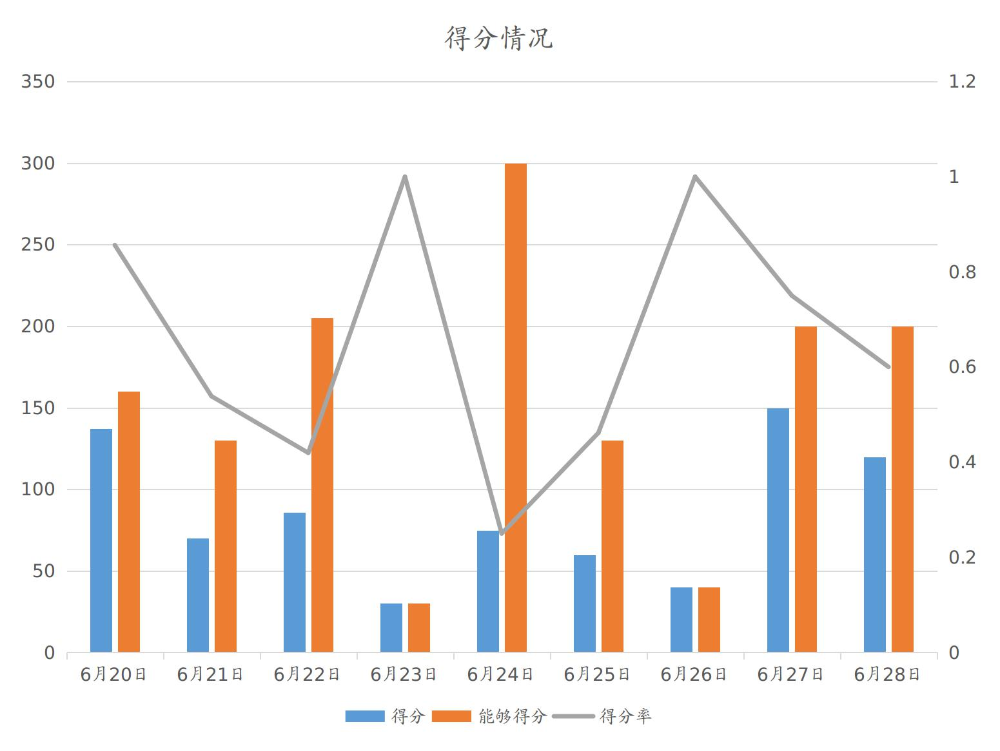
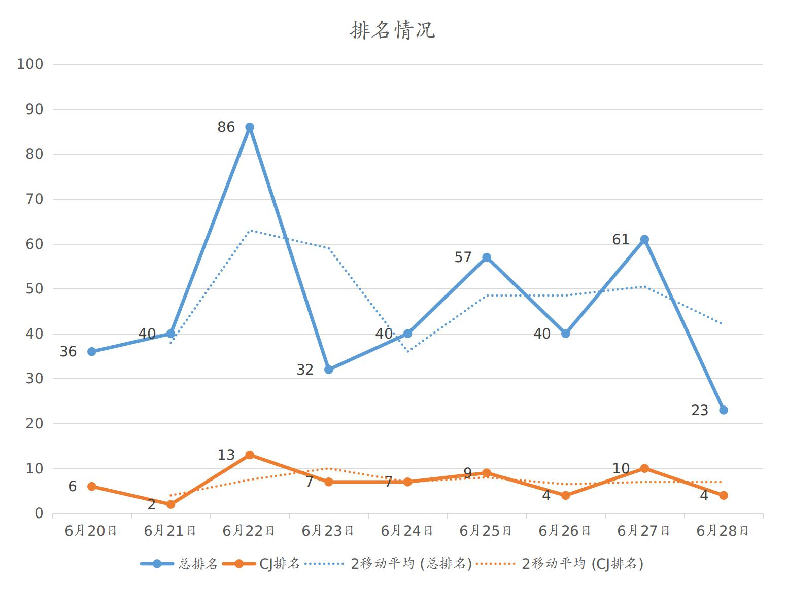
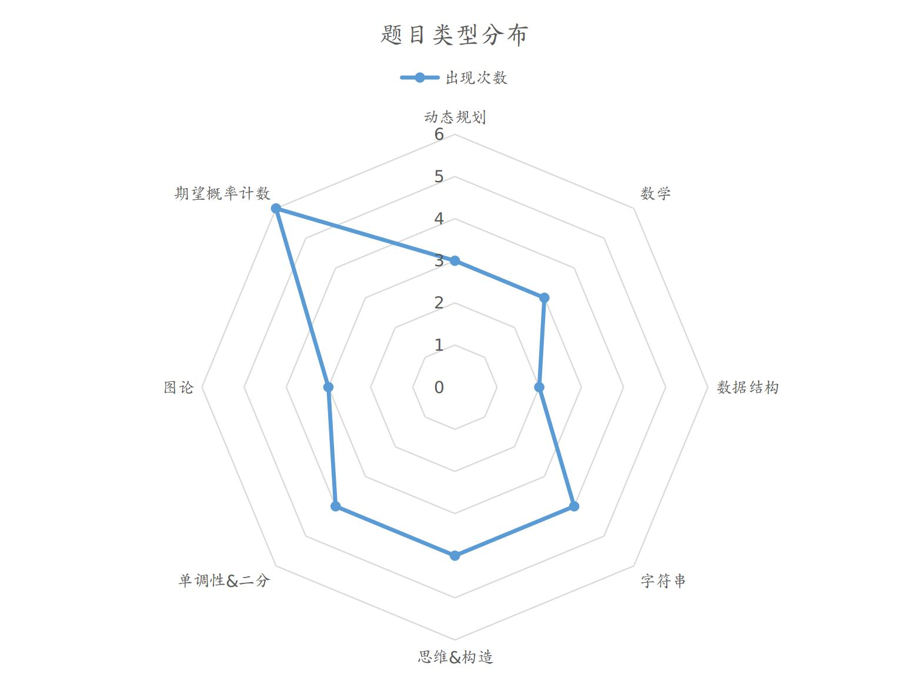
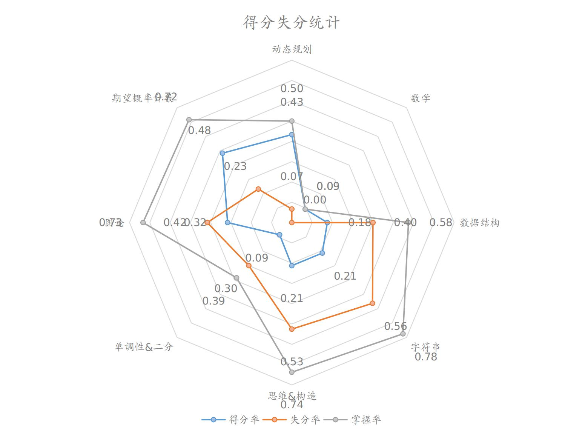

# HN2018省队集训总结
by SYC

## 综述
简单记录一下九天省队集训。

与去年只会写搜索相比，今年省队集训收获颇多。一些题目在考场上能够写出行之有效的算法，也学习到了很多以前不知道的姿势。  
一些技巧和算法也能更加熟练地运用了，像是计数的式子，还有后缀自动机、后缀数组这类算法/数据结构

## 考试分析
考试涉及的面较广，对于各方面的考察较全面，下面分析一下考试情况。
### 得分分析

从得分情况来看，得分不太稳定，对于自己熟练掌握的部分，能够得到较多的分数；而对于自己不太熟练的部分，可能就要花较长的时间。这导致了在有的时候能够获得较高的分数，而另外的一些时候可能无法获得高分。  
对于不熟练或是没能完全掌握的内容，今后要着重练习练习，要更加全面地学习知识。
### 排名分析

从排名情况来看，前段和后段发挥较好，中间有一段时间状态没有跟上来。总体来看，排名还是略呈上升态势，能够逐步稳定。
### 失分细则

从题目类型来看，计数概率和$DP$类考察得最多，其次是字符串和思维/构造题。另一个考得较多的是单调性，比如利用单调性优化$DP$或是凸函数单调性等。

$得分率=\frac{\sum实际得分}{总分}$。从得分率来看，期望概率计数、动态规划和图论的题目得分率较高，这类题在考场上可能需要一定时间推导，但是如果推出来了就比较好实现，所以得分率较高。  
$失分率=\frac{\sum能够得的分-实际得分}{\sum能够得的分}$。从失分率来看，思维构造和字符串类的一些题目是会做的，但是考场上由于各种原因，没有调出来或者是没有想到，考完后