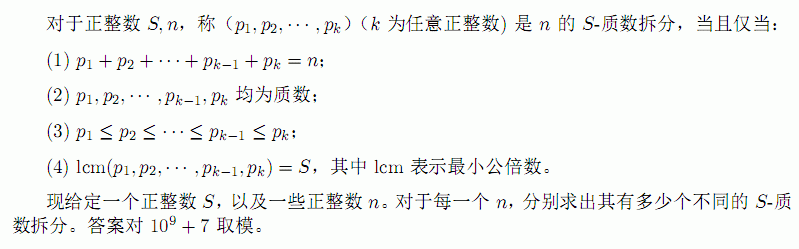

# DZY Loves Math II
[BZOJ3462]



首先自然对 S 质因数分解。只要有一个质因数出现次数超过 1 则无解，算下来这里质因数个数不会超过 7 。然后要求的即是$c _ i$ 满足 $\sum c _ ip _ i=n$ 。  
直观来看是一个背包 DP ，但是 n 的范围很大。注意到 $p _ i$ 均是 S 的因数，那么在最终的某一组分组方案中， $c _ i$ 定能表示成 $x _ i \frac{S}{p _ i}+y _ i,y _ i \in [0,\frac{S}{p _ i})$ 的形式。注意到 $\sum y _ i \le PS$ ，所以不妨枚举 $\sum y _ i$ ，要凑的整 $S$ 数量是确定的，且这部分是一个组合插板。另一边直接背包预处理。

```cpp
#include<cstdio>
#include<cstdlib>
#include<cstring>
#include<algorithm>
using namespace std;

typedef long long ll;
const int maxS=2020000*7;
const int maxP=10;
const int Mod=1e9+7;

int S,X,Q;
int pcnt,P[maxP];
int F[2][maxS],Ifc[maxP];

int QPow(int x,int cnt);
int Plus(int x,int y);
int Minus(int x,int y);
int C(ll n,int m);
int main(){
    Ifc[0]=1;for (int i=1;i<maxP;i++) Ifc[i]=1ll*Ifc[i-1]*QPow(i,Mod-2)%Mod;
    scanf("%d%d",&S,&Q);X=S;
    for (int i=2;1ll*i*i<=X;i++)
        if (X%i==0){
            X/=i;P[++pcnt]=i;
            if (X%i==0){
                while (Q--) puts("0");return 0;
            }
        }
    if (X!=1) P[++pcnt]=X;

    int now=0,sum=0;F[now][0]=1;
    for (int i=1;i<=pcnt;i++){
        now^=1;memset(F[now],0,sizeof(F[now]));sum+=P[i];
        int limit=i*S;
        for (int j=0;j<=limit;j++){
            F[now][j]=F[now^1][j];
            if (j>=P[i]) F[now][j]=Plus(F[now][j],F[now][j-P[i]]);
            if (j>=S) F[now][j]=Minus(F[now][j],F[now^1][j-S]);
        }
    }
    while (Q--){
        ll n;scanf("%lld",&n);n=n-sum;
        if (n<0){
            puts("0");continue;
        }
        int Ans=0;
        for (int i=n%S;i<=pcnt*S&&i<=n;i+=S) Ans=(Ans+1ll*F[now][i]*C((n-i)/S+pcnt-1,pcnt-1)%Mod)%Mod;
        printf("%d\n",Ans);
    }
    return 0;
}
int QPow(int x,int cnt){
    int ret=1;
    while (cnt){
        if (cnt&1) ret=1ll*ret*x%Mod;
        cnt>>=1;x=1ll*x*x%Mod;
    }
    return ret;
}
int Plus(int x,int y){
    x+=y;if (x>=Mod) x-=Mod;return x;
}
int Minus(int x,int y){
    x-=y;if (x<0) x+=Mod;return x;
}
int C(ll n,int m){
    int ret=Ifc[m];
    for (ll i=n;i>n-m;i--) ret=1ll*ret*(i%Mod)%Mod;
    return ret;
}
```