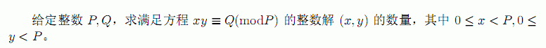

# DZY Loves Math III
[BZOJ3481]

  

枚举 x ，如何计算合法的 y 的个数？设 $d=\gcd(x,P)$注意到对于等式 $xy \equiv 0 \pmod P$ 对于每一个 $\frac{P}{d}|y$ 是成立的，并且把 y 分成 $P/\frac{P}{d}=d$ 组，那么自然就有 $d$ 个合法的 y 了。再考虑同余方程的性质，由裴蜀定理知， $Ans=\sum _ {x=0} ^ {P-1} \gcd(x,P) [\gcd(x,P)|Q]$ ，转化式子为枚举 $\gcd$ 得 $Ans=\sum _ {d|P,d|Q} ^ {P-1} d \varphi(\frac{P}{d})$ ，注意到这是一个积性函数，所以只需要考虑所有质数次幂的贡献，全部乘起来就是答案。对于质数 $g$ ，设其在 P 中的指数为 p ，在 $\gcd(P,Q)$ 中的指数为 q ，则有 $\sum _ {i=0} ^ {q}g ^ i \varphi(g ^ {p-i})=(q+1)g^{p-1}(g-1)$ ，但是注意到当 $p=q$ 时，最后一项是不满足的，需要单独算。  
最后剩下的问题就是分解质因数了，用 PollardRho 和 MillerRabin 。

```cpp
#include<cstdio>
#include<cstdlib>
#include<cstring>
#include<algorithm>
#include<map>
#include<iostream>
using namespace std;

typedef long long ll;
const ll Mod=1e9+7;

map<ll,ll> P,Q,D;
bool qzero=0;

ll random(ll l,ll r);
ll Mul(ll x,ll y,ll M);
ll QPow(ll x,ll cnt,ll M);
void Fc(map<ll,ll> &M,ll X);
bool Miller_Rabin(ll X);
ll Pollard_Rho(ll X);
int main(){
    int n;scanf("%d",&n);srand(20020729);
    for (int i=1;i<=n;i++){
        ll X;scanf("%lld",&X);Fc(P,X);
    }
    for (int i=1;i<=n;i++){
        ll X;scanf("%lld",&X);Fc(Q,X);
    }
    if (qzero) Q=P;
    for (map<ll,ll>::iterator it=P.begin();it!=P.end();++it){
        ll p=(*it).first;
        if (Q.count(p)) D[p]=min(P[p],Q[p]);
    }
    ll Ans=1;
    for (map<ll,ll>::iterator it=P.begin();it!=P.end();++it){
        ll p=(*it).first,mul=1;
        if (D[p]<P[p]) mul=1ll*(D[p]+1)*QPow(p,P[p]-1,Mod)%Mod*(p-1)%Mod;
        else mul=(1ll*D[p]*QPow(p,P[p]-1,Mod)%Mod*(p-1)%Mod+QPow(p,P[p],Mod))%Mod;
        Ans=1ll*Ans*mul%Mod;
    }
    printf("%lld\n",Ans);return 0;
}
ll random(ll l,ll r){
    double dou=1.0*rand()/RAND_MAX;
    return min(r,(ll)(dou*(r-l+1)+l));
}
ll Mul(ll x,ll y,ll M){
    return (x*y-(ll)((long double)x/M*y+0.5)*M+M)%M;
}
ll QPow(ll x,ll cnt,ll M){
    ll ret=1;
    while (cnt){
        if (cnt&1) ret=Mul(ret,x,M);
        x=Mul(x,x,M);cnt>>=1;
    }
    return ret;
}
void Fc(map<ll,ll> &M,ll X){
    if (X==0){
        qzero=1;return;
    }
    if (X==1) return;
    if (Miller_Rabin(X)){
        ++M[X];return;
    }
    ll d=X; while (d==X) d=Pollard_Rho(X);
    Fc(M,d);Fc(M,X/d);return;
}
bool Miller_Rabin(ll X){
    static int pcnt=10,P[]={2,3,5,7,11,13,17,19,23,29};
    for (int i=0;i<10;i++){
        if (X<=P[i]) continue;
        if (QPow(P[i],X-1,X)!=1) return 0;
        ll dX=X-1;
        while (~dX&1){
            dX>>=1;ll dt=QPow(P[i],dX,X);
            if (Mul(dt,dt,X)==1&&dt!=1&&dt!=X-1) return 0;
        }
    }
    return 1;
}
ll Pollard_Rho(ll X){
    ll x=0,y=0,a=random(1,X-1),b=2,g=1;
    while (1){
        ll mul=1;y=x;
        for (int i=1;i<b;i++){
            y=(Mul(y,y,X)+a)%X;
            mul=Mul(mul,abs(y-x),X);
            if (!(i&127)){
                g=__gcd(mul,X);
                if (g>1) return g;
            }
        }
        b<<=1;x=y;
        if (g>1||(g=__gcd(mul,X))>1) break;
    }
    if (g==X) g=1;return g;
}
```