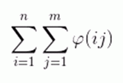

# DZY Loves Math IV
[BZOJ3512]

给定n,m，求  模10^9+7的值。

注意到 n 很小但 m 比较大，考虑枚举 n ，设 $S(n,m)=\sum _ {i=1} ^ m \varphi(in)$ ，要求的即为 $\sum _ {i=1} ^ n S(i,m)$ 。设 $w$ 为 $n$ 的所有质因子之和，$yw=n$ ，则

$$
\begin{align}
S(n,m)&=y \sum _ {i=1} ^ m \varphi(iw) \nonumber \\
&=y \sum _ {i=1} ^ m \varphi(\frac{w}{\gcd(i,w)}) \varphi(i) \gcd(i,w) \nonumber \\
&=y \sum _ {i=1} ^ m \varphi(i) \varphi(\frac{w}{\gcd(i,w)}) \sum _ {d|\gcd(i,w)} \varphi(d) \nonumber \\
&=y \sum _ {i=1} ^ m \varphi(i) \sum _ {e|i,e|w} \varphi(\frac{w}{e}) \nonumber \\
&=y \sum _ {e|w} \varphi(\frac{w}{e}) \sum _ {i=1} ^ {m/e} \varphi(ie) \nonumber \\
&=y \sum _ {e|w} \varphi(\frac{w}{e}) S(e,\lfloor \frac{m}{e} \rfloor) \nonumber
\end{align}
$$
递归去做。边界情况是，当 n=1 时即求 $\varphi$ 的前缀和，这个可以杜教筛；当 $m=1$ 时即是 $\varphi(n)$ ，这个在前面线性筛的时候就处理过了。

```cpp
#include<cstdio>
#include<cstdlib>
#include<cstring>
#include<algorithm>
#include<map>
#include<vector>
#include<iostream>
using namespace std;

const int maxNum=1010000;
const int maxN=100010;
const int Mod=1e9+7;

int pcnt,notp[maxNum],P[maxNum];
int phi[maxNum],sum[maxNum],low[maxNum];
map<int,int> psum,s[maxN];

void Init();
int GetPhi(int n);
int GetS(int n,int m);
int main(){
    Init();int n,m;scanf("%d%d",&n,&m);
    int Ans=0;for (int i=1;i<=n;i++) Ans=(Ans+GetS(i,m))%Mod;
    printf("%d\n",Ans);return 0;
}
void Init(){
    notp[1]=1;phi[1]=1;sum[1]=1;low[1]=1;
    for (int i=2;i<maxNum;i++){
        if (!notp[i]) P[++pcnt]=i,phi[i]=i-1,low[i]=i;
        for (int j=1;j<=pcnt&&1ll*i*P[j]<maxNum;j++){
            notp[i*P[j]]=1;low[i*P[j]]=P[j];
            if (i%P[j]==0){
                phi[i*P[j]]=phi[i]*P[j];break;
            }
            phi[i*P[j]]=phi[i]*(P[j]-1);
        }
        sum[i]=(sum[i-1]+phi[i])%Mod;
    }
    return;
}
int GetPhi(int n){
    if (n<maxNum) return sum[n];
    if (psum.count(n)) return psum[n];
    int ret=(1ll*n*(n+1)/2)%Mod;
    for (int l=2,r;l<=n;l=r+1){
        r=n/(n/l);
        ret=(ret-1ll*(r-l+1)*GetPhi(n/l)%Mod+Mod)%Mod;
    }
    return psum[n]=ret;
}
int GetS(int n,int m){
    if (m==0) return 0;
    if (n==1) return GetPhi(m);
    if (m==1) return phi[n];
    if (s[n].count(m)) return s[n][m];
    vector<int> fc;int X=n,x=1,y;
    while (X!=1){
        int lw=low[X];fc.push_back(lw);x*=lw;
        while (X%lw==0) X/=lw;
    }
    y=n/x;int ret=0,sz=fc.size(),S=1<<sz;
    for (int i=0;i<S;i++){
        int e=1;for (int j=0;j<sz;j++) if ((i>>j)&1) e*=fc[j];
        ret=(ret+1ll*phi[x/e]*GetS(e,m/e)%Mod)%Mod;
    }
    ret=1ll*ret*y%Mod;return s[n][m]=ret;
}
```