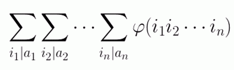

# DZY Loves Math V
[BZOJ3560]

给定n个正整数a1,a2,…,an，求  的值（答案模10^9+7）。

 $\varphi$ 是积性函数，那么只需要考虑每一个质数的贡献。由于 $\varphi(p^k)=p^k\frac{p}{p-1}$ ，故某一质数 $p$ 在所有数中的贡献就是 $((\prod _ {i=1} ^ n \sum _ {e=0} ^ {p ^ e|a _ i} p _ e)-1)\frac{p}{p-1}+1$ 。

```cpp
#include<cstdio>
#include<cstdlib>
#include<cstring>
#include<algorithm>
#include<map>
using namespace std;

const int Mod=1e9+7;

int n;
map<int,int> Mp;

int QPow(int x,int cnt);
int main(){
    scanf("%d",&n);
    for (int i=1;i<=n;i++){
        int X;scanf("%d",&X);
        for (int i=2;1ll*i*i<=X;i++)
            if (X%i==0){
                int sum=1,mul=1;
                while (X%i==0) mul=1ll*mul*i%Mod,sum=(sum+mul)%Mod,X/=i;
                if (Mp.count(i)==0) Mp[i]=1;
                Mp[i]=1ll*Mp[i]*sum%Mod;
            }
        if (X!=1){
            if (Mp.count(X)==0) Mp[X]=1;
            Mp[X]=1ll*Mp[X]*(X+1)%Mod;
        }
    }
    int Ans=1;
    for (map<int,int>::iterator it=Mp.begin();it!=Mp.end();++it){
        int p=(*it).first,sum=(*it).second;sum=(sum-1+Mod)%Mod;
        sum=1ll*sum*(p-1)%Mod*QPow(p,Mod-2)%Mod;
        sum=(sum+1)%Mod;Ans=1ll*Ans*sum%Mod;
    }
    printf("%d\n",Ans);return 0;
}
int QPow(int x,int cnt){
    int ret=1;
    while (cnt){
        if (cnt&1) ret=1ll*ret*x%Mod;
        x=1ll*x*x%Mod;cnt>>=1;
    }
    return ret;
}
```