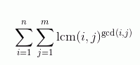

# DZY Loves Math VI
[BZOJ3561]

给定正整数n,m。求 

推导一下。

$$
\begin{align}
Ans&=\sum _ {i=1} ^ n \sum _ {j=1} ^ m [\frac{ij}{\gcd(i,j)}] ^ {\gcd(i,j)} \nonumber \\
&=\sum _ {d=1} ^ n \frac{1}{d^d} \sum _ {i=1} ^ {n/d} \sum _ {j=1} ^ {m/d} (idjd)^d [\gcd(i,j)=1] \nonumber \\
&=\sum _ {d=1} ^ n d ^ d \sum _ {i=1} ^ {n/d} \mu(i) \sum _ {a=1} ^ {n/id} (ai)^d \sum _ {b=1} ^ {m/id} (bi)^d \nonumber \\
&=\sum _ {d=1} ^ n d ^ d \sum _ {i=1} ^ {n/d} \mu(i) i ^ {2d} \sum _ {a=1} ^ {n/id} a ^ d \sum _ {b=1} ^ {m/id} b ^ d \nonumber
\end{align}
$$

枚举 $d$ ，每次处理出 $i ^ d$ 的前缀和即可计算。注意需要计算到的仅仅是 $n/d$ 项。

```cpp
#include<cstdio>
#include<cstdlib>
#include<cstring>
#include<algorithm>
#include<iostream>
using namespace std;

const int maxN=505000;
const int Mod=1e9+7;

int n,m,Pw[maxN],Sm[maxN];
int pcnt,notp[maxN],P[maxN],Mu[maxN];

int QPow(int x,int cnt);
int main(){
    scanf("%d%d",&n,&m);if (n>m) swap(n,m);
    Mu[1]=1;notp[1]=1;
    for (int i=2;i<=n;i++){
        if (!notp[i]) P[++pcnt]=i,Mu[i]=-1;
        for (int j=1;j<=pcnt&&1ll*i*P[j]<=n;j++){
            notp[i*P[j]]=1;if (i%P[j]==0) break;
            Mu[i*P[j]]=-Mu[i];
        }
    }
    for (int i=1;i<=m;i++) Pw[i]=1,Sm[i]=Sm[i-1]+Pw[i];
    int Ans=0;
    for (int d=1;d<=n;d++){
        for (int i=1;i<=m/d;i++) Pw[i]=1ll*Pw[i]*i%Mod,Sm[i]=(Sm[i-1]+Pw[i])%Mod;
        int sum=0;
        for (int i=1;i<=n/d;i++) sum=(sum+1ll*Mu[i]*QPow(i,d+d)%Mod*Sm[n/i/d]%Mod*Sm[m/i/d]%Mod+Mod)%Mod;
        Ans=(Ans+1ll*QPow(d,d)*sum)%Mod;
    }
    printf("%d\n",Ans);return 0;
}
int QPow(int x,int cnt){
    int ret=1;
    while (cnt){
        if (cnt&1) ret=1ll*ret*x%Mod;
        x=1ll*x*x%Mod;cnt>>=1;
    }
    return ret;
}
```