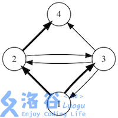
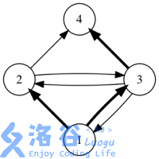
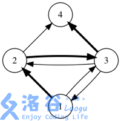
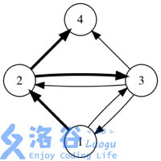
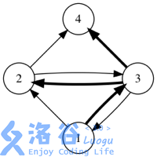
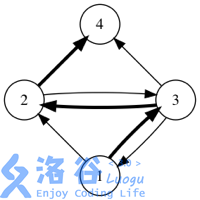

# [CQOI2018]社交网络
[BZOJ5297 Luogu4455]

当今社会，在社交网络上看朋友的消息已经成为许多人生活的一部分。通常，一个用户在社交网络上发布一条消息(例如微博、状态、Tweet等) 后，他的好友们也可以看见这条消息，并可能转发。转发的消息还可以继续被人转发，进而扩散到整个社交网络中。  
在一个实验性的小规模社交网络中我们发现，有时一条热门消息最终会被所有人转发。为了研究这一现象发生的过程，我们希望计算一条消息所有可能的转发途径有多少种。为了编程方便，我们将初始消息发送者编号为1,其他用户编号依次递增。  
该社交网络上的所有好友关系是已知的,也就是说对于A、B 两个用户，我们知道A 用户可以看到B 用户发送的消息。注意可能存在单向的好友关系，即lA 能看到B 的消息，但B 不能看到A 的消息。  
还有一个假设是，如果某用户看到他的多个好友转发了同一条消息，他只会选择从其中一个转发，最多转发一次消息。从不同好友的转发，被视为不同的情况。  
如果用箭头表示好友关系，下图展示了某个社交网络中消息转发的所有可能情况。 (初始消息是用户1发送的，加粗箭头表示一次消息转发)







有向图的生成树计数，矩阵中统计的变成单向边的出边和出度。

```cpp
#include<iostream>
#include<cstdio>
#include<cstdlib>
#include<cstring>
#include<algorithm>
using namespace std;

#define ll long long
#define mem(Arr,x) memset(Arr,x,sizeof(Arr))

const int maxN=310;
const int Mod=10007;
const int inf=2147483647;

int n,m;
int Mat[maxN][maxN];

int Guass();

int main()
{
	scanf("%d%d",&n,&m);
	for (int i=1;i<=m;i++)
	{
		int u,v;scanf("%d%d",&u,&v);
		Mat[u][v]--;Mat[u][u]++;
	}
	
	printf("%d\n",Guass());
}

int Guass()
{
	int ret=1;
	for (int i=2;i<=n;i++)
	{
		for (int j=i+1;j<=n;j++)
			while (Mat[j][i])
			{
				int p=Mat[i][i]/Mat[j][i];
				for (int k=i;k<=n;k++) Mat[i][k]=(Mat[i][k]-1ll*Mat[j][k]*p%Mod+Mod)%Mod;
				ret=-ret;
				swap(Mat[i],Mat[j]);
			}
		ret=1ll*ret*Mat[i][i]%Mod;
	}
	return (ret+Mod)%Mod;
}
```