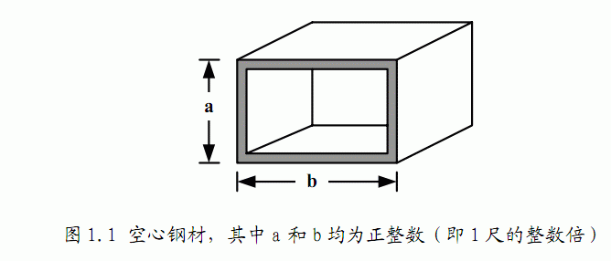
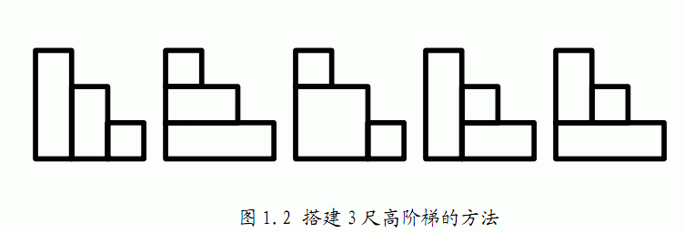

# [AHOI2012]树屋阶梯
[BZOJ2822 Luogu2532]

暑假期间，小龙报名了一个模拟野外生存作战训练班来锻炼体魄，训练的第一个晚上，教官就给他们出了个难题。由于地上露营湿气重，必须选择在高处的树屋露营。小龙分配的树屋建立在一颗高度为N+1尺（N为正整数）的大树上，正当他发愁怎么爬上去的时候，发现旁边堆满了一些空心四方钢材（如图1.1），经过观察和测量，这些钢材截面的宽和高大小不一，但都是1尺的整数倍，教官命令队员们每人选取N个空心钢材来搭建一个总高度为N尺的阶梯来进入树屋，该阶梯每一步台阶的高度为1尺，宽度也为1尺。如果这些钢材有各种尺寸，且每种尺寸数量充足，那么小龙可以有多少种搭建方法？（注：为了避免夜里踏空，钢材空心的一面绝对不可以向上。）



以树屋高度为4尺、阶梯高度N=3尺为例，小龙一共有如图1.2所示的5种  
搭建方法：


卡特兰数，维基百科有：https://en.wikipedia.org/wiki/Catalan_number

```cpp
#include<iostream>
#include<cstdio>
#include<cstdlib>
#include<cstring>
#include<algorithm>
#include<iomanip>
using namespace std;

#define ll long long
#define mem(Arr,x) memset(Arr,x,sizeof(Arr))

const int maxN=510;
const int B=1000;
const int inf=2147483647;

class Bigint
{
public:
	int num[6000],high;
	int bp[6000];
	
	void MainTain(){
		for (int i=1;i<high;i++)
			num[i+1]+=num[i]/B,num[i]%=B;
		while (num[high]>=B) num[high+1]+=num[high]/B,num[high]%=B,high++;
		return;
	}
	
	Bigint(int a){
		mem(num,0);mem(bp,0);
		num[high=1]=a;MainTain();return;
	}

	Bigint operator * (int a){
		for (int i=1;i<=high;i++) num[i]=num[i]*a;
		MainTain();return *this;
	}

	Bigint operator / (int a){
		int bcnt=0,ret=0;
		for (int i=high;i>=1;i--){
			ret=ret*B+num[i];
			bp[i]=ret/a;ret%=a;
		}
		for (int i=1;i<=high;i++) num[i]=bp[i];
		while (num[high]==0) high--;
		return *this;
	}
};

int n;
Bigint Ans(1);
ostream & operator << (ostream &os,Bigint B);

int main(){
	scanf("%d",&n);
	if (n<=2){
		printf("1\n");return 0;
	}

	for (int i=2;i<=n;i++) Ans=Ans*(4*i-2)/(i+1);
	printf("%d",Ans.num[Ans.high]);
	for (int i=Ans.high-1;i>=1;i--) printf("%03d",Ans.num[i]);
	return 0;
}

ostream & operator << (ostream &os,Bigint B){
	os<<B.num[B.high];
	for (int i=B.high-1;i>=1;i--) os<<setfill('0')<<setw(3)<<B.num[i];
	return os;
}
```