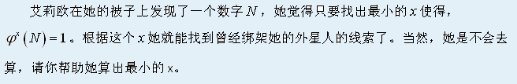

# [HAOI2012]外星人
[BZOJ2749 Luogu2350]



除了 2 以外的所有质数都是奇数，也就意味着其 phi 一定是偶数，且唯一分解出来若干的 2 最多。那么最后的答案就只与每一个质数的 phi 的 2 有关。线性筛出每一个数的 phi 的 2 的因子个数，那么其分解次数就是 2 的个数。  
需要注意的是，如果原来不存在 2 则说明第一次分解的时候不能分解掉一个 2 ，答案最后要加一。

```cpp
#include<iostream>
#include<cstdio>
#include<cstdlib>
#include<cstring>
#include<algorithm>
using namespace std;

#define ll long long
#define mem(Arr,x) memset(Arr,x,sizeof(Arr))

const int maxN=101000;
const int inf=2147483647;

bool notprime[maxN];
int pcnt,P[maxN],Cnt[maxN];

int main(){
	notprime[1]=1;Cnt[1]=1;
	for (int i=2;i<maxN;i++){
		if (notprime[i]==0) P[++pcnt]=i,Cnt[i]=Cnt[i-1];
		for (int j=1;(j<=pcnt)&&(1ll*i*P[j]<maxN);j++){
			notprime[i*P[j]]=1;
			Cnt[i*P[j]]=Cnt[i]+Cnt[P[j]];
			if (i%P[j]==0) break;
		}
	}
	int TTT;scanf("%d",&TTT);
	while (TTT--){
		int m;scanf("%d",&m);
		ll Ans=0,two=1;
		while (m--){
			int p,q;scanf("%d%d",&p,&q);
			Ans+=1ll*Cnt[p]*q;
			if (p==2) two=0;
		}
		printf("%lld\n",Ans+two);
	}
	return 0;
}
```