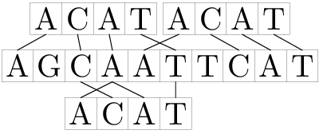

# Fuzzy Search
[CF528D]

有两个基因串S和T，他们只包含AGCT四种字符。现在你要找出T在S中出现了几次。 有一个门限值k≥0。T在S的第i(1≤i≤|S|-|T|+1)个位置中出现的条件如下：把T的开头和S的第i个字符对齐，然后T中的每一个字符能够在S中找到一样的，且位置偏差不超过k的，那么就认为T在S的第i个位置中出现。也就是说对于所有的 j (1≤j≤|T|)，存在一个 p (1≤p≤|S|)，使得|(i+j-1)-p|≤k 和[p]=T[j]都成立。 例如，根据这样的定义"ACAT"出现在"AGCAATTCAT"的第2，3和6的位置。



如果k=0，那么这个就是经典的字符串匹配问题。 现在给定门限和两个基因串S，T，求出T在S中出现的次数。

分别枚举 4 种字符，如果构造使得能够匹配的贡献为 0 ，不能匹配的贡献为 1 ，那么和为 0 的部分即为合法的位置。  
设 Ai,Bi 分别表示 S,T 的某一位是否为当前枚举的字符，如果是则为 1 否则为０。构造 $f(i)=\sum _ {j=0}^{m-1}B _ j(A _ {i-j} - B _ j)^2$ ，当 f(i) 为 0 时位置合法。展开得到 $f(i)=\sum _ {j=0} ^ {m-1} A _ {i-j} ^ 2 B _ j - 2 A _ {i-j} B _ j ^ 2 + B _ j ^ 3$ ，注意到 A,B 均为 0/1 ，所以可以继续化简为 $f(i)=\sum _ {j=0} ^ {m-1} B _ j-A _ {i-j}B _ j$ ，前面是一个常量，后面是卷积形式， NTT 即可。

```cpp
#include<iostream>
#include<cstdio>
#include<cstdlib>
#include<cstring>
#include<algorithm>
using namespace std;

#define ll long long
#define mem(Arr,x) memset(Arr,x,sizeof(Arr))

const int maxN=202000<<2;
const char AGCT[]="AGCT";
const int Mod=998244353;
const int G=3;
const int inf=2147483647;

int n,m,K;
int N,L,Rader[maxN],Mark[maxN];
char S[maxN],T[maxN];
int A[maxN],B[maxN];

int QPow(int x,int cnt);
void NTT(int *P,int opt);

int main(){
	scanf("%d%d%d",&n,&m,&K);scanf("%s",S);scanf("%s",T);reverse(&T[0],&T[m]);
	for (N=1;N<n+n;N<<=1) L++;for (int i=0;i<N;i++) Rader[i]=(Rader[i>>1]>>1)|((i&1)<<(L-1));
	for (int c=0;c<4;c++){
		for (int i=0,lst=-K-K-10;i<n;i++){
			if (S[i]==AGCT[c]) lst=i;
			if (i-lst<=K) A[i]=1;
		}
		for (int i=n-1,lst=n+K+K+10;i>=0;i--){
			if (S[i]==AGCT[c]) lst=i;
			if (lst-i<=K) A[i]=1;
		}
		int sum=0;
		for (int i=0;i<m;i++) B[i]=(T[i]==AGCT[c]),sum+=B[i];
		NTT(A,1);NTT(B,1);
		for (int i=0;i<N;i++) A[i]=1ll*A[i]*B[i]%Mod;
		NTT(A,-1);
		for (int i=m-1;i<n;i++) if (sum!=A[i]) Mark[i]=1;
		for (int i=0;i<N;i++) A[i]=B[i]=0;
	}
	int Ans=0;for (int i=m-1;i<n;i++) Ans+=(Mark[i]==0);
	printf("%d\n",Ans);return 0;
}

int QPow(int x,int cnt){
	int ret=1;
	while (cnt){
		if (cnt&1) ret=1ll*ret*x%Mod;
		x=1ll*x*x%Mod;cnt>>=1;
	}
	return ret;
}

void NTT(int *P,int opt){
	for (int i=0;i<N;i++) if (i<Rader[i]) swap(P[i],P[Rader[i]]);
	for (int i=1;i<N;i<<=1){
		int dw=QPow(G,(Mod-1)/(i<<1));
		if (opt==-1) dw=QPow(dw,Mod-2);
		for (int j=0;j<N;j+=(i<<1))
			for (int k=0,w=1;k<i;k++,w=1ll*w*dw%Mod){
				int X=P[j+k],Y=1ll*P[j+k+i]*w%Mod;
				P[j+k]=(X+Y)%Mod;P[j+k+i]=(X-Y+Mod)%Mod;
			}
	}
	if (opt==-1){
		int inv=QPow(N,Mod-2);
		for (int i=0;i<N;i++) P[i]=1ll*P[i]*inv%Mod;
	}
	return;
}
```