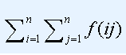

# Lucas的数论
[BZOJ4176]

去年的Lucas非常喜欢数论题，但是一年以后的Lucas却不那么喜欢了。  
在整理以前的试题时，发现了这样一道题目“求Sigma(f(i)),其中1<=i<=N”，其中 表示i的约数个数。他现在长大了，题目也变难了。
求如下表达式的值：

其中 表示ij的约数个数。  
他发现答案有点大，只需要输出模1000000007的值。

对于约数个数，有一个经典式子 $f(ij)=\sum _ {u|i} \sum _ {v|j} [u \perp v]$ ，那么直接带进去展开。

$$
\begin{align}
Ans&=\sum _ {i=1} ^ n \sum _ {j=1} ^ n \sum _ {u|i} \sum _ {v|i} [u \perp v] \nonumber \\
&=\sum _ {u=1} ^ n \sum _ {v=1} ^ n [u \perp v] \lfloor \frac{n}{u} \rfloor \lfloor \frac{n}{v} \rfloor \nonumber \\
&=\sum _ {d=1} ^ n \mu(d) (\sum _ {i=1} ^ {n/d} \lfloor \frac{n}{id} \rfloor) ^ 2 \nonumber
\end{align}
$$

对 $\frac{n}{d}$ 数论分块，mu 就用杜教筛来筛 ，后面进去同样是数论分块来算。

```cpp
#include<iostream>
#include<cstdio>
#include<cstdlib>
#include<map>
using namespace std;

#define ll long long

const int maxN=10100000;
const int Mod=1000000007;
const int inf=2147483647;

bool notprime[maxN];
int pcnt,P[maxN],Mu[maxN];
map<int,int> Mp;

void Init();
int GetMu(ll n);
int Calc(ll n);

int main(){
	Init();ll n;scanf("%lld",&n);
	int Ans=0;
	for (ll i=1,j;i<=n;i=j+1){
		j=n/(n/i);
		int m=(GetMu(j)-GetMu(i-1)+Mod)%Mod,k=Calc(n/i);
		k=1ll*k*k%Mod;m=(1ll*m*k%Mod)%Mod;
		Ans=(Ans+m)%Mod;
	}
	printf("%d\n",Ans);return 0;
}

void Init(){
	notprime[1]=1;Mu[1]=1;
	for (int i=2;i<maxN;i++){
		if (notprime[i]==0) P[++pcnt]=i,Mu[i]=Mod-1;
		for (int j=1;(j<=pcnt)&&(1ll*i*P[j]<maxN);j++){
			notprime[i*P[j]]=1;
			if (i%P[j]==0) break;
			Mu[i*P[j]]=Mod-Mu[i];
		}
	}
	for (int i=2;i<maxN;i++) Mu[i]=(Mu[i]+Mu[i-1])%Mod;
	return;
}

int GetMu(ll n){
	if (n<maxN) return Mu[n];
	if (Mp.count(n)) return Mp[n];
	int ret=0;
	for (ll i=2,j;i<=n;i=j+1){
		j=n/(n/i);
		ret=(ret+1ll*(j-i+1)*GetMu(n/i)%Mod)%Mod;
	}
	return Mp[n]=(1-ret+Mod)%Mod;
}

int Calc(ll n){
	int ret=0;
	for (ll i=1,j;i<=n;i=j+1){
		j=n/(n/i);
		ret=(ret+1ll*(j-i+1)*(n/i)%Mod)%Mod;
	}
	return ret;
}
```