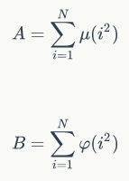

# 神犇和蒟蒻
[BZOJ4916]



第一问，由莫比乌斯函数的定义可得只有$n=1$时有值$1$，其他时候为$0$，所以前缀和也为$1$。  
第二问，由欧拉函数性质，可以得到$S(n)=\sum _ {i=1} ^ N i\varphi(i)$，考虑杜教筛的式子$g(1)S(n)=\sum _ {i=1} ^ N (g * f) - \sum _ {i=2} ^ N g(i)S(\frac{N}{i})$，带入这里的式子，得到$S(n)=\sum _ {i=1} ^ N \sum _ {d|i} g(\frac{i}{d}) d\varphi(d) - \sum _ {i=2} ^ N g(i) S(\frac{N}{i})$。当$g$取单位函数$id(n)=n$时比较好算，得到$S(n)=\sum _ {i=1} ^ N \sum _ {d|i} \frac{i}{d} d \varphi(d)- \sum _ {i=2} ^ N i S(\frac{N}{i})=\sum _ {i=1} ^ N i \sum _ {d|i} \varphi(d) - \sum _ {i=2} ^ N i S(\frac{N}{i}) = \sum _ {i=1} ^N i ^ 2- \sum _ {i=2} ^ N iS(\frac{N}{i})$。  
后面可以数论分块，前面则是平方的和，有公式$\sum _ {i=1} ^ N i ^ 2=\frac{n(n+1)(2n+1)}{6}$。  
证明：
由$(n+1) ^ 3=n ^ 3+3n ^ 2+3n+1$，得到$(n+1) ^ 3 - n ^ 3=3n ^ 2 + 3n+1$，依次类推可得$n ^ 3 - (n-1) ^ 3 =3 (n-1) ^ 2 + 3(n-1)+1 \dots$，累加可以得到$(n+1) ^ 3-1=3 (1 ^ 2+2 ^ 2+3 ^ 2+4 ^ 2+5 ^ 2+ \dots + n ^ 2) + 3(1+2+3+ \dots + n)+n$，移项后即可得证。

```cpp
#include<iostream>
#include<cstdio>
#include<cstdlib>
#include<cstring>
#include<algorithm>
#include<map>
using namespace std;

#define ll long long
#define mem(Arr,x) memset(Arr,x,sizeof(Arr))

const int maxN=10100000;
const int Mod=1e9+7;
const int inf=2147483647;

int inv2,inv6;
bool notprime[maxN];
int pricnt,Prime[maxN],Phi[maxN];
map<int,int> Rc;

int QPow(int x,int cnt);
void Init();
int Calc(int n);

int main(){
	inv2=QPow(2,Mod-2);inv6=QPow(6,Mod-2);
	Init();

	int N;scanf("%d",&N);
	printf("1\n%d\n",Calc(N));

	return 0;
}

int QPow(int x,int cnt){
	int ret=1;
	while (cnt){
		if (cnt&1) ret=1ll*ret*x%Mod;
		x=1ll*x*x%Mod;cnt>>=1;
	}
	return ret;
}

void Init(){
	Phi[1]=1;notprime[1]=1;
	for (int i=2;i<maxN;i++){
		if (notprime[i]==0) Prime[++pricnt]=i,Phi[i]=i-1;
		for (int j=1;(j<=pricnt)&&(1ll*i*Prime[j]<maxN);j++){
			notprime[i*Prime[j]]=1;
			if (i%Prime[j]==0){
				Phi[i*Prime[j]]=Phi[i]*Prime[j];break;
			}
			Phi[i*Prime[j]]=Phi[i]*Phi[Prime[j]];
		}
	}

	for (int i=1;i<maxN;i++) Phi[i]=1ll*Phi[i]*i%Mod;

	for (int i=1;i<maxN;i++) Phi[i]=(Phi[i]+Phi[i-1])%Mod;

	return;
}

int Calc(int n){
	if (n<maxN) return Phi[n];
	if (Rc.count(n)) return Rc[n];
	int ret=0;
	for (int i=2,j;i<=n;i=j+1){
		j=n/(int)(n/i);
		ret=(ret+1ll*(i+j)*(j-i+1)%Mod*inv2%Mod*Calc(n/i)%Mod)%Mod;
	}
	return Rc[n]=(1ll*n*(n+1)%Mod*(2*n+1)%Mod*inv6%Mod+Mod-ret)%Mod;
}
```