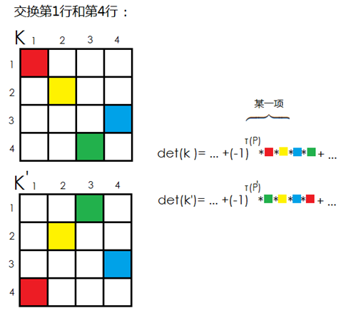
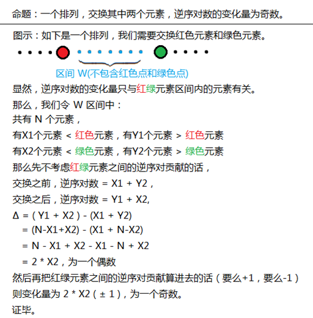

# MatrixTree
## 定义和定理
对于一个无向图 $G$ ，它的生成树个数等于其基尔霍夫 $Kirchhoff$ 矩阵任何一个 $N-1$ 阶主子式的行列式的绝对值  

> 所谓的 $N-1$ 阶主子式就是对于一个任意的一个 $r$ ，将矩阵的第 $r$ 行和第 $r$ 列同时删去得到的新矩阵，简记为$M _ {ii}$。

基尔霍夫矩阵的一种构造方法：  
$Kirchhoff$ 矩阵 $K$ =度数矩阵 $D$ - 邻接矩阵 $A$

## 行列式相关内容
### 行列式的求法
$det(K)=\sum _ {P}{(-1)}^{\tau{(P)}}\times{K} _ {1,p1}\times{K} _  {2,p2}\times{K}  _ {3,p3}\times\cdots\times{K} _ {N,pN}$，其中$P$为$[1,n]$的任意一个排列，$\tau(P)$表示排列$P$的逆序对数，可以认为是在矩阵的每一行选择一个数使得每一列有且仅选择了一个数。  
这是直接的求法，由于排列一共有$n!$个，所以求解的复杂度为$O(n!n)$，下面由行列式的若干性质可以得到一个消元的解法。

### 行列式的性质
#### 性质一
> 互换矩阵的两行或两列，行列式变号

证明：  
考虑对于原矩阵 $K$，我们可以得到其行列式的求和式：  
$det(K)=\sum _ {P}{(-1)}^{\tau{(P)}}\times{K} _ {1,p1}\times{K} _ {2,p2}\times{K} _ {3,p3}\times\cdots\times{K} _ {N,pN}$
若交换某两行的位置后得到了 $K'$ 矩阵，若写出其行列式的求和式，不难发现，如果不看符号位的变化，只看每一个乘积项，那么这两个的矩阵的行列式的求和式是完全相同的。我们把相同的乘积项移到对应的位置，如图示：


但是很显然，两个矩阵的这一项对应的排列 $P$ 和 $P'$ 不同：  
> P:1 2 4 3
> P':3 2 4 1

而又有命题，交换排列中两个元素的位置，逆序对的变化数量为奇数。  


#### 性质二
> 如果矩阵有两行完全相同，则行列式为$0$

证明：由性质一知，如果交换这两行，行列式要变号，但实际上行列式应该不变，即$x=-x$，所以$x=0$

#### 性质三
> 给矩阵的一行同时乘以一个数$k$，相当于给行列式乘以$k$

把$k$带入到式子中，发现可以直接提取出一个公因子$k$，所以相当于是原来的行列式乘以$k$。

#### 性质四
行列式的线性性
$$\begin{bmatrix} a _ {11} & a _ {12} & \cdots & a _ {1n} \\\\ \vdots & \vdots &  & \vdots \\\\ a _ {i1}+b _ {i1} & a _ {i2}+b _ {i2} & \cdots & a _ {in}+b _ {in} \\\\ \vdots & \vdots &  & \vdots \\\\ a _ {n1} & a _ {n2} & \cdots & a _ {nn} \end{bmatrix} = \begin{bmatrix} a _ {11} & a _ {12} & \cdots & a _ {1n} \\\\ \vdots & \vdots &  & \vdots \\\\ a _ {i1} & a _ {i2} & \cdots & a _ {in} \\\\ \vdots & \vdots &  & \vdots \\\\ a _ {n1} & a _ {n2} & \cdots & a _ {nn} \end{bmatrix} + \begin{bmatrix} a _ {11} & a _ {12} & \cdots & a _ {1n} \\\\ \vdots & \vdots &  & \vdots \\\\ b _ {i1} & b _ {i2} & \cdots & b _ {in} \\\\ \vdots & \vdots &  & \vdots \\\\ a _ {n1} & a _ {n2} & \cdots & a _ {nn} \end{bmatrix}$$

#### 性质五
> 如果矩阵有两行成比例，则行列式的值为$0$

证明：把其中一行提取出公因子$k$，这样就转化为有两行一样的情况了。

#### 性质六
> 如果把矩阵的一行以一定倍数加到另一行上，行列式不变

根据线性性可以把矩阵拆成两个，一个是原来的，另一个是被加的一行变成那个加上的若干倍，这样后一个矩阵的行列式为$0$，所以原行列式不变

#### 性质七
> 如果矩阵是上三角或下三角矩阵，行列式等于对角线的乘积

根据计算式，只有当排列$P$满足$P _ i=i$时才能保证每一项都不是$0$，即为对角线

### 优化行列式的计算
那么根据上面的形式，可以采用高斯消元的方法，把矩阵化成上三角形式，这样就可以$O(n^3)$地计算行列式了。
```cpp
ld Guass()
{
    ld ret=1;
    for (int i=1;i<n;i++)
    {
        for (int j=i;j<n;j++)
            if (fabs(Mat[i][i])<fabs(Mat[j][i])){
                swap(Mat[i],Mat[j]);
                ret=-ret;
            }
        for (int j=i+1;j<n;j++)
        {
            ld p=Mat[j][i]/Mat[i][i];
            for (int k=1;k<n;k++) Mat[j][k]=Mat[j][k]-Mat[i][k]*p;
        }
        ret=ret*Mat[i][i];
    }
    return fabs(ret);
}
```

如果要求不能出现小数，可以采用类似辗转相除的方法

```cpp
int Guass()
{
    int Ans=1;
    for (int i=1;i<idcnt;i++)
    {
        for (int j=i+1;j<idcnt;j++)
            while (Mat[j][i])
            {
                int p=Mat[i][i]/Mat[j][i];
                for (int k=i;k<idcnt;k++)
                    Mat[i][k]=(Mat[i][k]-1ll*Mat[j][k]*p%Mod+Mod)%Mod;
                swap(Mat[i],Mat[j]);
                Ans=-Ans;
            }
        Ans=1ll*Ans*Mat[i][i]%Mod;
    }
    return (Ans+Mod)%Mod;
}
```

## Matrix的拓展形式
### 计算边权之积的和
边矩阵变成边权和矩阵，度数矩阵变成出边边权之和，然后就可以正常做高斯消元

### 有向图计数
边矩阵变成只记出边，度数矩阵变成只记出边个数，然后余子式$M _ {ii}$就是以$i$为根的有向生成树个数。

## 参考
https://www.cnblogs.com/zj75211/p/8039443.html  
http://www.cnblogs.com/TSHugh/p/8463532.html  
https://www.cnblogs.com/meowww/p/6485422.html