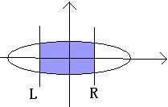

# Ellipse
[HDU1724]

Math is important!! Many students failed in 2+2’s mathematical test, so let's AC this problem to mourn for our lost youth..
Look this sample picture:  
  
A ellipses in the plane and center in point O. the L,R lines will be vertical through the X-axis. The problem is calculating the blue intersection area. But calculating the intersection area is dull, so I have turn to you, a talent of programmer. Your task is tell me the result of calculations.(defined PI=3.14159265 , The area of an ellipse A=PI*a*b )

由椭圆方程$\frac{x^2}{a}+\frac{y^2}{b}=1$，变形得到$b^2x^2+a^2y^2=a^2b^2$，继续变形得到$y=\frac{b}{a}\sqrt{a^2-x^2}$，这样表示出来的是椭圆的上半部分的解析式，对它求定积分。  
$$\int _ l^r \frac{b}{a}\sqrt{a^2-x^2}dx$$  
换元，设$x=a\sin(t)$，则根据换元公式得到$dx=a \cos(t)dt$，此时原上下界$[l,r]$也要换为$[acos(\frac{l}{a}),acos(\frac{r}{a})]$，设为$[l',r']$。  
$$\frac{b}{a}\int _ {l'}^{r'} a^2 \cos^2(t)dt \\\\ =ab \int _ {l'}^{r'}cos^2(t)dt \\\\ =-ab\int _ {l'}^{r'}\sin^2(t)dt \\\\ =-ab(t+\frac{1}{2}\sin(2t))$$  
当然，由于直接求求得是上面部分的面积，所以还要乘二。

```cpp
#include<iostream>
#include<cstdio>
#include<cstdlib>
#include<cstring>
#include<algorithm>
#include<cmath>
using namespace std;

#define ll long long
#define ld double
#define mem(Arr,x) memset(Arr,x,sizeof(Arr))

ld Calc(ld x);

int main()
{
	int TTT;scanf("%d",&TTT);
	while (TTT--)
	{
		ld a,b,l,r;scanf("%lf%lf%lf%lf",&a,&b,&l,&r);
		if (l==r){
			printf("%.3lf\n",(ld)0.0);continue;
		}
		ld ans=-a*b;
		printf("%.3lf\n",ans*(Calc(acos(r/a))-Calc(acos(l/a))));
	}
	return 0;
}

ld Calc(ld x)
{
	return x-0.5*sin(2.0*x);
}
```