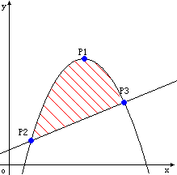

# The area
[HDU1071]

Ignatius bought a land last week, but he didn't know the area of the land because the land is enclosed by a parabola and a straight line. The picture below shows the area. Now given all the intersectant points shows in the picture, can you tell Ignatius the area of the land?  
Note: The point P1 in the picture is the vertex of the parabola.  


求出抛物线和一次函数的解析式后，相减得到一条新的抛物线，即求这条抛物线与$x$轴围成的面积大小。  
设新抛物线解析式为$y=ax^2+bx+c$，有  
$$\int\_l^r ax^2+bx+c \\\\ =a\int\_l^r x^2dx+b\int\_l^r xdx+c\int\_l^r dx \\\\ =\frac{a(r^3-l^3)}{3}+\frac{b(r^2-l^2)}{2}+c(r-l)$$

```cpp
#include<iostream>
#include<cstdio>
#include<cstdlib>
#include<cstring>
#include<algorithm>
#include<cmath>
using namespace std;

#define ll long long
#define ld double
#define mem(Arr,x) memset(Arr,x,sizeof(Arr))

int main()
{
	int TTT;scanf("%d",&TTT);
	while (TTT--)
	{
		ld x1,y1,x2,y2,x3,y3;scanf("%lf%lf%lf%lf%lf%lf",&x1,&y1,&x2,&y2,&x3,&y3);
		ld a,b,c;
		a=(y2-y1)/((x2-x1)*(x2-x1));
		b=-2.0*a*x1;c=a*x1*x1+y1;
		b-=(y2-y3)/(x2-x3);c-=(y2-(y2-y3)/(x2-x3)*x2);
		printf("%.2lf\n",a*(x3*x3*x3/3.0-x2*x2*x2/3.0)+b*(x3*x3/2.0-x2*x2/2.0)+c*(x3-x2));
	}
	return 0;
}
```