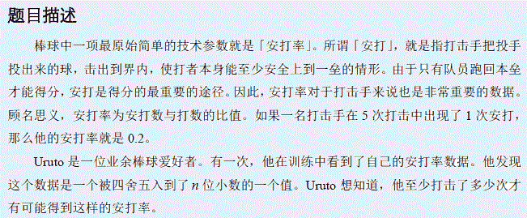

# [Violet 2]棒球
[BZOJ2712]



和 BZOJ2187 一样。

```cpp
#include<iostream>
#include<cstdio>
#include<cstdlib>
#include<cstring>
#include<algorithm>
using namespace std;

#define ll long long
#define mem(Arr,x) memset(Arr,x,sizeof(Arr))

const int inf=2147483647;

void Calc(ll a,ll b,ll c,ll d,ll &p,ll &q);

int main(){
	ll n,key;
	while (scanf(" %lld 0.%lld",&n,&key)!=EOF){
		if (key==0){
			printf("1\n");continue;
		}
		ll b=1,g,p,q;while (n--) b*=10;b*=10;
		ll la=key*10-5,lb=b,ra=key*10+5,rb=b;
		g=__gcd(la,lb);la/=g;lb/=g;
		g=__gcd(ra,rb);ra/=g;rb/=g;
		Calc(la,lb,ra,rb,p,q);
		printf("%lld\n",min(q,lb));
	}
	return 0;
}

void Calc(ll a,ll b,ll c,ll d,ll &p,ll &q){
	ll g=__gcd(a,b);a/=g;b/=g;
	g=__gcd(c,d);c/=g;d/=g;
	if ((a/b)+1<=(c+d-1)/d-1) p=a/b+1,q=1;
	else if (a==0) p=1,q=d/c+1;
	else if ((a<=b)&&(c<=d)) Calc(d,c,b,a,q,p);
	else Calc(a%b,b,c-a/b*d,d,p,q),p+=a/b*q;
}
```