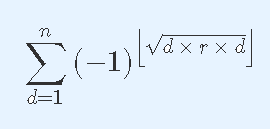

# [清华集训2014]Sum
[UOJ42 BZOJ3817]

给定正整数N，R。求



设 $x=\sqrt{r}$ 当 x 为整数时，答案可以直接讨论得到。  
当 x 不为整数时，有

$$=\sum_{i=1}^n (1-(2\times \lfloor ix \rfloor \mod 2)) =n- \sum _ {i=1} ^ n (\lfloor ix \rfloor-2\lfloor \frac{k}{2}\rfloor)=n-2\sum _ {i=1}^n \lfloor ix \rfloor+4\sum _ {i=1}^n \lfloor \frac{ix}{2}\rfloor$$

问题变成求解类似 $\sum _ {i=1} ^ n \lfloor \frac{ax+b}{c}i \rfloor$ 的问题，令 $\frac{ax+b}{c}=k$ 。根据类欧几里得的理论，当 $k \ge 1$ 时，分离 k 的整数部分出来直接计算，剩下的递归；当 $k < 1$ 时，有 $(k,n)=n\lfloor kn \rfloor -(\frac{1}{k},\lfloor kn\rfloor)$ 。  
注意到这里的 k 是去倒数的操作，多次翻转后可能会使得精度出现问题，不妨手写高精度用 $\frac{ax+b}{c}$ 来表示。

```cpp
#include<iostream>
#include<cstdio>
#include<cstdlib>
#include<cstring>
#include<algorithm>
#include<cmath>
using namespace std;

#define ll long long
#define ld long double
#define mem(Arr,x) memset(Arr,x,sizeof(Arr))

ll n,r;ld x;

ll Calc(ll a,ll b,ll c,ll n);

int main(){
	int TTT;scanf("%d",&TTT);
	while (TTT--){
		scanf("%lld%lld",&n,&r);x=sqrt(r);
		if ((ll)x*(ll)x==r) printf("%lld\n",(ll)x&1? ((n&1)?(-1ll):0ll) : (n));
		else printf("%lld\n",n-2ll*Calc(1,0,1,n)+4ll*Calc(1,0,2,n));
	}
	return 0;
}

ll Calc(ll a,ll b,ll c,ll n){
	if (n<=0) return 0;
	ll d=abs(__gcd(a,__gcd(b,c)));a/=d;b/=d;c/=d;
	ll k=(a*x+b)/c;
	if (k>=1) return Calc(a,b-k*c,c,n)+n*(n+1)/2*k;
	else return n*(ll)((a*x+b)/c*n)-Calc(a*c,-b*c,a*a*r-b*b,(a*x+b)/c*n);
}
```