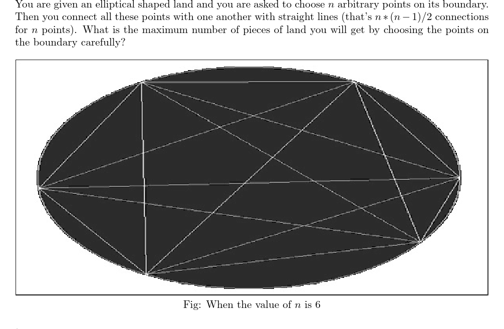

# How Many Pieces of Land
[UVA10213]



首先有欧拉公式，点数-边数+面数=2，那么只要知道点数和边数就可以算出面数了。

考虑把点逆时针标号，枚举点 1 ，那么把点 1 到 i 连上分成左边 i-2 个点右边 n-i 个点，那么最优的方式是两边的点的连线一定在这条线上形成了若干互不重合的点，这部分的方案就是 $\sum _ {i=2} ^ {n-1} (i-2)(n-i)$ ，枚举每一个点作为 1 号点，由于每个点会被算 4 次，所以这部分的答案就是 $\frac{n}{4}\sum _ {i=2} ^ {n-1}(i-2)(n-i)$ ，再加上在边界上的 n 个点，所以总点数就是 $n+\frac{n}{4}\sum _ {i=2} ^ {n-1} (i-2)(n-i)$  
对于边上也是一样的考虑，同样枚举 i 与 1 形成的线上的点，那么由于形成了 (i-2)(n-i) 个点，势必就会有 (i-2)(n-i)+1 条线段，由于这里每条线段只会算 2 次，所以这部分的答案就是 $\frac{n}{2}\sum _ {i=2} ^ {n-1} ((i-2)(n-i)+1)$ ，加上外面多边形和圆弧上的 2n 条边总共就是 $2n+\frac{n}{2}\sum _ {i=2} ^ {n-1} ((i-2)(n-i)+1)$ 。  
套用欧拉公式，注意到这样算出来的面数是包括了最外面的无限大的区域，所以最后要减一。最后把式子化简得到 $\binom{n}{4}+\binom{n}{2}+1$ 。

```cpp
#include<iostream>
#include<cstdio>
#include<cstdlib>
using namespace std;

__int128 Input();
void Print(__int128 x);

int main(){
	int Case=Input();
	while (Case--){
		__int128 n=Input();
		Print(n*(n-1)*(n-2)*(n-3)/24+n*(n-1)/2+1);
		putchar('\n');
	}
	return 0;
}

__int128 Input(){
	char ch=getchar();__int128 x=0;
	while (!isdigit(ch)) ch=getchar();
	while (isdigit(ch)) x=x*10+ch-48,ch=getchar();
	return x;
}

void Print(__int128 x){
	if (x==0) return;
	Print(x/10);
	putchar('0'+x%10);return;
}
```