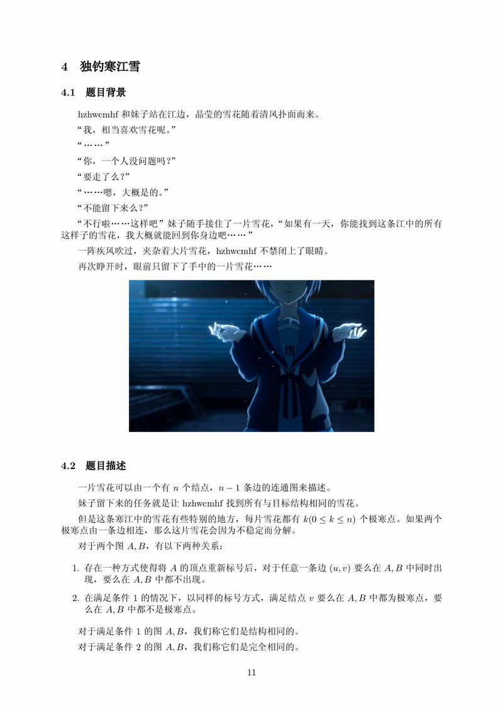
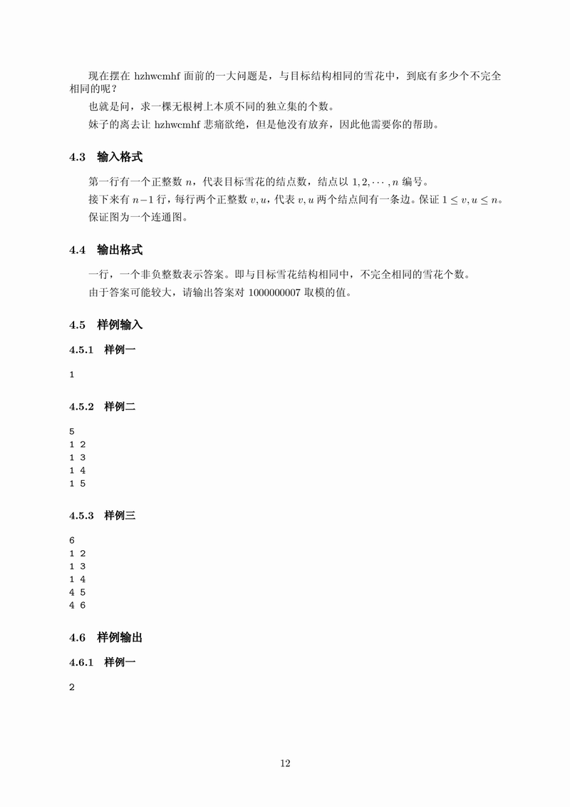
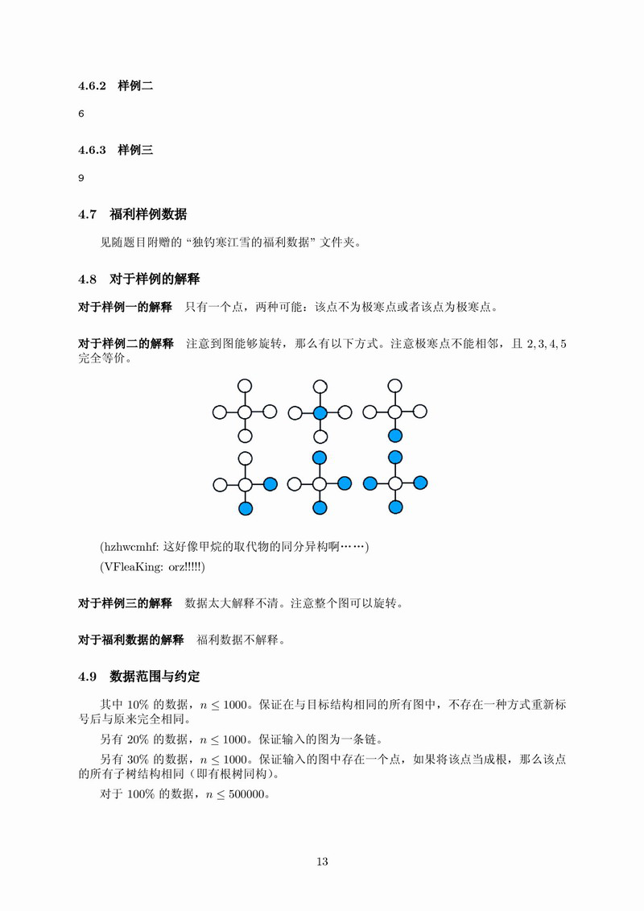

# 独钓寒江雪
[BZOJ3162]




首先知道，一棵树如果与自身另一种标号同构，它们的重心是相同的。那么就找到重心，如果重心有两个，则断开两个重心的边，新建一个点连接到两个重心。那么按照$F[0][],F[1][]$的方式分别$DP$。把同构的子树放在一起$DP$，相当于一个可重组合。最后再对重心的情况分别讨论。

```cpp
#include<iostream>
#include<cstdio>
#include<cstdlib>
#include<cstring>
#include<algorithm>
#include<vector>
using namespace std;

#define ll long long
#define ull unsigned long long
#define mem(Arr,x) memset(Arr,x,sizeof(Arr))
#define NAME "paint"

const int maxN=501000*2;
const int maxM=maxN<<1;
const int Mod=1e9+7;
const ull base1=141404;
const ull base2=170524;
const int inf=2147473647;

int n;
int Fac[maxN],Inv[maxN];
int edgecnt=-1,Head[maxN],Next[maxM],V[maxM];
int Size[maxN],MxSon[maxN];
int rt1,rt2;
ull W[maxN];
int F[maxN][2];
vector<int> Son;

void Add_Edge(int u,int v);
void dfs_root(int u,int fa);
void dfs_calc(int u,int fa);
int C(int n,int m);
bool cmp(int a,int b);
int QPow(int x,int cnt);
ull QPow(ull x,int cnt);

int main()
{
	mem(Head,-1);
	Fac[0]=Inv[0]=1;for (int i=1;i<maxN;i++) Fac[i]=1ll*Fac[i-1]*i%Mod;
	Inv[maxN-1]=QPow(Fac[maxN-1],Mod-2);
	for (int i=maxN-2;i>=1;i--) Inv[i]=1ll*Inv[i+1]*(i+1)%Mod;
	
	scanf("%d",&n);
	for (int i=1;i<n;i++)
	{
		int u,v;scanf("%d%d",&u,&v);
		Add_Edge(u,v);
	}

	MxSon[0]=inf;
	dfs_root(1,1);
	
	int begin;
	if (rt2){
		for (int i=Head[rt2],last=-1;i!=-1;last=i,i=Next[i])
			if (V[i]==rt1){
				V[i]=V[i^1]=0;break;
			}
		++n;Add_Edge(rt1,n);Add_Edge(rt2,n);
		begin=n;
	}
	else begin=rt1;

	dfs_calc(begin,begin);
	int Ans=0;
	if (rt2==0) Ans=(F[rt1][0]+F[rt1][1])%Mod;
	else if (W[rt1]==W[rt2]) Ans=(1ll*F[rt1][0]*F[rt1][1]%Mod+C(F[rt1][0]+2-1,2)%Mod)%Mod;
	else Ans=1ll*(1ll*F[rt1][0]*F[rt2][1]+1ll*F[rt1][1]*F[rt2][0]+1ll*F[rt1][1]*F[rt2][1]%Mod)%Mod;

	printf("%d\n",Ans);
	return 0;
}

void Add_Edge(int u,int v){
	Next[++edgecnt]=Head[u];Head[u]=edgecnt;V[edgecnt]=v;
	Next[++edgecnt]=Head[v];Head[v]=edgecnt;V[edgecnt]=u;
	return;
}

void dfs_root(int u,int fa)
{
	F[u][0]=F[u][1]=1;Size[u]=1;
	for (int i=Head[u];i!=-1;i=Next[i])
		if (V[i]!=fa){
			dfs_root(V[i],u);Size[u]+=Size[V[i]];
			MxSon[u]=max(MxSon[u],Size[V[i]]);
		}
	MxSon[u]=max(MxSon[u],n-Size[u]);
	if (MxSon[u]<MxSon[rt1]) rt1=u,rt2=0;
	else if (MxSon[u]==MxSon[rt1]) rt2=u;
	return;
}

void dfs_calc(int u,int fa)
{
	F[u][0]=F[u][1]=1;Size[u]=1;W[u]=base1;
	for (int i=Head[u];i!=-1;i=Next[i])
		if ((V[i])&&(V[i]!=fa)) dfs_calc(V[i],u),Size[u]+=Size[V[i]];

	Son.clear();
	for (int i=Head[u];i!=-1;i=Next[i])
		if ((V[i])&&(V[i]!=fa)) Son.push_back(V[i]);
	if (Son.size()==0) return;

	sort(Son.begin(),Son.end(),cmp);

	int sz=Son.size();
	for (int i=0,cnt=0;i<sz;i++)
	{
		W[u]=W[u]*W[Son[i]]+base2;
		if ((i<sz-1)&&(W[Son[i]]==W[Son[i+1]])) cnt++;
		else
		{
			F[u][0]=1ll*F[u][0]*C(F[Son[i]][0]+F[Son[i]][1]+cnt,cnt+1)%Mod;
			F[u][1]=1ll*F[u][1]*C(F[Son[i]][0]+cnt,cnt+1)%Mod;
			cnt=0;
		}
	}
	for (int i=sz-1;i>=0;i--) W[u]=W[u]^W[Son[i]]+base2;
	return;
}

int C(int n,int m)
{
	int t=1;
	for (int i=n-m+1;i<=n;i++) t=1ll*t*i%Mod;
	return 1ll*t*Inv[m]%Mod;
}

bool cmp(int a,int b){
	return W[a]<W[b];
}

int QPow(int x,int cnt)
{
	int ret=1;
	while (cnt){
		if (cnt&1) ret=1ll*ret*x%Mod;
		x=1ll*x*x%Mod;cnt>>=1;
	}
	return ret;
}

ull QPow(ull x,int cnt)
{
	ull ret=1;
	while (cnt){
		if (cnt&1) ret=ret*x;
		x=x*x;cnt>>=1;
	}
	return ret;
}
```