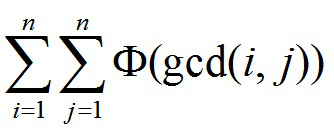

# 欧拉心算
[BZOJ4804]

给出一个数字N  


$$\sum _ {i=1}^n \sum _ {j=1}^n \phi(\gcd(i,j)) \\\\ =\sum _ {d=1}^n \phi(d)\sum _ {i=1}^n \sum _ {j=1}^n [\gcd(i,j)==d] $$
$$=\sum _ {d=1}^n \phi(d) \sum _ {i=1}^{n/d} \sum _ {j=1}^{n/d} [\gcd(i,j)==1] \\\\ =\sum _ {d=1}^{n} \phi(d) \sum _ {i=1}^{n/d} \mu(i) \lfloor \frac{n}{id} \rfloor ^2 $$
$$= \sum _ {T=1}^{n} \lfloor \frac{n}{T} \rfloor ^2 \sum _ {d|T} \phi(d) \mu(\frac{T}{d})$$

后面是两个积性函数的狄利克雷卷积，也是积性函数，可以线性筛，前面分块，单次询问$O(\sqrt{n})$

```cpp
#include<iostream>
#include<cstdio>
#include<cstdlib>
#include<cstring>
#include<algorithm>
using namespace std;

#define ll long long
#define mem(Arr,x) memset(Arr,x,sizeof(Arr))

const int maxN=10000100;
const int inf=2147483647;

int pricnt,Prime[maxN/100];
bool notprime[maxN];
int Phi[maxN],F[maxN],Mu[maxN],Low[maxN];
ll Sum[maxN];

void Init();

int main(){
	Init();
	int TTT;scanf("%d",&TTT);
	while (TTT--)
	{
		int n;scanf("%d",&n);
		ll Ans=0;
		
		for (int i=1,last;i<=n;i=last+1){
			last=n/(n/i);int x=n/i;
			Ans=Ans+1ll*x*x*(Sum[last]-Sum[i-1]);
		}
		printf("%lld\n",Ans);
	}
	return 0;
}

void Init(){
	F[1]=Phi[1]=Mu[1]=Low[1]=1;notprime[1]=1;
	for (int i=2;i<maxN;i++){
		if (notprime[i]==0){
			Prime[++pricnt]=i;Mu[i]=-1;Phi[i]=i-1;F[i]=i-2;Low[i]=i;
		}
		for (int j=1;1ll*i*Prime[j]<maxN;j++){
			int p=Prime[j];
			notprime[i*p]=1;
			if (i%p==0){
				if (Low[i]==i){
					Mu[i*p]=0;Phi[i*p]=Phi[i]*p;Low[i*p]=Low[i]*p;F[i*p]=Phi[i*p]-Phi[i];
				}
				else{
					Mu[i*p]=Mu[i/Low[i]]*Mu[p*Low[i]];Phi[i*p]=Phi[i/Low[i]]*Phi[p*Low[i]];
					Low[i*p]=Low[i]*p;F[i*p]=F[i/Low[i]]*F[Low[i]*p];
				}
				break;
			}
			Mu[i*p]=Mu[i]*Mu[p];Phi[i*p]=Phi[i]*Phi[p];Low[i*p]=p;F[i*p]=F[i]*F[p];
		}
	}
	for (int i=1;i<maxN;i++) Sum[i]=Sum[i-1]+F[i];
	return;
}
```
