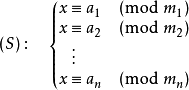

# 中国剩余定理CRT
## 基本内容
中国剩余定理给出了下图所示的一元线性同余方程组有解的判定条件，并用构造法给出了在有解情况下解的具体形式


## 构造方法
### 一般情况
设 $M = \prod\_1^n m\_i$ ，并设 $M\_i = \frac{M}{m\_i}$ 是除了$m\_i$以外的$n-1$个整数的乘积。  
设 $t\_i = M\_i^{-1} \mod m\_i$ ，即$t\_i$为$M\_i$模 $m\_i$ 意义下的逆元，$M\_i \times t\_i \equiv 1 \pmod {m\_i},i \in \lbrace 1,2,3,…,n \rbrace$  
方程的通解形式为$x=\sum a\_i \times t\_i \times M\_i $  
而在模$M$的意义下，只有一个解。

### 更一般的情况
一般的中国剩余定理要求模数互质，那么不互质要怎么做呢？  
考虑把模方程组两两合并的方法。假设要合并$x=a\_1+m\_1 \times x\_1$和$x=a\_2+m\_2 \times x\_2$，那么有$a\_a+m\_1 \times x\_1=a\_2+m\_2 \times x\_2$，$m\_1 \times x\_1+m\_2 \times x\_2=a\_2-a\_1$，可以用扩展欧几里得解出$x\_1$的最小正整数解，带入得到$x$，最后合并得到$y = x \mod(lcm(m\_1,m\_2))$

## 代码实现
### 模数互质
```cpp
int CRT(int a[],int m[],int n){
    int M = 1;
    int ans = 0;
    for(int i=1; i<=n; i++)
        M *= m[i];
    for(int i=1; i<=n; i++){
        int x, y;
        int Mi = M / m[i];
        ex_gcd(Mi, m[i], x, y);
        ans = (ans + Mi * x * a[i]) % M;
    }
    if(ans < 0) ans += M;
    return ans;
}
```
### 模数不互质
```cpp
bool merge(LL a1, LL m1, LL a2, LL m2, LL &a3, LL &m3)  {
    LL d = gcd(m1, m2);
    LL c = a2 - a1;
    if(c % d) return false;
    c = (c % m2 + m2) % m2;
    m1 /= d;
    m2 /= d;
    c /= d;
    c *= Inv(m1, m2);//Inv为乘法逆元，数论常用内容——欧几里得算法与扩展欧几里得算法
    c %= m2;
    c *= m1 * d;
    c += a1;
    m3 = m1 * m2 * d;
    a3 = (c % m3 + m3) % m3;
    return true;
}

LL CRT(LL a[], LL m[], int n)  {
    LL a1 = a[1];
    LL m1 = m[1];
    for(int i=2; i<=n; i++)  {
        LL a2 = a[i];
        LL m2 = m[i];
        LL m3, a3;
        if(!merge(a1, m1, a2, m2, a3, m3))
            return -1;
        a1 = a3;
        m1 = m3;
    }
    return (a1 % m1 + m1) % m1;
}
```

（未完）https://blog.csdn.net/tick_tock97/article/details/71313058