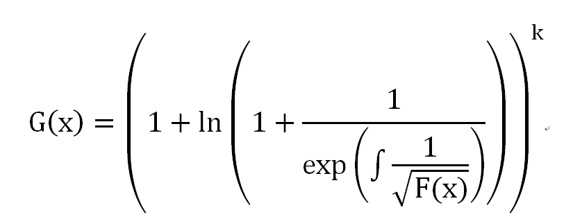

# [HZOI2015] 帕秋莉的超级多项式
[COGS2189]

幻想乡，帕秋莉·诺蕾姬(パチュリー·ノーレッジ)是以宅在图书馆闻名的魔法使。  

其语文，数学，英语，物理，化学，生物，政治，历史，地理，哲♂学，无所不通晓。  
今天，她在研♂究多项式……  
“小恶魔……”，帕秋莉突然召唤道。  
“来啦，帕秋莉sama”，小恶魔高兴地飘到了帕秋莉的身边。  
帕秋莉头也不抬地将一张写满公式的纸递给了小恶魔，  
“帮我把这个式子求出来。”  
 “唔……”，小恶魔对帕秋莉冷淡的态度有些失望，  
不过，先以公事为先吧，以后，哼哼，再把帕秋莉攻略掉！  
小恶魔看了看帕秋莉给她的公式：  

 (+﹏+)~  
这是啥。。。  
不过小恶魔是很聪明的，瞬间学会了C++，编好了程序  
当她兴高采烈地去找帕秋莉时，帕秋莉用很疑惑的眼神看着她  
“怎么啦？”小恶魔问道，  
“F(x)是个多项式哦。”  
“啥！！Σ( ° △ °|||)︴”，不会了…  
 就这样，小恶魔找到了你  
帮帮小恶魔吧！  
题目概述：  
给定n,k,F(x)，其中F(x)是常数项为完全平方数的多项式，其最高次项为n-1，一切运算都在mod x^n的意义下进行，积分之后默认常数项为0，求G'(x)，即G(x) mod x^n的导函数。（先mod再求导）  
由于答案有可能非常的大，你只需要输出G'(x)每项的系数mod 998244353的余数的非负整数即可。  

多项式运算。

```cpp
#include<iostream>
#include<cstdio>
#include<cstdlib>
#include<cstring>
#include<algorithm>
#include<cmath>
using namespace std;

#define ll long long
#define mem(Arr,x) memset(Arr,x,sizeof(Arr))
#define NAME "polynomial"

const int maxN=101000*10;
const int Mod=998244353;
const int G=3;
const int inf=2147483647;

int n,K;
int Inv[maxN];
int X[maxN],Y[maxN],Rader[maxN];
int I1[maxN],I2[maxN],S1[maxN],S2[maxN],L1[maxN],L2[maxN],E1[maxN],E2[maxN],P1[maxN];

int QPow(int x,int cnt);
void NTT(int *P,int len,int opt);
void PolyInv(int *A,int *B,int len);
void PolySqrt(int *A,int *B,int len);
void PolyDery(int *A,int *B,int len);
void PolyInte(int *A,int *B,int len);
void PolyLn(int *A,int *B,int len);
void PolyExp(int *A,int *B,int len);
void PolyPow(int *A,int *B,int len,int k);

int main()
{
	freopen(NAME".in","r",stdin);freopen(NAME".out","w",stdout);
	scanf("%d%d",&n,&K);
	for (int i=0;i<n;i++) scanf("%d",&X[i]);
	int N=1;while (N<n) N<<=1;
	Inv[0]=Inv[1]=1;for (int i=2;i<=(N<<2);i++) Inv[i]=1ll*Inv[Mod%i]*(Mod-Mod/i)%Mod;

	PolySqrt(X,Y,N);mem(X,0);
	PolyInv(Y,X,N);mem(Y,0);
	PolyInte(X,Y,N);mem(X,0);
	PolyExp(Y,X,N);mem(Y,0);
	PolyInv(X,Y,N);mem(X,0);Y[0]=(Y[0]+1)%Mod;
	PolyLn(Y,X,N);mem(Y,0);X[0]=(X[0]+1)%Mod;
	PolyPow(X,Y,N,K);mem(X,0);
	PolyDery(Y,X,N);X[n-1]=0;
	for (int i=0;i<n;i++) printf("%d ",X[i]);
	printf("\n");
	return 0;
}

int QPow(int x,int cnt){
	int ret=1;
	while (cnt){
		if (cnt&1) ret=1ll*ret*x%Mod;
		x=1ll*x*x%Mod;cnt>>=1;
	}
	return ret;
}

void NTT(int *P,int len,int opt){
	int N,L=0;
	for (N=1;N<len;N<<=1) L++;
	for (int i=0;i<N;i++) Rader[i]=(Rader[i>>1]>>1)|((i&1)<<(L-1));
	for (int i=0;i<N;i++) if (i<Rader[i]) swap(P[i],P[Rader[i]]);
	for (int i=1;i<N;i<<=1){
		int dw=QPow(G,(Mod-1)/(i<<1));
		if (opt==-1) dw=QPow(dw,Mod-2);
		for (int j=0;j<N;j+=(i<<1))
			for (int k=0,w=1;k<i;k++,w=1ll*w*dw%Mod){
				int x=P[j+k],y=1ll*P[j+k+i]*w%Mod;
				P[j+k]=(x+y)%Mod;P[j+k+i]=(x-y+Mod)%Mod;
			}
	}
	if (opt==-1){
		int inv=QPow(N,Mod-2);
		for (int i=0;i<N;i++) P[i]=1ll*P[i]*inv%Mod;
	}
	return;
}

void PolyInv(int *A,int *B,int len){
	if (len==1){B[0]=QPow(A[0],Mod-2);return;}
	PolyInv(A,B,len>>1);
	for (int i=0;i<len;i++) I1[i]=A[i],I2[i]=B[i];
	NTT(I1,len<<1,1);NTT(I2,len<<1,1);
	for (int i=0;i<(len<<1);i++) I1[i]=1ll*I1[i]*I2[i]%Mod*I2[i]%Mod;
	NTT(I1,len<<1,-1);
	for (int i=0;i<len;i++) B[i]=((B[i]+B[i])%Mod+Mod-I1[i])%Mod;
	for (int i=0;i<(len<<1);i++) I1[i]=I2[i]=0;
	return;
}

void PolySqrt(int *A,int *B,int len){
	if (len==1){B[0]=sqrt(A[0]);return;}
	PolySqrt(A,B,len>>1);
	PolyInv(B,S1,len);
	for (int i=0;i<len;i++) S2[i]=A[i];
	NTT(S1,len<<1,1);NTT(S2,len<<1,1);
	for (int i=0;i<(len<<1);i++) S1[i]=1ll*S1[i]*S2[i]%Mod;
	NTT(S1,len<<1,-1);
	for (int i=0;i<len;i++) B[i]=1ll*(B[i]+S1[i])%Mod*Inv[2]%Mod;
	for (int i=0;i<(len<<1);i++) S1[i]=S2[i]=0;
	return;
}

void PolyDery(int *A,int *B,int len){
	for (int i=0;i<len;i++) B[i]=1ll*A[i+1]*(i+1)%Mod;
	B[len]=B[len-1]=0;
	return;
}

void PolyInte(int *A,int *B,int len){
	for (int i=1;i<len;i++) B[i]=1ll*A[i-1]*Inv[i]%Mod;
	B[0]=0;return;
}

void PolyLn(int *A,int *B,int len){
	mem(L1,0);mem(L2,0);
	PolyDery(A,L1,len);
	PolyInv(A,L2,len);
	NTT(L1,len<<1,1);NTT(L2,len<<1,1);
	for (int i=0;i<(len<<1);i++) L1[i]=1ll*L1[i]*L2[i]%Mod;
	NTT(L1,len<<1,-1);
	PolyInte(L1,B,len);
	for (int i=0;i<(len<<1);i++) L1[i]=L2[i]=0;
	return;
}

void PolyExp(int *A,int *B,int len)
{
	if (len==1){B[0]=1;return;}
	PolyExp(A,B,len>>1);
	PolyLn(B,E1,len);
	for (int i=0;i<len;i++) E1[i]=((Mod-E1[i]+A[i])%Mod+Mod)%Mod,E2[i]=B[i];
	E1[0]=(E1[0]+1)%Mod;
	NTT(E1,len<<1,1);NTT(E2,len<<1,1);
	for (int i=0;i<(len<<1);i++) E1[i]=1ll*E1[i]*E2[i]%Mod;
	NTT(E1,len<<1,-1);
	for (int i=0;i<len;i++) B[i]=E1[i];
	for (int i=0;i<(len<<1);i++) E1[i]=E2[i]=0;
	return;
}

void PolyPow(int *A,int *B,int len,int k)
{
	PolyLn(A,P1,len);
	for (int i=0;i<len;i++) P1[i]=1ll*P1[i]*k%Mod;
	PolyExp(P1,B,len);
	for (int i=0;i<len;i++) P1[i]=0;
	return;
}
```