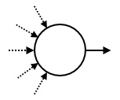
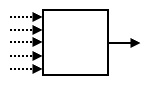
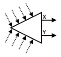

# IOI2018

## D1T1 组合动作

你在玩一个动作游戏。游戏控制器有 $4$ 个按键，`A`、`B`、`X` 和 `Y`。在游戏中，你用组合动作来赚金币。你可以依次按这些按键来完成一个组合动作。  
这个游戏有一个隐藏的按键序列，可以表示为由这 $4$ 个字符组成的串 $S$。你并不知道这个串 $S$，但是你知道它的长度为 $N$。  
**你还知道，$S$ 的首字符不会在串中重复出现。**例如，$S$ 可以是“`ABXYY`”或者“`XYYAA`”，但不能是“`AAAAA`”或“`BXYBX`”。  
你可以依次按最多 $4N$ 个按键来完成一个组合动作。串 $p$ 为你所按的按键序列。你用这个组合动作赚到的金币数量，等于同时为 $p$ 之子串和 $S$ 之前缀的最长字符串的长度。串 $t$ 的子串定义为 $t$ 中的连续字符序列（可以为空）。$t$ 的前缀定义为 $t$ 的子串，其或者为空，或者包含 $t$ 的首字符。  
例如，如果 $S$ 是“`ABXYY`”，而 $p$ 是“`XXYYABYABXAY`”，你会得到 $3$ 个金币，因为“`ABX`”是可作为 $p$ 的子串的 $S$ 的前缀中最长的。  
你的任务是，用少量的组合动作，找出隐藏字符串 $S$。


首先可以通过两次询问得到初始字符，假设为 A。考虑增量询问假设当前已经得到的字符串为 S ，则询问 S+XX+S+XY+S+XB+S+A ，根据返回的结果可以判定下一个是 X,Y 还是 B 。

```cpp
#include "combo.h"
#include<string>
#include<iostream>
using namespace std;

string C="ABXY";

string guess_sequence(int N){
	string Ans="",Q="";
	Q="AB";
	if (press(Q)){
		Q="A";
		if (press(Q)) ;
		else swap(C[0],C[1]);
	}
	else{
		Q="X";
		if (press(Q)) swap(C[0],C[2]);
		else swap(C[0],C[3]);
	}
	Ans=Ans+C[0];
	if (N==1) return Ans;
	for (int i=2;i<N;i++){
		Q=Ans+C[1]+C[1]+Ans+C[1]+C[2]+Ans+C[1]+C[3]+Ans+C[2];
		int r=press(Q);
		if (r==i-1) Ans=Ans+C[3];
		else if (r==i) Ans=Ans+C[2];
		else Ans=Ans+C[1];
	}
	for (int i=1;i<3;i++){
		Q=Ans+C[i];
		if (press(Q)==N) return Ans+C[i];
	}
	return Ans+C[3];
}
```

## D1T2 排座位

你要在一个长方形大厅里举办国际编程比赛，该大厅共有 $HW$ 个座位（$H$ 行 $W$ 列）。行的编号是从 $0$ 到 $H-1$，列的编号是从 $0$ 到 $W-1$。位于 $r$ 行 $c$ 列的座位用 $(r,c)$ 表示。一共邀请了 $HW$ 位参赛者，编号是从 $0$ 到 $HW-1$。你制定好了一个座位表，第 $i$（$0\le i\le HW-1$）个参赛者被安排到座位 $(R_i,C_i)$。座位表中参赛者和座位是一一对应的。  
大厅中一个座位集合 $S$ 被称为是长方形的，如果存在整数 $r_1,r_2,c_1$ 和 $c_2$ 满足下列条件：  
<ul>$0\le r_1\le r_2\le H-1$。  
$0\le c_1\le c_2\le W-1$。  
$S$ 正好是所有满足 $r_1\le r\le r_2$ 和 $c_1\le c\le c_2$ 的座位 $(r,c)$ 的集合。  
</ul>如果一个长方形座位集合包含 $k$（$1\le k\le HW$）个座位，并且被分配到这个集合的参赛者的编号恰好是从 $0$ 到 $k-1$，那么该集合是美妙的。一个座位表的美妙度定义为这个表中美妙的长方形座位集合的个数。  
在准备好座位表后，你会收到一些交换两个参赛者座位的请求。具体来说，有 $Q$ 个这样的请求，按时间顺序编号为 $0$ 到 $Q-1$。第 $j$（$0\le j\le Q-1$）个请求希望交换参赛者 $A_j$ 和 $B_j$ 的座位。你立即接受每个请求并更新座位表。每次更新后，你的目标是计算当前座位表的美妙度。  

设当前要判断前 k 个人是否构成一个矩阵，将前 k 个人染成黑色，剩下的为白色，则这 k 个格子能够构成一个矩形当且仅当下面两个条件同时成立。  
1.存在且仅存在一个黑色格子满足它的左边和上面为白色。  
2.不存在一个白色格子使得它四周黑色格子数大于等于两个。  
前者保证了左上角唯一，后者则保证了白色格子不会出现在黑色内部，两者综合起来即保证了矩形。  
那么考虑每一个格子作为白色和黑色的贡献，均是一段连续区间，用线段树维护这个信息。交换的时候则更新所有受到影响的格子。

```cpp
#include "seats.h"
#include<cstdio>
#include<cstring>
#include<algorithm>
#include<vector>
#include<iostream>
using namespace std;

#define mem(Arr,x) memset(Arr,x,sizeof(Arr))
#define ls (x<<1)
#define rs (ls|1)
#define pb push_back
#define mp make_pair
#define ft first
#define sd second

const int maxN=1010000;
const int F1[]={0,0,1,-1};
const int F2[]={1,-1,0,0};
const int inf=2147483647;

int X[maxN],Y[maxN],n,m,N,Pls[maxN<<2],Pre[maxN];
vector<int> Mp[maxN];
pair<int,int> S[maxN<<2];

pair<int,int> operator + (pair<int,int> A,pair<int,int> B);
void Build(int x,int l,int r);
void Update(int x,int y,int opt);
void Add(int x,int k);
void PushDown(int x);
void Plus(int x,int l,int r,int ql,int qr,int k);

void give_initial_chart(int H,int W,vector<int> R,vector<int> C){
	n=H;m=W;N=n*m;
	for (int i=1;i<=n;i++) Mp[i].resize(m+2);
	for (int i=1,cnt=0;i<=n;i++) for (int j=1;j<=m;j++) ++cnt,X[cnt]=R[cnt-1]+1,Y[cnt]=C[cnt-1]+1,Mp[X[cnt]][Y[cnt]]=cnt;

	for (int i=1;i<=n;i++)
		for (int j=1;j<=m;j++){
			int mn1=inf,mn2=inf,key=Mp[i][j];
			for (int f=0;f<4;f++){
				int xx=i+F1[f],yy=j+F2[f];
				if (xx<=0||yy<=0||xx>n||yy>m) continue;
				if (Mp[xx][yy]<mn1) mn2=mn1,mn1=Mp[xx][yy];
				else if (Mp[xx][yy]<mn2) mn2=Mp[xx][yy];
			}
			if (mn2<=key-1) ++Pre[mn2],--Pre[key];
			int mn=N+1;
			if (i>1) mn=min(mn,Mp[i-1][j]);
			if (j>1) mn=min(mn,Mp[i][j-1]);
			if (mn-1>=key) ++Pre[key],--Pre[mn];
		}
	for (int i=1;i<=N;i++) Pre[i]+=Pre[i-1];
	
	Build(1,1,N);
	return;
}

int swap_seats(int a,int b){
	++a;++b;vector<pair<int,int> > P;
	P.pb(mp(X[a],Y[a]));P.pb(mp(X[b],Y[b]));
	for (int f=0;f<4;f++){
		int xx=X[a]+F1[f],yy=Y[a]+F2[f];
		if (xx<=0||yy<=0||xx>n||yy>m) continue;
		P.pb(mp(xx,yy));
	}
	for (int f=0;f<4;f++){
		int xx=X[b]+F1[f],yy=Y[b]+F2[f];
		if (xx<=0||yy<=0||xx>n||yy>m) continue;
		P.pb(mp(xx,yy));
	}
	sort(P.begin(),P.end());P.erase(unique(P.begin(),P.end()),P.end());
	for (int i=0;i<P.size();i++) Update(P[i].ft,P[i].sd,-1);
	swap(X[a],X[b]);swap(Y[a],Y[b]);
	Mp[X[a]][Y[a]]=a;Mp[X[b]][Y[b]]=b;

	for (int i=0;i<P.size();i++) Update(P[i].ft,P[i].sd,1);
	return (S[1].ft!=1)?0:S[1].sd;
}
pair<int,int> operator + (pair<int,int> A,pair<int,int> B){
	pair<int,int> R=mp(min(A.ft,B.ft),0);
	if (R.ft==A.ft) R.sd+=A.sd;
	if (R.ft==B.ft) R.sd+=B.sd;
	return R;
}
void Build(int x,int l,int r){
	if (l==r){
		S[x]=mp(Pre[l],1);return;
	}
	int mid=(l+r)>>1;
	Build(ls,l,mid);Build(rs,mid+1,r);
	S[x]=S[ls]+S[rs];
	return;
}
void Update(int x,int y,int opt){
	int mn1=inf,mn2=inf,key=Mp[x][y];
	for (int f=0;f<4;f++){
		int xx=x+F1[f],yy=y+F2[f];
		if (xx<=0||yy<=0||xx>n||yy>m) continue;
		if (Mp[xx][yy]<mn1) mn2=mn1,mn1=Mp[xx][yy];
		else if (Mp[xx][yy]<mn2) mn2=Mp[xx][yy];
	}
	if (mn2<=key-1) Plus(1,1,N,mn2,key-1,opt);
	int mn=N+1;
	if (x>1) mn=min(mn,Mp[x-1][y]);
	if (y>1) mn=min(mn,Mp[x][y-1]);
	if (mn-1>=key) Plus(1,1,N,key,mn-1,opt);
	return;
}
void Add(int x,int k){
	Pls[x]+=k;S[x].ft+=k;
	return;
}
void PushDown(int x){
	if (Pls[x]){
		Add(ls,Pls[x]);Add(rs,Pls[x]);
		Pls[x]=0;
	}
	return;
}
void Plus(int x,int l,int r,int ql,int qr,int k){
	if (l==ql&&r==qr){
		Add(x,k);return;
	}
	int mid=(l+r)>>1;PushDown(x);
	if (qr<=mid) Plus(ls,l,mid,ql,qr,k);
	else if (ql>=mid+1) Plus(rs,mid+1,r,ql,qr,k);
	else Plus(ls,l,mid,ql,mid,k),Plus(rs,mid+1,r,mid+1,qr,k);
	S[x]=S[ls]+S[rs];return;
}
```

## D1T3 狼人

在日本的茨城县内共有 $N$ 个城市和 $M$ 条道路。这些城市是根据人口数量的升序排列的，依次编号为 $0$ 到 $N-1$。每条道路连接两个不同的城市，并且可以双向通行。由这些道路，你能从任意一个城市到另外任意一个城市。  
你计划了 $Q$ 个行程，这些行程分别编号为 $0$ 至 $Q-1$。第 $i$（$0\le i\le Q-1$）个行程是从城市 $S_i$ 到城市 $E_i$。  
你是一个狼人。你有两种形态：人形和狼形。在每个行程开始的时候，你是人形。在每个行程结束的时候，你必须是狼形。在行程中，你必须要变身（从人形变成狼形）恰好一次，而且只能在某个城市内（包括可能是在 $S_i$ 或 $E_i$ 内）变身。  
狼人的生活并不容易。当你是人形时，你必须避开人少的城市，而当你是狼形时，你必须避开人多的 城市。对于每一次行程 $i$（$0\le i\le Q-1$），都有两个阈值 $L_i$ 和$R_i$（$0\le L_i\le R_i\le N-1$），用以表示哪些城市必须要避开。准确地说，当你是人形时，你必须避开城市 $0,1,\cdots,L_i-1$；而当你是狼形时，则必须避开城市 $R_i+1,R_i+2,\cdots,N-1$。这就是说，在行程 $i$ 中，你必须在城市 $L_i,L_i+1,\cdots,R_i$ 中的其中一个城市内变身。  
你的任务是，对每一次行程，判定是否有可能在满足上述限制的前提下，由城市 $S_i$ 走到城市 $E_i$。你的路线可以有任意长度。

注意到关于人形和狼形的限制实际上是克鲁斯卡尔重构树的子树。分别以大权和小权建立克鲁斯卡尔重构树，转化为二维数点问题，本身又是离线的，那么就扫描线+树状数组。

```cpp
#include "werewolf.h"
#include<vector>
#include<algorithm>
#include<vector>
#include<iostream>
using namespace std;

const int maxN=201000<<1;
const int maxM=404000;
const int maxB=20;
class Edge{
public:
	int u,v;
};
class Graph{
public:
	int n,dfncnt,dfn[maxN],lst[maxN],Fa[maxB][maxN],root,Key[maxN];
	vector<int> T[maxN];
	void Add_Edge(int u,int v){
		T[u].push_back(v);T[v].push_back(u);return;
	}
	void dfs(int u,int fa){
		dfn[u]=++dfncnt;Fa[0][u]=fa;
		for (int i=0,sz=T[u].size();i<sz;i++)
			if (T[u][i]!=fa) dfs(T[u][i],u);
		lst[u]=dfncnt;return;
	}
	void Init(){
		dfs(root,0);
		for (int i=1;i<maxB;i++)
			for (int j=1;j<=n;j++)
				if (Fa[i-1][j]) Fa[i][j]=Fa[i-1][Fa[i-1][j]];
		return;
	}
};
class Question{
public:
	int p,ql,qr,id,opt;
};

int qcnt;
Edge EI[maxM];
int ufs[maxN],Ans[maxN],B[maxN];
Graph T1,T2;
Question Q[maxN];
pair<int,int> P[maxN];

bool cmpmin(Edge A,Edge B);
bool cmpmax(Edge A,Edge B);
int find(int x);
bool cmpq(Question A,Question B);
void Plus(int x,int k,int n);
int Sum(int x);
int Query(int l,int r);

vector<int> check_validity(int N,vector<int> X,vector<int> Y,
						   vector<int> S,vector<int> E,
						   vector<int> L,vector<int> R){
	for (int i=0,sz=X.size();i<sz;i++) EI[i]=((Edge){X[i]+1,Y[i]+1});

	T1.n=T2.n=N;for (int i=1;i<=N;i++) T1.Key[i]=T2.Key[i]=i;
	sort(&EI[0],&EI[X.size()],cmpmin);for (int i=1;i<=N+N;i++) ufs[i]=i;

	for (int i=0,sz=X.size();i<sz;i++)
		if (find(EI[i].u)!=find(EI[i].v)){
			int fu=find(EI[i].u),fv=find(EI[i].v);
			++T1.n;T1.Add_Edge(fu,T1.n);T1.Add_Edge(fv,T1.n);
			T1.Key[T1.n]=max(T1.Key[fu],T1.Key[fv]);
			ufs[fu]=ufs[fv]=T1.n;
		}
	for (int i=1;i<=T1.n;i++) if (ufs[i]==i) T1.root=i;
	sort(&EI[0],&EI[X.size()],cmpmax);for (int i=1;i<=N+N;i++) ufs[i]=i;

	for (int i=0,sz=X.size();i<sz;i++)
		if (find(EI[i].u)!=find(EI[i].v)){
			int fu=find(EI[i].u),fv=find(EI[i].v);
			++T2.n;T2.Add_Edge(fu,T2.n);T2.Add_Edge(fv,T2.n);
			T2.Key[T2.n]=min(T2.Key[fu],T2.Key[fv]);
			ufs[fu]=ufs[fv]=T2.n;
		}
	for (int i=1;i<=T2.n;i++) if (ufs[i]==i) T2.root=i;

	T1.Init();T2.Init();
	for (int i=0,sz=S.size();i<sz;i++){
		int u=S[i],v=E[i],l1=L[i],l2=R[i];++u;++v;++l1;++l2;
		for (int j=maxB-1;j>=0;j--) if (T2.Fa[j][u]&&T2.Key[T2.Fa[j][u]]>=l1) u=T2.Fa[j][u];
		for (int j=maxB-1;j>=0;j--) if (T1.Fa[j][v]&&T1.Key[T1.Fa[j][v]]<=l2) v=T1.Fa[j][v];
		Q[++qcnt]=((Question){T1.dfn[v]-1,T2.dfn[u],T2.lst[u],i,-1});
		Q[++qcnt]=((Question){T1.lst[v],T2.dfn[u],T2.lst[u],i,1});
	}
	sort(&Q[1],&Q[qcnt+1],cmpq);

	for (int i=1;i<=N;i++) P[i]=make_pair(T1.dfn[i],T2.dfn[i]);
	sort(&P[1],&P[N+1]);

	for (int i=1,p=1;i<=qcnt;i++){
		while (p<=N&&P[p].first<=Q[i].p) Plus(P[p++].second,1,N+N);
		int r=Query(Q[i].ql,Q[i].qr);
		Ans[Q[i].id]+=Q[i].opt*r;
	}

	vector<int> Rt;
	for (int i=0,sz=S.size();i<sz;i++) Rt.push_back(Ans[i]>=1);
	return Rt;
}
bool cmpmin(Edge A,Edge B){
	return max(A.u,A.v)<max(B.u,B.v);
}
bool cmpmax(Edge A,Edge B){
	return min(A.u,A.v)>min(B.u,B.v);
}
int find(int x){
	if (ufs[x]!=x) ufs[x]=find(ufs[x]);
	return ufs[x];
}
bool cmpq(Question A,Question B){
	return A.p<B.p;
}
void Plus(int x,int k,int n){
	while (x<=n){
		B[x]+=k;x+=(x)&(-x);
	}
	return;
}
int Sum(int x){
	int ret=0;
	while (x){
		ret+=B[x];x-=(x)&(-x);
	}
	return ret;
}
int Query(int l,int r){
	return Sum(r)-Sum(l-1);
}
```

## D2T1 机械娃娃

所谓机械娃娃，是能够自动地重复特定运动序列的娃娃。在日本，很多机械娃娃在古代就造出来了。机械娃娃的运动被一个由多个器件组成的管路所控制。这些器件通过管道连在一起。每个器件都有一个或两个出口，而且可以有任意多的（也可以为零）的入口。每个管道都从某个器件的出口连到同一器件或其他器件的入口。每个入口都连接恰好一个管道，而每个出口也都连接恰好一个管道。  
为了描述娃娃是如何运动的，设想有一个球放在这些器件之一的上面。这个球在管路中穿行。在穿行的每一步，它从所在器件的一个出口离开该器件，沿着连接该出口的管道，进入管道另一头所连接的器件。  
器件有三种类型：起点、 触发器和开关。总共有恰好一个起点，$M$个触发器和$S$个开关（$S$可以为零）。开关的数量$S$要由你来定。每个器件都有唯一的序列号。  
起点是球最初所在的那个器件。它有一个出口。它的序列号是$0$。  


一旦球进入某个触发器，就会让娃娃做某个特定运动。每个触发器都有一个出口。触发器的序列号是从$1$到$M$。



每个开关都有两个出口，被记为“X”和“Y”。开关的状态或者为“X”，或者为“Y”。在球进入
某个开关后，它会从开关的当前状态所对应的出口离开。此后开关将切换为另一状态。最初，所有开关的状态都是“X”。开关的序列号是从$-1$到$-S$。


告诉你触发器的数量$M$。再给你一个长度为$N$的序列$A$，序列的每个元素都是某个触发器的序列号。每个触发器会在序列$A$中出现若干次（也可能是零次）。你的任务是设计一个管路，以满足如下条件：  
球在若干步之后返回到起点。  
当球首次返回到起点时，所有开关的状态都是“X”。  
在球首次返回到起点时，此前它进入所有触发器的总次数恰好为 $N$ 。这些被进入过的触发器，其序列号按照被球经过的顺序依次为$A_0,A_1,\ldots,A_{N-1}$。  
设 $ P $ 为球首次返回到起点时，球所引起的所有开关状态切换的总次数。$ P $ 不能超过 $ 2 \times 10^7 $。  
同时，你不要用太多的开关。

可以建立一棵类似二叉树的结构，最下层的叶子为触发器，其余点都为开关。设往左子树走为 0，往右子树走为 1 ，那么从根到叶子的倒序对应的数就是对应叶子的触发顺序。  
但是这样仅适用于触发序列恰好是 2 的次幂的情况，其余的情况会很浪费，那么不妨强制让这个二叉树左边连续叶子为空，并且如果一个点两个儿子都为空的话这个点也不需要，这样就可以省下一部分空间。
要注意的就是最后回到起点的处理，一个简单的方式是把 1 直接放到序列的末尾作为一个触发序列的元素，这样就可以支持回到起点了。

```cpp
#include<cstdio>
#include<cstdlib>
#include<cstring>
#include<vector>
#include<iostream>
#include "doll.h"
using namespace std;

const int maxN=202000<<1;

int n,m,N,limit;
int In[maxN],Rader[maxN],P[maxN],O[maxN],nodecnt;
int X[maxN],Y[maxN];

void Divide(int l,int r,int x);

void create_circuit(int M,vector<int> A){
	if (A.size()==1){
		vector<int> R,Rc;
		Rc.push_back(A[0]);for (int i=1;i<=M;i++) Rc.push_back(0);
		answer(Rc,R,R);return;
	}
	n=A.size();m=M;
	for (int i=0;i<n;i++) In[i]=A[i];In[++n]=0;
	N=1;int L=0;while (N<=n) N<<=1,++L;
	for (int i=1;i<N;i++) Rader[i]=(Rader[i>>1]>>1)|((i&1)<<(L-1));
	for (int i=0;i<N;i++) P[i]=i;
	for (int i=0;i<N;i++) if (i<Rader[i]) swap(P[i],P[Rader[i]]);

	limit=N-n-1;
	for (int i=0,j=0;i<n;i++){
		while (P[j]<=limit) ++j;
		O[P[j]]=In[i];++j;
	}
	Divide(0,N-1,++nodecnt);

	vector<int> Rx,Ry,Rc;
	for (int i=0;i<=m;i++) Rc.push_back(-1);
	for (int i=1;i<=nodecnt;i++) Rx.push_back(X[i]),Ry.push_back(Y[i]);
	answer(Rc,Rx,Ry);return;
}

void Divide(int l,int r,int x){
	int mid=(l+r)>>1,ls=-1,rs=-1;
	if (l<=mid){
		if (mid<=limit) X[x]=-1;
		else if (l==mid) X[x]=O[l];
		else ls=++nodecnt,X[x]=-ls;
	}
	else X[x]=-1;
	if (mid+1<=r){
		if (r<=limit) Y[x]=-1;
		else if (mid+1==r) Y[x]=O[r];
		else rs=++nodecnt,Y[x]=-rs;
	}
	else Y[x]=-1;
	if (ls!=-1) Divide(l,mid,ls);
	if (rs!=-1) Divide(mid+1,r,rs);
	return;
}
```

## D2T2 高速公路收费

在日本，城市是用一个高速公路网络连接起来的。这个网络包含 $N$ 个城市和 $ M $ 条高速公路。每条高速公路都连接着两个不同的城市。不会有两条高速公路连接相同的两个城市。城市的编号是从 $ 0 $ 到 $ N - 1 $，高速公路的编号则是从 $ 0 $ 到 $ M - 1 $。每条高速公路都可以双向行驶。你可以从任何一个城市出发，通过这些高速公路到达其他任何一个城市。  
使用每条高速公路都要收费。每条高速公路的收费都会取决于它的交通状况。交通状况或者为顺畅，
或者为繁忙。当一条高速公路的交通状况为顺畅时，费用为 $ A $ 日元（日本货币），而当交通状况为繁忙时，费用为 $ B $ 日元。这里必有 $A&lt; B$。注意，$A$ 和 $B$ 的值对你是已知的。  
你有一部机器，当给定所有高速公路的交通状况后，它就能计算出在给定的交通状况下，在两个城市 $ S $ 和 $ T $（ $ S \ne T $ ）之间旅行所需要的最小的高速总费用。  
然而，这台机器只是一个原型。所以 $ S $ 和 $ T $ 的值是固定的（即它已经被硬编码到机器中），但是你并不知道它们的值是什么。你的任务就是去找出 $ S $ 和 $ T $ 的值。为了找出答案，你打算先给机器设定几种交通状况，然后利用它输出的高速费用来推断出 $ S $ 和 $ T $。由于设定高速公路交通状况的代价很大，所以你并不想使用这台机器很多次。  

对所有的边二分，可以得到 S 到 T 最短路上的任意一条边，把剩下的边按照离这条边两个端点更近的那个分成两类，这样就变成树的问题了。对于每一棵树，求出 dfn 序，然后二分 dfn 序找到答案。

```cpp
#include "highway.h"
#include<cstdio>
#include<cstdlib>
#include<cstring>
#include<algorithm>
#include<vector>
#include<iostream>
using namespace std;

#define ll long long
#define mp make_pair
#define pb push_back
#define ft first
#define sd second
#define mem(Arr,x) memset(Arr,x,sizeof(Arr))

const int maxN=90100;

int n,m;
vector<int> Rw;
vector<pair<int,int> > T[maxN],Tr[2][maxN];
int Dist[2][maxN],dfncnt,dfn[2][maxN],idfn[2][maxN],Fa[2][maxN],Qu[maxN];
bool vis[maxN];

void Bfs(int u,int opt);
bool dfs_getdfn(int u,int opt);

void find_pair(int N,vector<int> U,vector<int> V,int A,int B){
	m=U.size();n=N;
	for (int i=0;i<m;i++) T[U[i]+1].pb(mp(V[i]+1,i+1)),T[V[i]+1].pb(mp(U[i]+1,i+1));
	for (int i=0;i<m;i++) Rw.push_back(0);
	ll DIST=ask(Rw);

	int l=0,r=m-1,p=0;
	while (l<=r){
		int mid=(l+r)>>1;
		for (int i=0;i<=mid;i++) Rw[i]=0;for (int i=mid+1;i<m;i++) Rw[i]=1;
		if (ask(Rw)==DIST) p=mid,r=mid-1;
		else l=mid+1;
	}
	int su=U[p]+1,sv=V[p]+1,dfn1,dfn2,rp=p;
	mem(vis,0);Bfs(su,0);
	mem(vis,0);Bfs(sv,1);
	mem(vis,0);dfncnt=0;dfs_getdfn(su,0);dfn1=dfncnt;
	mem(vis,0);dfncnt=0;dfs_getdfn(sv,1);dfn2=dfncnt;

	for (int i=0;i<m;i++) Rw[i]=1;Rw[rp]=0;
	for (int i=1;i<=dfn2;i++) if (Fa[1][idfn[1][i]]) Rw[Fa[1][idfn[1][i]]-1]=0;
	
	l=1;r=dfn1;p=1;
	while (l<=r){
		int mid=(l+r)>>1;
		for (int i=1;i<=mid;i++) if (Fa[0][idfn[0][i]]) Rw[Fa[0][idfn[0][i]]-1]=0;
		for (int i=mid+1;i<=dfn1;i++) if (Fa[0][idfn[0][i]]) Rw[Fa[0][idfn[0][i]]-1]=1;
		if (ask(Rw)==DIST) p=mid,r=mid-1;
		else l=mid+1;
	}
	int S,T;
	S=idfn[0][p]-1;

	for (int i=0;i<m;i++) Rw[i]=1;Rw[rp]=0;
	for (int i=1;i<=dfn1;i++) if (Fa[0][idfn[0][i]]) Rw[Fa[0][idfn[0][i]]-1]=0;
	l=1;r=dfn2;p=1;
	while (l<=r){
		int mid=(l+r)>>1;
		for (int i=1;i<=mid;i++) if (Fa[1][idfn[1][i]]) Rw[Fa[1][idfn[1][i]]-1]=0;
		for (int i=mid+1;i<=dfn2;i++) if (Fa[1][idfn[1][i]]) Rw[Fa[1][idfn[1][i]]-1]=1;
		if (ask(Rw)==DIST) p=mid,r=mid-1;
		else l=mid+1;
	}
	T=idfn[1][p]-1;
	answer(S,T);return;
}
void Bfs(int S,int opt){
	int ql=1,qr=1;Dist[opt][S]=0;Qu[1]=S;vis[S]=1;
	while (ql<=qr)
		for (int u=Qu[ql++],i=0,sz=T[u].size();i<sz;i++)
			if (vis[T[u][i].first]==0){
				Dist[opt][T[u][i].first]=Dist[opt][u]+1;
				Qu[++qr]=T[u][i].first;vis[T[u][i].first]=1;
				Tr[opt][u].push_back(T[u][i]);
			}
	return;
}
bool dfs_getdfn(int u,int opt){
	if ( (Dist[opt][u]>Dist[opt^1][u]) || ((Dist[opt][u]==Dist[opt^1][u])&&(opt==1))) return 0 ;
	vis[u]=1;
	idfn[opt][dfn[opt][u]=++dfncnt]=u;
	for (int i=0,sz=Tr[opt][u].size();i<sz;i++){
		int v=Tr[opt][u][i].first;if (vis[v]) continue;
		if (dfs_getdfn(v,opt)) Fa[opt][v]=Tr[opt][u][i].second;
	}
	return 1;
}
```

## D2T2 会议

有 $ N $ 座山横着排成一行，从左到右编号为从 $ 0 $ 到 $ N - 1 $。山 $ i $ 的高度为 $ H_i $（ $ 0 \le i \le N - 1 $ ）。每座山的顶上恰好住着一个人。  
你打算举行 $ Q $ 个会议，编号为从 $ 0 $ 到 $ Q - 1 $。会议 $ j $（ $ 0 \le j \le Q - 1 $ ）的参加者为住在从山 $ L_j $ 到山 $ R_j $（包括 $ L_j $ 和 $ R_j $ ）上的人（ $ 0 \le L_j \le R_j \le N - 1 $ ）。对于该会议，你必须选择某个山 $ x $ 做为会议举办地（ $ L_j \le x \le R_j $ ）。举办该会议的成本与你的选择有关，其计算方式如下：  
来自每座山 $ y $（ $ L_j \le y \le R_j $ ）的参会者的成本，等于在山 $ x $ 和 $ y $ 之间（包含$ x $ 和 $ y $ ）的所有山的最大高度。特别地，来自山 $ x $ 的参会者的成本是 $ H_x $，也就是山 $ x $ 的高度。  
会议的成本等于其所有参会者的成本之和。  
你想要用最低的成本来举办每个会议。  
注意，所有的参会者将在每次会议后回到他们自己的山；所以一个会议的成本不会受到先前会议的影响。

代价为经过所有山中的最大值，那么以大权优先建立笛卡尔树，把每一个询问挂在区间最浅的点那里。考虑一个询问，只有三种情况，在左边取得答案，在右边取得答案，在中间取得答案。对于在中间取得答案的，直接就是区间最值乘上长度；对于在两边取得答案的，以左边为例，那么左边的贡献是在下一层已经算好的，右边移动到左边的最大值一定就是当前根。用两棵线段树分别维护每一个位置向左、向右到当前笛卡尔树区间的最优答案，每次修改的时候就是区间对两个一次函数取 min 。

```cpp
#include "meetings.h"
#include<cstdio>
#include<cstdlib>
#include<algorithm>
#include<vector>
#include<iostream>
using namespace std;

#define ll long long
#define mem(Arr,x) memset(Arr,x,sizeof(Arr))
#define ls (x<<1)
#define rs (ls|1)
#define Min(x,y) x=min(x,y)

const int maxB=20;
const int maxN=750101;
const ll INF=1e18;

class Question{
public:
    int l,r;
    ll Ans;
};
class SegmentTree{
public:
    ll Lv[maxN<<2],Rv[maxN<<2],Pk[maxN<<2],Pb[maxN<<2],Pls[maxN<<2];
    void Cover(int x,int l,int r,ll K,ll B){
	Lv[x]=K*l+B;Rv[x]=K*r+B;Pls[x]=0;
	Pk[x]=K;Pb[x]=B;return;
    }
    void Plus(int x,ll p){
	Lv[x]+=p;Rv[x]+=p;Pls[x]+=p;return;
    }
    void Update(int x){
	Lv[x]=Lv[ls];Rv[x]=Rv[rs];return;
    }
    void PushDown(int x,int l,int r,int mid){
	if (Pk[x]||Pb[x]){
	    Cover(ls,l,mid,Pk[x],Pb[x]);
	    Cover(rs,mid+1,r,Pk[x],Pb[x]);
	    Pk[x]=Pb[x]=0;
	}
	if (Pls[x]){
	    Plus(ls,Pls[x]);Plus(rs,Pls[x]);
	    Pls[x]=0;
	}
	return;
    }
    void Add(int x,int l,int r,int ql,int qr,ll p){
	if (l==ql&&r==qr){
	    Plus(x,p);return;
	}
	int mid=(l+r)>>1;PushDown(x,l,r,mid);
	if (qr<=mid) Add(ls,l,mid,ql,qr,p);
	else if (ql>=mid+1) Add(rs,mid+1,r,ql,qr,p);
	else Add(ls,l,mid,ql,mid,p),Add(rs,mid+1,r,mid+1,qr,p);
	Update(x);return;
    }
    void Cover(int x,int l,int r,int ql,int qr,ll K,ll B){
	if (l==ql&&r==qr){
	    ll lft=K*l+B,rht=K*r+B;
	    if (lft>=Lv[x]&&rht>=Rv[x]) return;
	    if (lft<=Lv[x]&&rht<=Rv[x]){
		Cover(x,l,r,K,B);return;
	    }
	}
	int mid=(l+r)>>1;PushDown(x,l,r,mid);
	if (qr<=mid) Cover(ls,l,mid,ql,qr,K,B);
	else if (ql>=mid+1) Cover(rs,mid+1,r,ql,qr,K,B);
	else Cover(ls,l,mid,ql,mid,K,B),Cover(rs,mid+1,r,mid+1,qr,K,B);
	Update(x);return;
    }
    ll Query(int x,int l,int r,int p){
	if (l==r) return Lv[x];
	int mid=(l+r)>>1;PushDown(x,l,r,mid);
	if (p<=mid) return Query(ls,l,mid,p);
	else if (p>=mid+1) return Query(rs,mid+1,r,p);
    }
};

int n,Q;
Question Ot[maxN];
SegmentTree SL,SR;
int Mx[maxB][maxN],Mxp[maxB][maxN],Lg[maxN];
vector<int> Qid[maxN];

int Gm(int l,int r);
void Divide(int l,int r);

vector<long long> minimum_costs(vector<int> H,vector<int> L,vector<int> R){
    n=H.size();Q=L.size();for (int i=2;i<maxN;i++) Lg[i]=Lg[i>>1]+1;
    for (int i=1;i<=n;i++) Mx[0][i]=H[i-1],Mxp[0][i]=i;
    for (int i=1;i<maxB;i++)
	for (int j=1;j+(1<<i)-1<=n;j++)
	    if (Mx[i-1][j]>=Mx[i-1][j+(1<<(i-1))]) Mx[i][j]=Mx[i-1][j],Mxp[i][j]=Mxp[i-1][j];
	    else Mx[i][j]=Mx[i-1][j+(1<<(i-1))],Mxp[i][j]=Mxp[i-1][j+(1<<(i-1))];
    for (int i=1;i<=Q;i++){
	Ot[i]=((Question){L[i-1]+1,R[i-1]+1,INF});
	Qid[Gm(Ot[i].l,Ot[i].r)].push_back(i);
    }
    Divide(1,n);
    vector<ll> Rt;
    for (int i=1;i<=Q;i++) Rt.push_back(Ot[i].Ans);
    return Rt;
}

int Gm(int l,int r){
    int lg=Lg[r-l+1];
    if (Mx[lg][l]>=Mx[lg][r-(1<<lg)+1]) return Mxp[lg][l];
    else return Mxp[lg][r-(1<<lg)+1];
}
void Divide(int l,int r){
    if (l>r) return;
    int mid=Gm(l,r),key=Mx[0][mid];
    Divide(l,mid-1);Divide(mid+1,r);
    for (int i=0,sz=Qid[mid].size();i<sz;i++){
	int id=Qid[mid][i];
	Ot[id].Ans=1ll*key*(Ot[id].r-Ot[id].l+1);
	if (Ot[id].l<mid) Min(Ot[id].Ans,SL.Query(1,1,n,Ot[id].l)+1ll*key*(Ot[id].r-mid+1));
	if (Ot[id].r>mid) Min(Ot[id].Ans,SR.Query(1,1,n,Ot[id].r)+1ll*key*(mid-Ot[id].l+1));
    }
    ll tl=SL.Query(1,1,n,l),tr=SR.Query(1,1,n,r);
    SL.Add(1,1,n,l,mid,1ll*(r-mid+1)*key);
    SL.Cover(1,1,n,l,mid,-key,tr+1ll*(mid+1)*key);
    SR.Add(1,1,n,mid,r,1ll*(mid-l+1)*key);
    SR.Cover(1,1,n,mid,r,key,tl-1ll*(mid-1)*key);
    return;
}
```