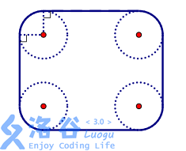

# [SHOI2012]信用卡凸包
[BZOJ2829 Luogu3829]

信用卡是一个矩形，唯四个角作了圆滑处理，使它们都是与矩形的两边相切的 1/4 圆，如下图所示。现在平面上有一些规格相同的信用卡，试求其凸包的周长。注意凸包未必是多边形，因为它可能包含若干段圆弧。  


思路比较简单。相当于是把所有四点的圆心提出来求凸包，再加上一个圆周的长度。  
实现有较多细节。

```cpp
#include<iostream>
#include<cstdio>
#include<cstdlib>
#include<cstring>
#include<algorithm>
#include<cmath>
using namespace std;

#define ll long long
#define ld long double
#define mem(Arr,x) memset(Arr,x,sizeof(Arr))

const int maxN=10100*4;
const ld Pi=acos(-1);
const ld eps=1e-10;
const int inf=2147483647;

class Point
{
public:
	ld x,y;
};

int n,pcnt=0;
ld a,b,r,rate;
Point P[maxN],Q[maxN];

Point operator + (Point A,Point B);
Point operator - (Point A,Point B);
Point operator * (Point A,ld b);
Point Rotate(Point A,ld theta);
ostream & operator << (ostream & os,Point A);
bool cmp(Point A,Point B);
ld Cross(Point A,Point B);
ld Dist(Point A);

int main(){
	scanf("%d",&n);scanf("%LF%LF%LF",&a,&b,&r);
	a-=r*2;b-=r*2;
	for (int i=1;i<=n;i++){
		ld x,y,theta;scanf("%LF%LF%LF",&x,&y,&theta);
		Point I=((Point){x,y});
		P[++pcnt]=Rotate((Point){b/2,a/2},theta)+I;
		P[++pcnt]=Rotate((Point){b/2,-a/2},theta)+I;
		P[++pcnt]=Rotate((Point){-b/2,a/2},theta)+I;
		P[++pcnt]=Rotate((Point){-b/2,-a/2},theta)+I;
	}

	for (int i=2;i<=pcnt;i++) if ((P[i].y<P[1].y)||((fabs(P[i].y-P[1].y)<eps)&&(P[i].x<P[1].x))) swap(P[1],P[i]);
	for (int i=2;i<=pcnt;i++) P[i]=P[i]-P[1],P[i].y=fabs(P[i].y);
	P[1]=((Point){0,0});
	sort(&P[2],&P[pcnt+1],cmp);

	int top=1;Q[1]=P[1];
	for (int i=2;i<=pcnt;i++){
		while ((top>=2)&&(Cross(P[i]-Q[top],Q[top]-Q[top-1])>=0)) top--;
		Q[++top]=P[i];
	}

	ld Ans=0,S=Pi*r*2;
	Q[top+1]=Q[1];
	for (int i=1;i<=top;i++) Ans=Ans+Dist(Q[i+1]-Q[i]);
	Ans=Ans+S;
	printf("%.2LF\n",Ans);return 0;
}

Point operator + (Point A,Point B){
	return ((Point){A.x+B.x,A.y+B.y});
}

Point operator - (Point A,Point B){
	return ((Point){A.x-B.x,A.y-B.y});
}

Point operator * (Point A,ld b){
	return ((Point){A.x*b,A.y*b});
}

Point Rotate(Point A,ld theta){
	return ((Point){cos(theta)*A.x-sin(theta)*A.y,sin(theta)*A.x+cos(theta)*A.y});
}

ostream & operator << (ostream & os,Point A){
	os<<"("<<A.x<<","<<A.y<<")";return os;
}

bool cmp(Point A,Point B){
	ld t1=atan2(A.y,A.x),t2=atan2(B.y,B.x);
	if (fabs(t1-t2)<eps) return A.x<B.x;
	else return t1<t2;
}

ld Cross(Point A,Point B){
	return A.x*B.y-A.y*B.x;
}

ld Dist(Point A){
	return sqrt(A.x*A.x+A.y*A.y);
}
```