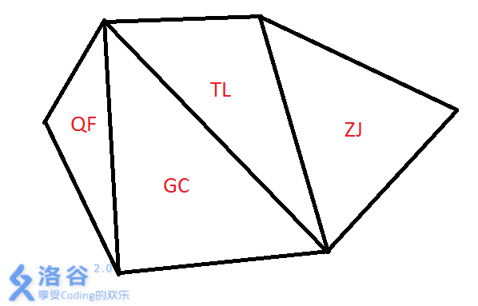

# [ZJOI2012]旅游
[BZOJ2657 Luogu2610]

到了难得的暑假，为了庆祝小白在数学考试中取得的优异成绩，小蓝决定带小白出去旅游~~  
经过一番抉择，两人决定将T国作为他们的目的地。T国的国土可以用一个凸N边形来表示，N个顶点表示N个入境/出境口。T国包含N-2个城市，每个城市都是顶点均为N边形顶点的三角形(换而言之，城市组成了关于T国的一个三角剖分)。两人的旅游路线可以看做是连接N个顶点中不相邻两点的线段。  
  
为了能够买到最好的纪念品，小白希望旅游路线上经过的城市尽量多。作为小蓝的好友，你能帮帮小蓝吗？

凸多边形三教剖分的性质在于，转成对偶图后是一棵树，那么问题转化为求树的直径，两边 bfs 。

```cpp
#include<iostream>
#include<cstdio>
#include<cstdlib>
#include<cstring>
#include<algorithm>
#include<map>
using namespace std;

#define ll long long
#define mem(Arr,x) memset(Arr,x,sizeof(Arr))

const int maxN=201000;
const int maxM=maxN<<1;
const int inf=2147483647;

int n;
int edgecnt=0,Head[maxN],Next[maxM],V[maxM],Dph[maxN];
map<int,int> Eg[maxN];

void Plus(int u,int v,int id);
void Add_Edge(int u,int v);
void dfs(int u,int fa,int d);

int main(){
	mem(Head,-1);
	scanf("%d",&n);
	for (int i=1;i<=n-2;i++){
		int u,v,w;scanf("%d%d%d",&u,&v,&w);
		Plus(u,v,i);Plus(u,w,i);Plus(v,w,i);
	}
	dfs(1,1,1);
	int mx=1;
	for (int i=1;i<=n;i++) if (Dph[i]>Dph[mx]) mx=i;
	dfs(mx,mx,1);
	for (int i=1;i<=n;i++) if (Dph[i]>Dph[mx]) mx=i;
	printf("%d\n",Dph[mx]);return 0;
}

void Plus(int u,int v,int id){
	if (u>v) swap(u,v);
	if ((u+1==v)||((u==1)&&(v==n))) return;
	if (Eg[u][v]==0) Eg[u][v]=id;
	else Add_Edge(id,Eg[u][v]);
	return;
}

void Add_Edge(int u,int v){
	Next[++edgecnt]=Head[u];Head[u]=edgecnt;V[edgecnt]=v;
	Next[++edgecnt]=Head[v];Head[v]=edgecnt;V[edgecnt]=u;
	return;
}

void dfs(int u,int fa,int d){
	Dph[u]=d;
	for (int i=Head[u];i!=-1;i=Next[i])
		if (V[i]!=fa) dfs(V[i],u,d+1);
	return;
}
```