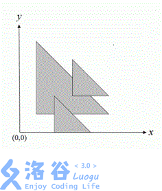

# [HNOI2012]三角形覆盖问题
[BZOJ2731 Luogu3219]

二维平面中，给定 N个等腰直角三角形（每个三角形的两条直角边分别平行于坐标轴，斜边从左上到右下）。我们用三个非负整数( x, y, d)来描述这样一个三角形，三角形三个顶点的坐标 分别为(x, y), (x + d, y)和(x, y + d)。要求计算这 N个三角形所覆盖的总面积。例如，下图有 3 个三角形，覆盖的总面积为 11.0。



把三角形按照底边排序，然后从下往上维护一根扫描线，对于对于每一个格子，维护被多少个三角形覆盖。用上一次的扫描线与这一次的扫描线组成的梯形算面积。移动的时候，把当前在扫描线上的三角形的右端点减去，而当某一个三角形被完全减去的时候，要删去它的贡献。用链表实现会比较方便。  
剪枝是，如果对于某个三角形，它完全包含了其它的某个三角形，则删掉被包含的；如果它被包含，则删除该三角形。  
需要注意的是，为了方便算面积，维护的是格子而不是点，但扫描线维护的是线。

```cpp
#include<iostream>
#include<cstdio>
#include<cstdlib>
#include<cstring>
#include<algorithm>
#include<vector>
using namespace std;

#define ll long long
#define mem(Arr,x) memset(Arr,x,sizeof(Arr))

const int maxN=101000;
const int maxNum=1010000;
const int inf=2147483647;

class Tgl
{
public:
	int x,y,d;
	int l,r;
};

int n;
ll Ans,sum;
Tgl T[maxN];
int Cnt[maxNum],head=0,Nxt[maxN],Pre[maxN];
vector<int> Dt[maxNum];

bool cmp(Tgl A,Tgl B);
void Insert(int id);
void Delete(int id);

int main(){
	scanf("%d",&n);
	int down=inf,up=-inf;
	for (int i=1;i<=n;i++){
		scanf("%d%d%d",&T[i].x,&T[i].y,&T[i].d);
		if (T[i].d==0) --i,--n;
		T[i].l=T[i].x;T[i].r=T[i].x+T[i].d-1;
		down=min(down,T[i].y);up=max(up,T[i].y+T[i].d);
	}
	sort(&T[1],&T[n+1],cmp);

	for (int i=1;i<=n;i++) Dt[T[i].y].push_back(i);

	for (int i=0,sz=Dt[down].size();i<sz;i++)
		Insert(Dt[down][i]);

	for (int d=down+1;d<=up;d++){
		int lastsum=sum;
		for (int i=head;i;i=Nxt[i]){
			if ((--Cnt[T[i].r])==0) sum--;
			if ((--T[i].r)<T[i].x) Delete(i);
		}
		Ans=Ans+lastsum+sum;
		for (int i=0,sz=Dt[d].size();i<sz;i++)
		{
			bool flag=1;int id=Dt[d][i];
			for (int j=head;j;j=Nxt[j])
				if ((T[j].x<=T[id].x)&&(T[j].r>=T[id].r)){
					flag=0;break;
				}
				else if ((T[j].x>=T[id].x)&&(T[j].r<=T[id].r)) Delete(j);
			if (flag) Insert(id);
		}
	}
	printf("%.1lf\n",(double)Ans/2.0);return 0;
}

bool cmp(Tgl A,Tgl B){
	return A.y<B.y;
}

void Insert(int id){
	if (head) Pre[head]=id;
	Nxt[id]=head;Pre[id]=0;head=id;
	for (int i=T[id].x;i<=T[id].r;i++) if ((++Cnt[i])==1) sum++;
	return;
}

void Delete(int id){
	if (Pre[id]) Nxt[Pre[id]]=Nxt[id];
	if (Nxt[id]) Pre[Nxt[id]]=Pre[id];
	if (head==id) head=Nxt[id];
	for (int i=T[id].x;i<=T[id].r;i++) if ((--Cnt[i])==0) sum--;
	return;
}
```