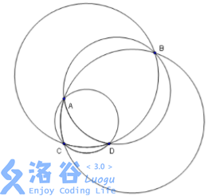
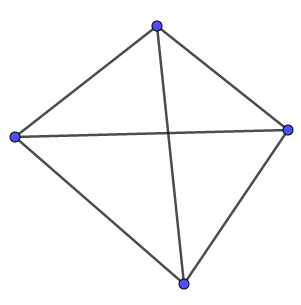
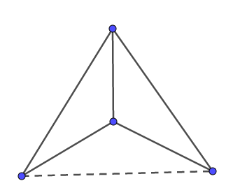

# [APIO2010]信号覆盖
[BZOJ1913 Luogu3630]

一家电信公司正在北京城搭建一个 GSM 网络。城市里共有 n 个房子需要被 信号覆盖。由于经费的限制，电信公司只能安装一个天线。 这里将每个房子用一个点坐标来表示。为了简化天线的放置，电信公司将会 选择其中的 3 个房子作一个外接圆，然后将天线放在圆的中心，所有位于这个圆 内或者圆的边界上的房子都将被天线的信号所覆盖。 电信公司将会随机选择城市中的 3 个房子来搭建天线，他们想知道在所有可 能放置天线的方案中平均会有多少个房子被信号覆盖。 例如，假设共有 4 个房子 A, B, C, D，它们的位置如下图：



如果我们选择ABC或者BCD三个点搭建的外接圆，所有的房子都会被覆盖。 如果我们选择 ACD 或者 ABD，剩下的房子将不会在天线的信号覆盖范围内。因 此平均有(4 + 4 + 3 + 3) / 4 = 3.50 个房子被信号覆盖。 给定所有房子的位置，你的任务是计算平均有多少个房子被信号覆盖。假定 每一个房子都有一个二维的整数坐标，并且保证任何三个房子都不在同一条直线 上，任何四个房子都不在同一个圆上。

考虑每一个房子的贡献。首先任意三个房子都可以形成一个圆，这个放在后面统计。那么需要统计的就是每个房子不作为顶点的贡献。

考虑两种四边形





其中前者会给答案贡献 2 ，后者只会给答案贡献 1 。由于两者之和是确定的 $\binom{n}{4}$不妨统计第二种的个数。  
枚举每一个点并以其为原点极角排序。依然考虑容斥求出第一种的方案，然后用总方案减得到第二种的个数。

```cpp
#include<cstdio>
#include<cstdlib>
#include<cstring>
#include<algorithm>
#include<cmath>
#include<iostream>
using namespace std;

#define sqr(x) ((x)*(x))

class Point{
    public:
    double x,y,agl;
    double len(){
        return sqrt(sqr(x)+sqr(y));
    }
};

const int maxN=3010;
const double eps=1e-8;
const double Pi=acos(-1);

int n;
Point P[maxN];
double Agl[maxN];

Point operator + (Point A,Point B);
Point operator - (Point A,Point B);
double C(double n,double m);

int main(){
    scanf("%d",&n);
    for (int i=1;i<=n;i++) scanf("%lf%lf",&P[i].x,&P[i].y);
    double cnt=0;
    for (int i=1;i<=n;i++){
        int scnt=0;double sum=0;
        for (int j=1;j<=n;j++) if (i!=j) Agl[++scnt]=atan2((P[j]-P[i]).y,(P[j]-P[i]).x);
        sort(&Agl[1],&Agl[scnt+1]);
        for (int i=1;i<=scnt;i++) Agl[i+scnt]=Agl[i]+Pi*2;
        for (int i=1,j=1;i<=scnt;i++){
            while (j+1<=scnt+scnt&&Agl[j+1]<Agl[i]+Pi) ++j;
            sum+=C(j-i,2);
        }
        cnt+=C(scnt,3)-sum;
    }
    printf("%.6lf\n",(cnt+(C(n,4)-cnt)*2)/C(n,3)+3);return 0;
}
Point operator + (Point A,Point B){
    return ((Point){A.x+B.x,A.y+B.y});
}
Point operator - (Point A,Point B){
    return ((Point){A.x-B.x,A.y-B.y});
}
double C(double n,double m){
    if (n<m) return 0;
    if (m==1) return n;
    if (m==2) return n*(n-1)/2;
    if (m==3) return n*(n-1)*(n-2)/6;
    if (m==4) return n*(n-1)*(n-2)*(n-3)/24;
}
```