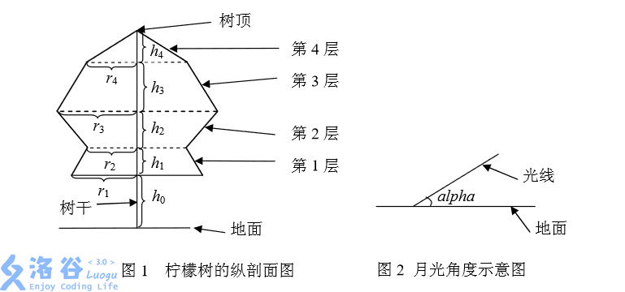

# [NOI2005]月下柠檬树
[BZOJ1502 Luogu4207]

李哲非常非常喜欢柠檬树，特别是在静静的夜晚，当天空中有一弯明月温柔 地照亮地面上的景物时，他必会悠闲地坐在他亲手植下的那棵柠檬树旁，独自思 索着人生的哲理。  
李哲是一个喜爱思考的孩子，当他看到在月光的照射下柠檬树投在地面上的 影子是如此的清晰，马上想到了一个问题：树影的面积是多大呢？  
李哲知道，直接测量面积是很难的，他想用几何的方法算，因为他对这棵柠 檬树的形状了解得非常清楚，而且想好了简化的方法。  
李哲将整棵柠檬树分成了 n 层，由下向上依次将层编号为 1,2,…,n。从第 1 到 n-1 层，每层都是一个圆台型，第 n 层(最上面一层)是圆锥型。对于圆台型， 其上下底面都是水平的圆。对于相邻的两个圆台，上层的下底面和下层的上底面 重合。第 n 层(最上面一层)圆锥的底面就是第 n-1 层圆台的上底面。所有的底面 的圆心(包括树顶)处在同一条与地面垂直的直线上。李哲知道每一层的高度为 h1,h2,…,hn，第 1 层圆台的下底面距地面的高度为 h0，以及每层的下底面的圆的 半径 r1,r2,…,rn。李哲用熟知的方法测出了月亮的光线与地面的夹角为 alpha。
.

为了便于计算，假设月亮的光线是平行光，且地面是水平的，在计算时忽略 树干所产生的影子。李哲当然会算了，但是他希望你也来练练手

注意到圆形被平行光投影到平行平面后依然是圆形。问题转化为求平面上，若干圆心在同一条直线上的圆以及它们相邻两两之间的切线组成的面积。预处理出所有交接的地方，辛普森积分求。

```cpp
#include<cstdio>
#include<cstdlib>
#include<cstring>
#include<algorithm>
#include<cmath>
#include<iostream>
using namespace std;

#define sqr(x) ((x)*(x))
const int maxN=510;
const double inf=1e18;
const double Pi=acos(-1);

class Point{
public:
    double x,y;
    double len(){
        return sqrt(sqr(x)+sqr(y));
    }
};
class Circle{
public:
    double r;Point p;
};

int n;
double alpha,H[maxN];
Circle C[maxN];
pair<Point,Point> L[maxN];

Point operator + (Point A,Point B);
Point operator - (Point A,Point B);
Point Rotate(Point A,double agl);
void CalcLine(Circle A,Circle B,int id);
double Calc(double x);
double Inte(double l,double r);
double Simpson(double l,double r,double eps);

int main(){
    double left=inf,right=-inf;
    scanf("%d%lf",&n,&alpha);
    for (int i=0;i<=n;i++){
        double h;scanf("%lf",&h);h=h/tan(alpha);
        H[i]=(i==0)?h:H[i-1]+h;
    }
    for (int i=0;i<=n;i++){
        double r;if (i==n) r=0;else scanf("%lf",&r);
        left=min(left,H[i]-r);right=max(right,H[i]+r);
        C[i]=((Circle){r,((Point){H[i],0})});
    }
    //for (int i=0;i<=n;i++) cout<<H[i]<<" ";cout<<endl;
    //for (int i=0;i<=n;i++) cout<<"("<<C[i].p.x<<","<<C[i].p.y<<") "<<C[i].r<<endl;
    for (int i=0;i<n;i++) CalcLine(C[i],C[i+1],i);
    //for (int i=0;i<n;i++) cout<<"("<<L[i].first.x<<","<<L[i].first.y<<") ("<<L[i].second.x<<","<<L[i].second.y<<")"<<endl;
    //cout<<left<<" "<<right<<endl;
    printf("%.2lf\n",Simpson(left,right,1e-3)*2);
    return 0;
}
Point operator + (Point A,Point B){
    return ((Point){A.x+B.x,A.y+B.y});
}
Point operator - (Point A,Point B){
    return ((Point){A.x-B.x,A.y-B.y});
}
Point Rotate(Point A,double agl){
    return ((Point){A.x*cos(agl)-A.y*sin(agl),A.y*cos(agl)+A.x*sin(agl)});
}
void CalcLine(Circle A,Circle B,int id){
    double d=(B.p-A.p).len(),dr=A.r-B.r;
    if (fabs(dr)>=d) return;
    double agl=acos(dr/d);
    L[id]=make_pair(A.p+Rotate((Point){A.r,0},agl),B.p+Rotate((Point){B.r,0},agl));
    return;
}
double Calc(double x){
    double mx=0;
    for (int i=0;i<n;i++)
        if (L[i].first.x<=x&&L[i].second.x>=x)
            mx=max(mx,L[i].first.y+(L[i].second.y-L[i].first.y)/(L[i].second.x-L[i].first.x)*(x-L[i].first.x));
    for (int i=0;i<=n;i++)
        if (fabs(x-C[i].p.x)<=C[i].r){
            double d=fabs(x-C[i].p.x);
            mx=max(mx,sqrt(sqr(C[i].r)-sqr(d)));
        }
    return mx;
}
double Inte(double l,double r){
    return (r-l)*(Calc(l)+Calc(r)+Calc((l+r)/2)*4)/6;
}
double Simpson(double l,double r,double eps){
    double mid=(l+r)/2,k=Inte(l,r),kl=Inte(l,mid),kr=Inte(mid,r);
    if (fabs(kl+kr-k)<eps*15) return kl+kr;
    return Simpson(l,mid,eps/2)+Simpson(mid,r,eps/2);
}
```