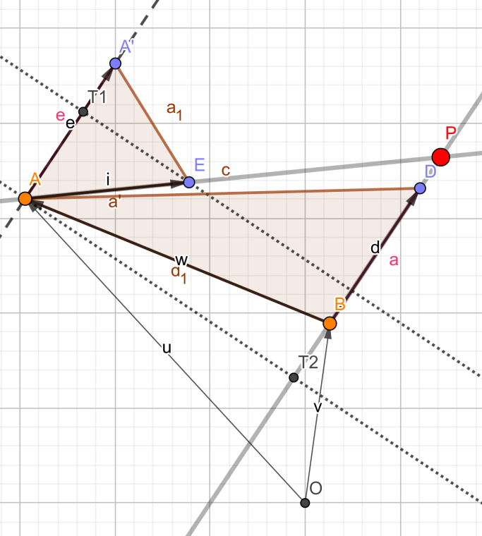

# 计算几何笔记

## 平面几何
### 直线的表示方法
最简单的是用一般式来表示，即 $Ax+By+c=0$ 。  
比较通用的形式是用向量来表示，有两种表示方法，一种是直接用两个不同的点来代表直线；另一种是指定直线上的一个点，然后用一个向量表示其指向方向，方便起见，指定的点通常是与 y 轴的交点。
### 求三角形面积

一种比较简介的方法是利用海伦公式 $S=\sqrt{p(p-a)(p-b)(p-c)}$ ，其中 $p=\frac{a+b+c}{2}$

另一种方法是用向量，注意求出的是带符号的面积，所以有的时候也可以用来判断两个向量的相对位置关系。
```cpp
ld Cross(Point A,Point B){
	return A.x*B.y-A.y*B.x;
}
```
### 求直线的交点
直接的方法就是带入两条直线的一般式解方程。需要讨论一些情况。  
一种比较简单的写法是用向量加面积的比来求。  
用直线上一个点+指向方向的向量这种方式表示两条直线，如图所示 AE 和 BD ，交点为 P ， OA 和 OB 分别为两点的位置向量， AE 和 BD 分别为方向向量，而 AA' 由  BD 平移得到。

能够通过 cross 快速算出两个黄色三角形的面积，然后两个面积之比就是 AE 与 AP 之比，这个由相似三角形可以证明，那么就用 A 点的位置向量加上方向向量的若干倍，得到的就是交点 P 的坐标了。
```cpp
Point GetP(Line A,Line B){//.p 为位置向量， .d 为方向向量
	Point dx=A.p-B.p;
	ld t=Cross(B.d,dx)/Cross(A.d,B.d);
	return A.p+A.d*t;
}
```

### 半平面交
若干个半平面的交集称之为半平面交，通常用来求解二元不等式的相关问题。  
默认半平面为有向向量的左半部分。

一般解法为，先把所有向量按照极角排序，然后考虑增量构造。维护两个双端队列，一个用来维护当前在半平面交上的向量，另一个用来维护在半平面交上相邻向量的交点坐标。加入一个新的向量的时候，判断最后的交点是否在当前向量的左边，如果是，说明前面的向量合法，否则说明前面的某个向量已经被覆盖，需要弹掉。需要用双端队列的原因是，后面向量可能会绕一圈绕回来，把前面的交点弹掉，同样是判断交点是否在当前向量的左边。  
但这样的话，会导致最后面有部分多余的向量，需要再假装把第一个向量再加入，弹掉后面那些交点在右边的向量。  
当向量个数大于等于 3 个，则说明存在解。

需要注意的是，因为半平面交的解有可能是外围的无限大平面，所以一般的做法是在外围加入一个非常大的平行四边形或矩形，把整个半平面限制在这个矩形内。

```cpp
bool Isleft(Line A,Point B){
	return Cross(A.d,B-A.p)>0;
}
bool check(){
	int L=1,R=1;Q1[1]=A[1];
	for (int i=2;i<=scnt;i++){
		while ((L<R)&&(!Isleft(A[i],Q2[R-1]))) R--;
		while ((L<R)&&(!Isleft(A[i],Q2[L]))) L++;
		Q1[++R]=A[i];
		if (fabs(Cross(Q1[R].d,Q1[R-1].d))<1e-15){
			--R;
			if (Isleft(Q1[R],A[i].p)) Q1[R]=A[i];
		}
		if (L<R) Q2[R-1]=GetP(Q1[R-1],Q1[R]);
	}
	while ((L<R)&&(!Isleft(Q1[L],Q2[R-1]))) R--;
	return R-L>1;
}
```
